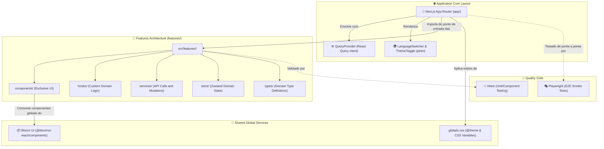

## 🌟 Visão Geral

O **ClubKey** é uma aplicação web moderna de alta performance e fortemente tipada projetada para o ecossistema do React 19 e Next.js 16 (App Router), equipada com a biblioteca de componentes **Bloom UI**, gerenciamento de estado leve com **Zustand**, sincronização e cache de servidor via **TanStack Query** e formulários validados com **React Hook Form + Zod**.

---

### Comandos de Desenvolvimento

Após criar seu projeto e acessar o diretório, utilize os scripts abaixo para gerenciar a aplicação:

```bash
# Instale as dependências
pnpm install

# Inicie o servidor de desenvolvimento
pnpm dev

# Realize a validação estática de tipos
pnpm typecheck

# Execute a suíte de testes unitários (Vitest)
pnpm test

# Execute a suíte de testes E2E (Playwright)
pnpm test:e2e

# Realize a compilação otimizada para produção
pnpm build
```

---

## 🛠️ Stack Tecnológica

<div align="center">
  
  
  
  
  
  
  
  
  
  
  
  
  
  
</div>

---

## 🏛️ Arquitetura do Sistema

O ClubKey adota o design orientado a **Features (Recursos)** para garantir o isolamento e modularização lógica de cada domínio de negócio:


