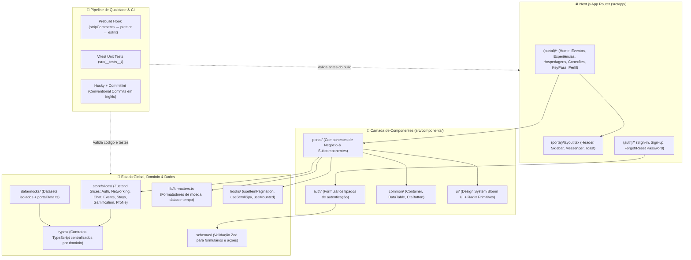

# 🗝️ ClubKey — Portal Executivo & Ecossistema de Membros

O **ClubKey** é uma plataforma web executiva de alta performance, fortemente tipada e projetada sobre o ecossistema do **React 19** e **Next.js 16 (App Router + Turbopack)**. Integra a biblioteca de componentes **Bloom UI**, gerenciamento de estado global modular com **Zustand (Slice Pattern)**, validação robusta de formulários com **React Hook Form + Zod** e estilização moderna via **Tailwind CSS v4**.

---

## 🚀 Comandos de Desenvolvimento

Utilize os comandos `npm` abaixo para gerenciar e executar o projeto:

```bash
# Instale as dependências
npm install

# Inicie o servidor de desenvolvimento com Turbopack
npm run dev

# Execute a validação estática de tipos (TypeScript)
npm run typecheck

# Execute a suíte de testes unitários (Vitest)
npm test

# Execute os testes unitários em modo interativo
npm run test:watch

# Execute o linter de código
npm run lint

# Formate o código com Prettier
npm run format

# Compile o projeto para produção (executa prebuild com stripComments + prettier + eslint)
npm run build

# Inicie o servidor de produção
npm start
```

---

## 🛠️ Stack Tecnológica

<div align="center">
  
  
  
  
  
  
  
  
  
  
  
  
</div>

---

## 🏛️ Arquitetura do Sistema

A aplicação é estruturada segundo princípios de **Clean Architecture**, **SOLID** e **Single Responsibility Principle (SRP)**:



---

## 📚 Documentação Técnica de Backend & APIs

Toda a especificação completa de modelagem de dados, regras de negócio da gamificação (KeyPass), contratos de API RESTful e manuais por módulo estão documentados na pasta [`docs/`](./docs):

- **[`docs/ARCHITECTURE.md`](./docs/ARCHITECTURE.md)**: Arquitetura técnica detalhada do frontend, convenções de código, pipeline e integração OpenAPI/Orval.
- **[`docs/DATABASE_MODELS.md`](./docs/DATABASE_MODELS.md)**: Modelagem relacional de banco de dados completa para o time de backend.
- **[`docs/API_SPECIFICATIONS.md`](./docs/API_SPECIFICATIONS.md)**: Especificação de todas as rotas RESTful, payloads e status codes.
- **[`docs/ENUMS.md`](./docs/ENUMS.md)**: Dicionário central de Enums e constantes padronizadas.
- **[`docs/GAMIFICATION_RULES.md`](./docs/GAMIFICATION_RULES.md)**: Manual oficial de pontuação, XP, tiers executivos e retenção do KeyPass.
- **[`docs/SEED_DATA.md`](./docs/SEED_DATA.md)**: Datasets JSON prontos para seeders de banco de dados.
- **[`docs/pages/`](./docs/pages)**: Documentação detalhada de regras e fluxos tela por tela.

---

## 🛡️ Padrões de Código & Git Commits

- **Nomenclatura de Arquivos**: Todos os arquivos de código-fonte seguem rigorosamente a convenção `camelCase` em inglês (`eventDetailClient.tsx`, `roomsSearchFilterBar.tsx`, `useItemPagination.ts`, `member.types.ts`).
- **Commits Convencionais**: Forçados via Husky (`commit-msg`) e Commitlint exclusivamente em inglês (ex: `feat(events): add rsvp confirmation modal`, `fix(auth): handle expired token error`).
