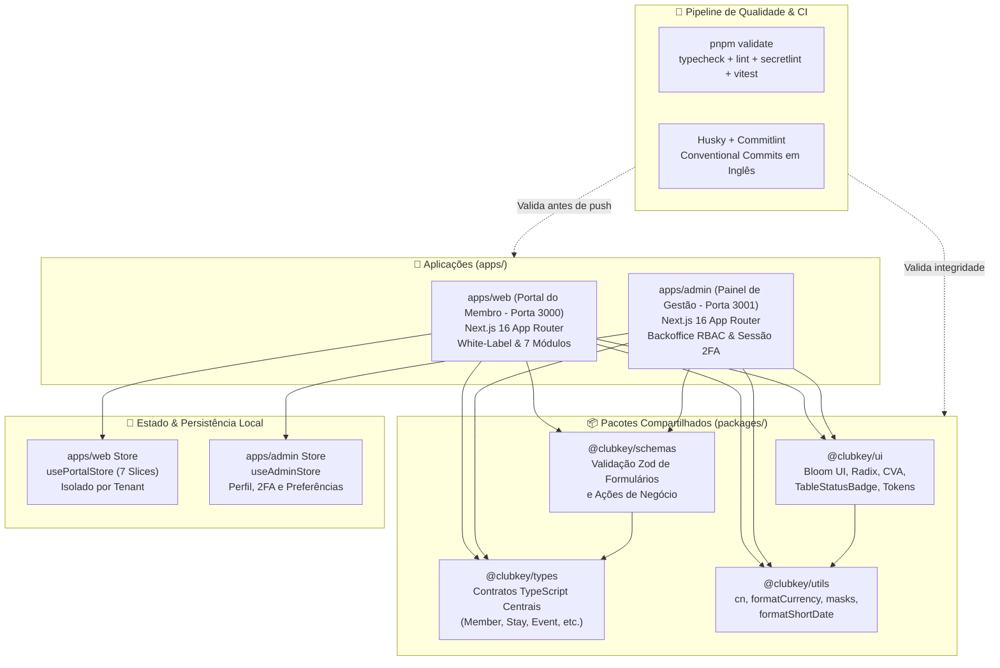

# 🗝️ ClubKey — Monorepo Executivo & Ecossistema de Membros

O **ClubKey** é um ecossistema web de alta performance, fortemente tipado e organizado como um **Monorepo moderno (Turborepo + pnpm workspaces)** construído sobre **React 19** e **Next.js 16 (App Router + Turbopack)**. 

O projeto unifica o portal de membros associados e o painel de gestão administrativa (backoffice), compartilhando pacotes internos modulares para o design system **Bloom UI**, tipagens de domínio, validação de schemas com **Zod** e utilitários.

---

## 🏛️ Estrutura do Monorepo

```
clubkey/
├── apps/
│   ├── web/                          # 🌐 Portal do Membro / Cliente (Next.js 16, porta 3000)
│   └── admin/                        # ⚙️ Painel de Gestão Administrativa / Backoffice (Next.js 16, porta 3001)
│
├── packages/
│   ├── ui/                           # 🎨 Design System Bloom UI, Tokens CVA e Componentes Compartilhados
│   ├── types/                        # 🏷️ Interfaces e Contratos TypeScript Centralizados
│   ├── schemas/                      # 🛡️ Schemas de Validação Zod Compartilhados
│   └── utils/                        # 🔧 Utilitários Compartilhados (cn, formatCurrency, masks)
│
├── docs/                             # 📚 Documentação Técnica Completa do Sistema
├── pnpm-workspace.yaml               # 📦 Configuração dos Workspaces pnpm
├── turbo.json                        # ⚡ Pipelines de Build, Typecheck e Cache Inteligente
└── package.json                      # 🛠️ Scripts Raiz e Orquestração do Repositório
```

---

## 🚀 Comandos de Desenvolvimento

Utilize os comandos `pnpm` abaixo a partir da raiz do monorepo:

### 💻 Ambiente Local
```bash
# Instale todas as dependências do monorepo
pnpm install

# Inicie ambas as aplicações em paralelo (Turbopack + Turborepo)
pnpm dev

# Inicie apenas o Portal do Membro (http://localhost:3000)
pnpm dev:web

# Inicie apenas o Painel Administrativo (http://localhost:3001)
pnpm dev:admin
```

### 🧪 Testes, Qualidade e Validação
```bash
# Execute a validação estática de tipos (TypeScript em todos os workspaces)
pnpm typecheck

# Execute a suíte de testes unitários (Vitest multi-projeto)
pnpm test

# Execute os testes unitários em modo observador (watch)
pnpm test:watch

# Execute o linter de código (ESLint)
pnpm lint

# Execute a validação de segredos e credenciais
pnpm test:secrets

# Pipeline completa de validação pré-push (typecheck + lint + secretlint + vitest)
pnpm validate
```

### 📦 Compilação para Produção
```bash
# Compile todas as aplicações e pacotes com cache do Turborepo
pnpm build

# Compile apenas o Portal do Membro
pnpm build:web

# Compile apenas o Painel Administrativo
pnpm build:admin
```

---

## 🛠️ Stack Tecnológica

<div align="center">
  
  
  
  
  
  
  
  
  
  
  
  
  
  
</div>

---

## 🏛️ Arquitetura do Monorepo


```mermaid
graph TB
    subgraph AppsLayer ["📱 Aplicações (apps/)"]
        Web["apps/web (Portal do Membro - Porta 3000)<br/>Next.js 16 App Router<br/>White-Label & 7 Módulos"]
        Admin["apps/admin (Painel de Gestão - Porta 3001)<br/>Next.js 16 App Router<br/>Backoffice RBAC & Sessão 2FA"]
    end

    subgraph PackagesLayer ["📦 Pacotes Compartilhados (packages/)"]
        UI["@clubkey/ui<br/>Bloom UI, Radix, CVA,<br/>TableStatusBadge, Tokens"]
        Types["@clubkey/types<br/>Contratos TypeScript Centrais<br/>(Member, Stay, Event, etc.)"]
        Schemas["@clubkey/schemas<br/>Validação Zod de Formulários<br/>e Ações de Negócio"]
        Utils["@clubkey/utils<br/>cn, formatCurrency, masks,<br/>formatShortDate"]
    end

    subgraph StoresLayer ["🧠 Estado & Persistência Local"]
        WebStore["apps/web Store<br/>usePortalStore (7 Slices)<br/>Isolado por Tenant"]
        AdminStore["apps/admin Store<br/>useAdminStore<br/>Perfil, 2FA e Preferências"]
    end

    subgraph PipelineLayer ["🧪 Pipeline de Qualidade & CI"]
        ValidateGate["pnpm validate<br/>typecheck + lint + secretlint + vitest"]
        HuskyGate["Husky + Commitlint<br/>Conventional Commits em Inglês"]
    end

    Web --> UI
    Web --> Types
    Web --> Schemas
    Web --> Utils
    Web --> WebStore

    Admin --> UI
    Admin --> Types
    Admin --> Schemas
    Admin --> Utils
    Admin --> AdminStore

    UI --> Utils
    Schemas --> Types

    PipelineLayer -.->|Valida antes de push| AppsLayer
    PipelineLayer -.->|Valida integridade| PackagesLayer
```

---

## 📦 Consumo dos Pacotes Compartilhados

As aplicações consomem os pacotes internos com imports limpos e resolução type-safe:

```tsx
// 🎨 Componentes Bloom UI e Elementos de Interface
import { Button, Card, DataTable, Badge, TableStatusBadge } from "@clubkey/ui"

// 🏷️ Tipagens TypeScript de Domínio
import type { Member, StayProperty, EventItem, AdminProfile } from "@clubkey/types"

// 🛡️ Validação com Schemas Zod
import { signUpSchema, adminLoginSchema } from "@clubkey/schemas"

// 🔧 Utilitários e Formatadores
import { cn, formatCurrency, maskCpf, formatShortDate } from "@clubkey/utils"
```

---

## 📚 Documentação Técnica Completa

Todas as especificações técnicas, modelos de dados, contratos de API e manuais de telas estão organizados no diretório [`docs/`](./docs):

- **[`docs/README.md`](./docs/README.md)**: Índice geral da documentação técnica.
- **[`docs/MONOREPO.md`](./docs/MONOREPO.md)**: Guia completo da arquitetura Monorepo com Turborepo e pnpm.
- **[`docs/ARCHITECTURE.md`](./docs/ARCHITECTURE.md)**: Arquitetura técnica global, decisões de engenharia e pipelines.
- **[`docs/DESIGN_SYSTEM.md`](./docs/DESIGN_SYSTEM.md)**: Diretrizes do Design System Bloom UI, tema neutro e tokens CVA.
- **[`docs/WHITE_LABEL.md`](./docs/WHITE_LABEL.md)**: Sistema White-Label multi-tenant e matriz dinâmica de 7 módulos.
- **[`docs/STATE_MANAGEMENT.md`](./docs/STATE_MANAGEMENT.md)**: Arquitetura de stores Zustand (`usePortalStore` e `useAdminStore`).
- **[`docs/TESTING.md`](./docs/TESTING.md)**: Estratégia de testes automatizados com Vitest, Playwright e Git Hooks.
- **[`docs/DATABASE_MODELS.md`](./docs/DATABASE_MODELS.md)**: Modelagem relacional PostgreSQL para o time de backend.
- **[`docs/API_SPECIFICATIONS.md`](./docs/API_SPECIFICATIONS.md)**: Especificação de rotas RESTful, payloads e códigos de status.
- **[`docs/ENUMS.md`](./docs/ENUMS.md)**: Dicionário canônico de Enums e constantes padronizadas.
- **[`docs/GAMIFICATION_RULES.md`](./docs/GAMIFICATION_RULES.md)**: Manual de regras de pontuação, XP e Tiers do KeyPass.
- **[`docs/pages/portal/`](./docs/pages/portal)**: Documentação funcional tela a tela do Portal do Membro (`apps/web`).
- **[`docs/pages/admin/`](./docs/pages/admin)**: Documentação funcional tela a tela do Painel Administrativo (`apps/admin`).

---

## 🛡️ Padrões de Código & Git Commits

- **Nomenclatura de Arquivos**: Todos os arquivos de código-fonte seguem rigorosamente a convenção `camelCase` em inglês (`adminUserDropdown.tsx`, `roomsSearchFilterBar.tsx`, `useItemPagination.ts`, `member.types.ts`).
- **Commits Convencionais**: Forçados via Husky (`commit-msg`) e Commitlint exclusivamente em inglês (ex: `feat(admin): implement session proxy middleware`, `fix(portal): resolve navbar alignment on mobile`).
