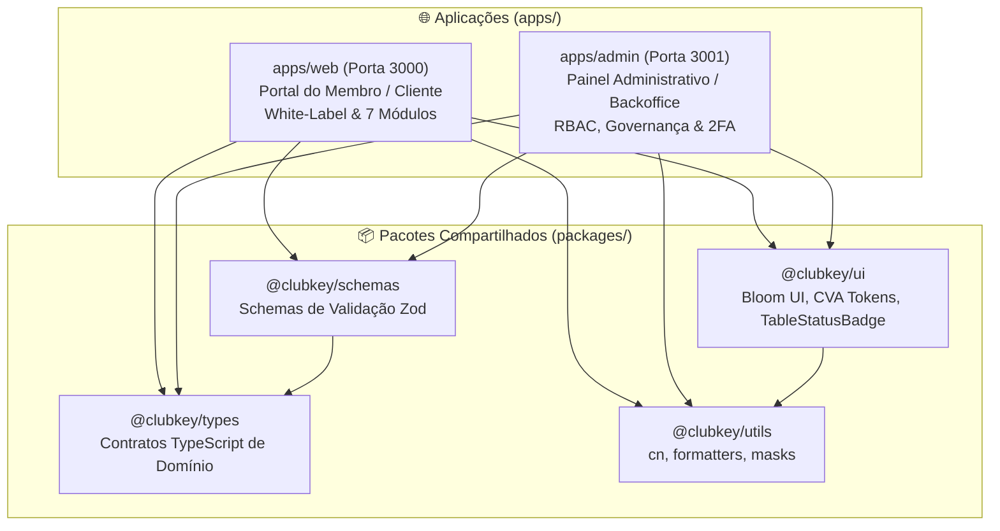

# Arquitetura Técnica do Frontend & Decisões de Tecnologia

Este documento detalha a arquitetura, convenções e tecnologias adotadas no desenvolvimento do frontend do ecossistema **ClubKey Monorepo & White-Label Multi-Tenant**.

---

## 🛠️ Stack Tecnológica

| Camada | Tecnologia | Justificativa / Uso |
| :--- | :--- | :--- |
| **Monorepo & Orquestração** | Turborepo + pnpm workspaces | Gerenciamento unificado de dependências com linking inteligente, isolamento de escopo e cache de builds. |
| **Framework Web** | Next.js 16.1.7 (App Router & Turbopack) | Suporte nativo a React 19, Server Components, SSR dinâmico, SEO otimizado (`generateMetadata`) e performance de ponta. |
| **Linguagem** | TypeScript 5+ | Tipagem estrita de todas as entidades de domínio, props de componentes e payloads de estado. |
| **Estilização** | Tailwind CSS v4 | Utility-first styling moderno, variáveis CSS nativas, alta performance e zero runtime overhead. |
| **Design System** | Bloom UI + Radix UI Primitives (`@clubkey/ui`) | Sistema de componentes acessíveis e consistentes baseados no Radix UI com CVA (Class Variance Authority). |
| **Gerenciamento de Estado** | Zustand 5.x (`persist` middleware) | Estado global reativo com sincronização local, isolado por tenant no portal e com store dedicada no admin. |
| **Ícones** | Phosphor Icons (`@phosphor-icons/react`) | Pacote de ícones leve e consistente com múltiplos pesos (`bold`, `regular`, `fill`). |
| **Formulários & Validação** | React Hook Form + Zod (`@clubkey/schemas`) | Validação robusta de schemas com tipagem inferida e feedback instantâneo. |
| **Feedback Visual** | Sonner (`toast`) | Notificações flutuantes elegantes e reativas para ações de sucesso, erro e alertas. |
| **Testes Unitários & Integração** | Vitest + React Testing Library | Validação ágil de componentes, formatadores, stores, proxies e isolamento modular (94 testes). |
| **Testes E2E** | Playwright Test | Validação ponta a ponta no navegador de fluxos de login, segurança de rotas e white-label (19 testes). |

---

## 🏛️ Padrões de Arquitetura do Monorepo

O repositório é particionado em duas aplicações autônomas (`apps/`) e quatro pacotes compartilhados (`packages/`):



---

## 📱 Aplicações do Monorepo

### 1. Portal do Membro (`apps/web` — Porta 3000)
- **Foco do Usuário**: Experiência premium para o membro associado (busca e reserva de estadias, confirmação em eventos, matchmaking de networking, vivências gastronômicas, resgate de cupons de parceiros e gamificação KeyPass).
- **White-Label & Multi-Tenant**: Configurado dinamicamente via `NEXT_PUBLIC_TENANT`. Suporta matriz booleana de 7 módulos (`home`, `stays`, `networking`, `events`, `experiences`, `benefits`, `keypass`).
- **Segurança & Route Guards**:
  - `apps/web/src/proxy.ts`: Edge Proxy que intercepta rotas de módulos inativos e reescreve requisições não autorizadas para `/not-found`.
  - Server Route Guards (`assertModule`): Garante defesa em profundidade no nível do servidor Next.js.
  - Componente `<ModuleGate>`: Ocultação condicional de blocos e cards no cliente.
- **Gerenciamento de Estado**: Store central `usePortalStore` composta por 7 fatias modulares (Slice Pattern) com persistência isolada por tenant (`${tenant}-portal-storage-v9`).

### 2. Painel Administrativo (`apps/admin` — Porta 3001)
- **Foco do Usuário**: Backoffice de gestão operacional, diretoria e concierges.
- **Módulos Principais**: Dashboard executivo com KPIs, gestão de usuários/membros com esteira de aprovação, catálogo de hospedagens, eventos com lotes e listas de presença, parceiros/benefícios, sinistros e configurações de White Label.
- **Autenticação & Controle de Sessão**:
  - Telas de autenticação split screen em `apps/admin/src/app/(auth)/login` e `(auth)/esqueci-minha-senha`.
  - Suporte a segundo fator de autenticação (2FA TOTP) via componente `inputOtp`.
  - Edge Proxy em `apps/admin/src/proxy.ts` que valida a presença do cookie de sessão `clubkey_admin_session`, protegendo todas as rotas de `(dashboard)/*` e redirecionando usuários não autenticados para `/login`.
- **Perfil do Administrador (`/perfil`)**:
  - Tela alinhada à visualização de detalhes de usuário, com avatar destacado, upload e recorte via `ImageCropper`.
  - Badges semânticas com `TableStatusBadge` para o nível de permissão (`SUPER ADMIN` com watermark Crown) e status de segurança (`2FA Ativo` com watermark ShieldCheck).
  - Metadados inline protegidos e restrições de governança (cargo e departamento somente leitura).
  - Gerenciamento de 2FA TOTP com geração de QR Code e confirmação por código.
- **Gerenciamento de Estado**: Store dedicada `useAdminStore` com persistência local em `clubkey-admin-storage-v1`.

---

## 📦 Pacotes Compartilhados (`packages/`)

### 1. `@clubkey/ui` (`packages/ui/`)
Centraliza o Design System institucional:
- Componentes do **Bloom UI** construídos sobre primitivas do **Radix UI** e **Tailwind CSS v4**.
- Componentes de domínio reutilizáveis de alta frequência, como `TableStatusBadge` (com suporte a variantes semânticas, bordas finas e watermarks sutis como `Crown` e `ShieldCheck`).
- Tokens de design CVA (`BloomSize`, `BloomRadius`, `BloomColor`, `BloomVariant`).
- Política rigorosa de **Tema Neutro**: cards brancos puros (`bg-white`) no tema claro e cinza neutro (`bg-zinc-900`) no tema escuro.

### 2. `@clubkey/types` (`packages/types/`)
Centraliza as interfaces e tipos TypeScript compartilhados:
- Domínio do Membro (`Member`, `UserProfile`, `MemberConnectionStatus`).
- Domínio de Hospedagens (`StayProperty`, `StayReservation`, `RoomType`).
- Domínio de Eventos (`EventItem`, `EventTicketBatch`, `EventRsvp`).
- Domínio de Gamificação (`Tier`, `Mission`, `WeeklyDrop`, `XpTransaction`).
- Domínio Administrativo (`AdminProfile`, `AdminUser`, `AdminAuditLog`).
- Exportação unificada através de `packages/types/src/index.ts`.

### 3. `@clubkey/schemas` (`packages/schemas/`)
Centraliza as regras de validação via **Zod**:
- Schemas de login e cadastro de membros (`signInSchema`, `signUpSchema`).
- Schemas de autenticação administrativa (`adminLoginSchema`, `adminForgotPasswordSchema`, `adminTwoFactorSchema`).
- Schemas de reservas, pagamentos e atualizações cadastrais.

### 4. `@clubkey/utils` (`packages/utils/`)
Centraliza funções auxiliares puras e testáveis:
- Fusão de classes CSS com Tailwind: `cn(...)`.
- Formatadores monetários: `formatCurrency(val)`, `formatBRL(val)`.
- Formatadores de data e tempo: `formatShortDate(d)`, `formatDateRange(start, end)`.
- Máscaras de formulário: `maskCpf(v)`, `maskCnpj(v)`, `maskDate(v)`, `maskCardNumber(v)`, `maskCardExpiry(v)`, `maskCvv(v)`.

---

## 📁 Estrutura de Diretórios do Monorepo

```
clubkey/
├── apps/
│   ├── web/                              # Portal do Membro (Next.js 16)
│   │   ├── src/
│   │   │   ├── app/                      # App Router
│   │   │   │   ├── (auth)/               # Rotas públicas de autenticação (/entrar, /cadastro)
│   │   │   │   └── (portal)/             # Rotas autenticadas do membro (/hospedagens, /eventos, etc.)
│   │   │   ├── components/               # Componentes específicos do portal (portal/, common/)
│   │   │   ├── config/                   # Presets de White-Label (brand.config.ts, modules.config.ts)
│   │   │   ├── hooks/                    # Hooks reutilizáveis (useBrandModules, useItemPagination)
│   │   │   ├── proxy.ts                  # Edge Proxy de proteção modular multi-tenant
│   │   │   ├── store/                    # usePortalStore + slices/ (auth, stays, events, etc.)
│   │   │   └── __tests__/                # Suíte de testes unitários do portal (89 testes)
│   │   ├── package.json
│   │   └── tsconfig.json
│   │
│   └── admin/                            # Painel de Gestão Administrativa (Next.js 16)
│       ├── src/
│       │   ├── app/                      # App Router
│       │   │   ├── (auth)/               # Rotas de acesso administrativo (/login, /esqueci-minha-senha)
│       │   │   └── (dashboard)/          # Rotas administrativas (/dashboard, /usuarios, /perfil, etc.)
│       │   ├── components/               # Componentes administrativos (admin/, auth/)
│       │   ├── proxy.ts                  # Edge Proxy de proteção por cookie clubkey_admin_session
│       │   ├── store/                    # useAdminStore (perfil, 2FA, preferências)
│       │   └── __tests__/                # Testes unitários do admin (proxy e autenticação - 5 testes)
│       ├── package.json
│       └── tsconfig.json
│
├── packages/
│   ├── ui/                               # @clubkey/ui (Bloom UI + CVA + TableStatusBadge)
│   ├── types/                            # @clubkey/types (Tipagens TypeScript de domínio)
│   ├── schemas/                          # @clubkey/schemas (Schemas Zod)
│   └── utils/                            # @clubkey/utils (cn, formatters, masks)
│
├── docs/                                 # Documentação Técnica e Especificações
│   ├── pages/
│   │   ├── portal/                       # Especificação funcional das telas do Portal
│   │   └── admin/                        # Especificação funcional das telas do Admin
│   ├── ARCHITECTURE.md
│   ├── MONOREPO.md
│   ├── DESIGN_SYSTEM.md
│   ├── WHITE_LABEL.md
│   ├── STATE_MANAGEMENT.md
│   ├── TESTING.md
│   ├── DATABASE_MODELS.md
│   ├── API_SPECIFICATIONS.md
│   ├── ENUMS.md
│   ├── GAMIFICATION_RULES.md
│   └── SEED_DATA.md
│
├── pnpm-workspace.yaml                   # Orquestração de workspaces do pnpm
├── turbo.json                            # Pipelines e cache do Turborepo
└── package.json                          # Scripts raiz e Husky
```

---

## 🔄 Pipeline de Integração com o Backend

A camada de dados do frontend é preparada para conexão type-safe com o backend RESTful:

### 1. Stack de Integração
- **HTTP Client**: `Axios` com interceptors globais para injeção de tokens `Authorization: Bearer <token>`, cabeçalhos `X-Tenant-ID: <tenant>`, refresh tokens e tratamento padronizado de erros.
- **Gerenciamento de Estado do Servidor**: `TanStack React Query v5` (`@tanstack/react-query`) para cache inteligente, revalidação em segundo plano e mutações otimistas.
- **Geração Automática de Código**: `Orval` (`orval`) para leitura da especificação OpenAPI 3.x exposta pelo backend, gerando tipos TypeScript e hooks do React Query de forma 100% automatizada.

### 2. Padrões de API & Documentação Interativa
- **Scalar**: Interface recomendada para visualização interativa da API OpenAPI no backend (PHP / Laravel com `dedoc/scramble` e `scalar/laravel`).
- **CORS Permissões**: Autorização configurada para origens locais `http://localhost:3000` (Portal) e `http://localhost:3001` (Admin).

---

## 🛡️ Padrões de Qualidade, SOLID & Pipeline Automatizada

### 1. Princípios SOLID Aplicados
- **Single Responsibility Principle (SRP)**: Componentes mantidos estritamente abaixo do threshold de 250–300 linhas, decompostos em subcomponentes atômicos.
- **Don't Repeat Yourself (DRY)**: Reutilização compulsória de utilitários em `@clubkey/utils` e componentes visuais em `@clubkey/ui`.
- **Interface Segregation Principle (ISP)**: Interfaces desacopladas e agrupadas em arquivos específicos por domínio em `@clubkey/types`.
- **Dependency Inversion / Slice Pattern (DIP)**: Stores modulares via Zustand Slice Pattern isolando regras de negócio da camada de apresentação.

### 2. Automação de Qualidade & Pipeline de CI
- **Validação Completa Pré-Push (`pnpm validate`)**:
  - `pnpm typecheck`: Verificação estrita de tipagem TypeScript em todos os workspaces.
  - `pnpm lint`: Execução do ESLint configurado para o monorepo.
  - `pnpm test:secrets`: Verificação estrita contra vazamento de credenciais via Secretlint.
  - `pnpm test`: Execução da suíte completa de 94 testes unitários e de integração via **Vitest**.
- **Git Hooks com Husky & Commitlint**: Validação automática de commits convencionais exclusivamente em inglês.
