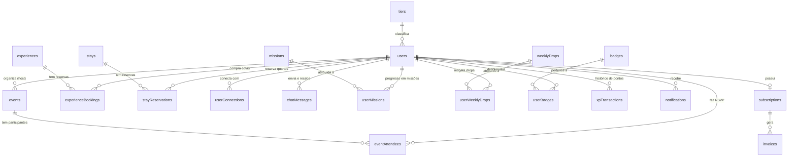

# Modelagem de Banco de Dados Sugerida (Database Schemas & ERD)

Este documento descreve a estrutura de tabelas, relacionamentos e tipos de dados recomendados para o banco de dados relacional (PostgreSQL) do backend, derivados diretamente das necessidades e interfaces do frontend da plataforma **ClubKey**.

---

## 🗺️ Diagrama de Relacionamentos (ERD)

---

## 🗄️ Esquemas de Tabelas Sugeridos

### 1. `users` (Membros & Associados)
| Coluna (camelCase) | Tipo | Descrição |
| :--- | :--- | :--- |
| `id` | `SERIAL` ou `UUID` (PK) | Identificador do membro |
| `firstName` | `VARCHAR(100)` | Primeiro nome do membro |
| `lastName` | `VARCHAR(100)` | Sobrenome do membro |
| `email` | `VARCHAR(255)` (Unique) | E-mail corporativo |
| `passwordHash` | `VARCHAR(255)` | Hash da senha (bcrypt/argon2) |
| `role` | `VARCHAR(100)` | Cargo (ex: `"Founder & CEO"`) |
| `company` | `VARCHAR(100)` | Empresa (ex: `"FinTech Capital"`) |
| `city` | `VARCHAR(100)` | Cidade |
| `avatar` | `TEXT` | URL da foto de perfil |
| `coverImage` | `TEXT` | URL do banner de capa |
| `bio` | `TEXT` | Biografia do membro |
| `membershipTier` | `VARCHAR(50)` | Nome do tier em português (`"Membro"`, `"Associado"`, `"Titular"`, `"Investidor"`, `"Incorporador"`, `"Patrono"`) |
| `tierId` | `VARCHAR(50)` | Identificador do tier (`"membro"`, `"associado"`, `"titular"`, `"investidor"`, `"incorporador"`, `"patrono"`) |
| `memberSince` | `VARCHAR(20)` | Ano de adesão (ex: `"2021"`) |
| `xp` | `INTEGER` (Default: 0) | Saldo total de XP acumulado |
| `ribTokens` | `INTEGER` (Default: 0) | Saldo de Tokens RIB |
| `seeking` | `TEXT[]` | O que está buscando no networking (ex: `["AgroTech", "Deals Seed"]`) |
| `offering` | `TEXT[]` | O que tem a oferecer no networking (ex: `["Investimentos", "Venture Capital"]`) |
| `linkedin` | `VARCHAR(255)` | URL do LinkedIn |
| `instagram` | `VARCHAR(255)` | Usuário do Instagram |
| `phone` | `VARCHAR(50)` | Telefone / WhatsApp |
| `nationality` | `VARCHAR(20)` | `"brasileiro"` ou `"estrangeiro"` |
| `cpf` | `VARCHAR(20)` | CPF do associado |
| `birthDate` | `VARCHAR(20)` | Data de nascimento |
| `companyName` | `VARCHAR(150)` | Razão social da empresa |
| `cnpj` | `VARCHAR(25)` | CNPJ da empresa |
| `corporateEmail` | `VARCHAR(255)` | E-mail corporativo |
| `openingDate` | `VARCHAR(20)` | Data de fundação da empresa |
| `twoFactorEnabled` | `BOOLEAN` | Se 2FA está ativo |
| `inviteCode` | `VARCHAR(50)` | Código exclusivo de convite do membro |
| `usedInviteCode` | `VARCHAR(50)` | Código de convite utilizado no cadastro (se houver) |
| `createdAt` | `TIMESTAMP` | Data de cadastro |

---

### 2. `events` (Eventos)
| Coluna (camelCase) | Tipo | Descrição |
| :--- | :--- | :--- |
| `id` | `SERIAL` (PK) | Identificador do evento |
| `organizerId` | `INTEGER` (FK) | Membro anfitrião / Host (`users.id`) |
| `title` | `VARCHAR(200)` | Nome do evento |
| `category` | `VARCHAR(50)` | `"networking"`, `"keynote"`, `"exclusive"`, `"gastronomy"` |
| `date` | `VARCHAR(50)` | Data formatada (ex: `"24 Out 2026"`) |
| `startTime` | `VARCHAR(20)` | Horário de início (ex: `"19:30"`) |
| `endTime` | `VARCHAR(20)` | Horário de término (ex: `"22:30"`) |
| `location` | `VARCHAR(200)` | Local do evento |
| `image` | `TEXT` | Imagem de capa |
| `description` | `TEXT` | Descrição resumida |
| `fullDescription` | `TEXT` | Descrição detalhada |
| `capacity` | `INTEGER` | Capacidade máxima de vagas |
| `initialConfirmed`| `INTEGER` | Quantidade inicial de confirmações |
| `participants` | `INTEGER[]` | IDs dos membros confirmados (`users.id`) |
| `dressCode` | `VARCHAR(100)` | Traje sugerido (ex: `"Passeio Completo / Traje Executivo"`) |
| `format` | `VARCHAR(100)` | Formato do evento (ex: `"Jantar Exclusivo & Mesa Redonda"`) |
| `highlights` | `JSONB` | Destaques da programação (`[{"title": "...", "desc": "..."}]`) |
| `inclusions` | `TEXT[]` | Itens inclusos no evento |
| `xpReward` | `INTEGER` | XP ganho ao participar (ex: `250`) |
| `ribTokensReward`| `INTEGER` | Tokens RIB ganhos (se aplicável) |
| `isExclusive` | `BOOLEAN` | Exclusivo para determinados tiers |
| `minTierId` | `VARCHAR(50)` | Tier mínimo exigido (opcional) |
| `createdAt` | `TIMESTAMP` | Data de criação |

---

### 3. `eventAttendees` (Inscrições / RSVP de Eventos)
| Coluna (camelCase) | Tipo | Descrição |
| :--- | :--- | :--- |
| `id` | `SERIAL` (PK) | Identificador da inscrição |
| `eventId` | `INTEGER` (FK) | Evento (`events.id`) |
| `userId` | `INTEGER` (FK) | Membro (`users.id`) |
| `status` | `VARCHAR(20)` | `"confirmed"`, `"waitlist"`, `"attended"`, `"cancelled"` |
| `confirmedAt` | `TIMESTAMP` | Data do RSVP |

---

### 4. `experiences` (Experiências & Lifestyle)
| Coluna (camelCase) | Tipo | Descrição |
| :--- | :--- | :--- |
| `id` | `SERIAL` (PK) | Identificador |
| `title` | `VARCHAR(200)` | Título |
| `sub` | `VARCHAR(100)` | Subtítulo / Duração / Vagas (ex: `"Jantar para 8"`, `"Três dias"`) |
| `category` | `VARCHAR(50)` | `"wine"`, `"gastronomy"`, `"lifestyle"`, `"art"` |
| `date` | `VARCHAR(50)` | Data |
| `time` | `VARCHAR(20)` | Horário |
| `location` | `VARCHAR(200)` | Localização |
| `image` | `TEXT` | Imagem principal |
| `description` | `TEXT` | Resumo |
| `fullDescription` | `TEXT` | Descrição completa |
| `includes` | `TEXT[]` | Lista de itens inclusos na experiência |
| `participants` | `INTEGER[]` | IDs dos membros com vaga garantida (`users.id`) |
| `price` | `NUMERIC(10,2)` | Valor por cota (em BRL) |
| `ribTokensCost` | `INTEGER` | Preço em RIB Tokens (se aplicável) |
| `capacity` | `INTEGER` | Vagas totais |
| `xpReward` | `INTEGER` | XP por participação |
| `createdAt` | `TIMESTAMP` | Data de criação |

---

### 5. `experienceBookings` (Compras de Experiências)
| Coluna (camelCase) | Tipo | Descrição |
| :--- | :--- | :--- |
| `id` | `SERIAL` (PK) | Identificador da compra |
| `experienceId` | `INTEGER` (FK) | Experiência comprada (`experiences.id`) |
| `userId` | `INTEGER` (FK) | Membro comprador (`users.id`) |
| `paymentMethod` | `VARCHAR(20)` | `"pix"`, `"credit_card"`, `"rib_tokens"` |
| `status` | `VARCHAR(20)` | `"confirmed"`, `"pending"`, `"cancelled"` |
| `amountPaid` | `NUMERIC(10,2)` | Valor total pago |
| `createdAt` | `TIMESTAMP` | Data da compra |

---

### 6. `stays` (Acomodações / Quartos)
| Coluna (camelCase) | Tipo | Descrição |
| :--- | :--- | :--- |
| `id` | `SERIAL` (PK) | Identificador do quarto |
| `title` | `VARCHAR(150)` | Nome da suíte |
| `roomType` | `VARCHAR(50)` | `"master_suite"`, `"executive_room"`, `"villa"` |
| `city` | `VARCHAR(100)` | Cidade da acomodação (ex: `"Gramado"`, `"Campos do Jordão"`) |
| `state` | `VARCHAR(10)` | Sigla do estado (ex: `"RS"`, `"SP"`) |
| `location` | `VARCHAR(200)` | Endereço / Localização descritiva |
| `description` | `TEXT` | Detalhes da acomodação |
| `pricePerNight` | `NUMERIC(10,2)` | Diária regular (preço cheio) |
| `memberPricePerNight` | `NUMERIC(10,2)` | Diária exclusiva de associado ClubKey |
| `memberDiscountPercent` | `INTEGER` | Desconto percentual para membros (ex: `20`) |
| `capacityGuests` | `INTEGER` | Limite máximo de hóspedes |
| `rating` | `NUMERIC(3,2)` | Nota média de avaliação (ex: `4.9`) |
| `images` | `TEXT[]` | Galeria de fotos |
| `amenities` | `TEXT[]` | Comodidades (Wi-Fi, Jacuzzi, Ar-condicionado, etc.) |

---

### 7. `stayReservations` (Reservas de Membro)
| Coluna (camelCase) | Tipo | Descrição |
| :--- | :--- | :--- |
| `id` | `VARCHAR(50)` (PK) | Ex: `"res-01"`, `"stay-res-001"` |
| `userId` | `INTEGER` (FK) | Membro hóspede (`users.id`) |
| `stayId` | `INTEGER` (FK) | Acomodação reservada (`stays.id`) |
| `stayName` | `VARCHAR(150)` | Nome da acomodação |
| `location` | `VARCHAR(150)` | Localização |
| `checkIn` | `VARCHAR(50)` | Data de Check-in |
| `checkOut` | `VARCHAR(50)` | Data de Check-out |
| `nights` | `INTEGER` | Quantidade de diárias |
| `guests` | `INTEGER` | Número de hóspedes |
| `roomType` | `VARCHAR(150)` | Tipo de quarto / Suíte |
| `status` | `VARCHAR(20)` | `"confirmed"`, `"pending"`, `"completed"`, `"cancelled"` |
| `confirmationCode`| `VARCHAR(50)` | Código do voucher (ex: `"CK-STAY-8821"`) |
| `totalPrice` | `NUMERIC(10,2)` | Valor total |
| `image` | `TEXT` | Foto da suíte |
| `createdAt` | `TIMESTAMP` | Data da reserva |

---

### 8. `benefits` (Benefícios & Parcerias)
| Coluna (camelCase) | Tipo | Descrição |
| :--- | :--- | :--- |
| `id` | `SERIAL` (PK) | Identificador |
| `partnerName` | `VARCHAR(150)` | Nome do parceiro |
| `partnerLogo` | `TEXT` | Logotipo do parceiro |
| `category` | `VARCHAR(50)` | `"gastronomy"`, `"mobility"`, `"lifestyle"`, `"wellness"` |
| `title` | `VARCHAR(200)` | Título do benefício |
| `discountBadge` | `VARCHAR(50)` | Ex: `"20% OFF"`, `"Isenção Rolha"` |
| `description` | `TEXT` | Regras e descrição |
| `redemptionType`| `VARCHAR(50)` | `"coupon"`, `"qr_code"`, `"direct_show"` |
| `couponCode` | `VARCHAR(50)` | Código promocional (se houver) |
| `validUntil` | `VARCHAR(50)` | Data de validade |

---

### 9. `userConnections` (Rede de Networking)
| Coluna (camelCase) | Tipo | Descrição |
| :--- | :--- | :--- |
| `id` | `SERIAL` (PK) | Identificador |
| `requesterId` | `INTEGER` (FK) | Membro que solicitou (`users.id`) |
| `receiverId` | `INTEGER` (FK) | Membro que recebeu (`users.id`) |
| `status` | `VARCHAR(20)` | `"pending"`, `"connected"`, `"declined"`, `"blocked"` |
| `createdAt` | `TIMESTAMP` | Data do pedido |
| `updatedAt` | `TIMESTAMP` | Data de aceitação |

---

### 10. `missions` & `userMissions` (KeyPass Missões)
| Coluna (camelCase) | Tipo | Descrição |
| :--- | :--- | :--- |
| `id` | `VARCHAR(50)` (PK) | Ex: `"mission-1"`, `"mission-profile-complete"` |
| `title` | `VARCHAR(150)` | Título da missão |
| `description` | `TEXT` | Regras de cumprimento |
| `category` | `VARCHAR(50)` | `"events"`, `"networking"`, `"stays"`, `"profile"`, `"ranking"` |
| `xpReward` | `INTEGER` | XP concedido |
| `tokensReward` | `INTEGER` | Tokens concedidos |
| `totalRequired` | `INTEGER` | Quantidade meta (ex: `3` conexões) |
| `actionUrl` | `VARCHAR(255)` | Rota de atalho no front (ex: `"/conexoes"`) |
| `actionLabel` | `VARCHAR(100)` | Label do botão (ex: `"Explorar Membros"`) |

**`userMissions`**:
| Coluna (camelCase) | Tipo | Descrição |
| :--- | :--- | :--- |
| `userId` | `INTEGER` (FK) | Membro (`users.id`) |
| `missionId` | `VARCHAR(50)` (FK) | Missão (`missions.id`) |
| `currentProgress`| `INTEGER` | Progresso atual (ex: `2` de `3`) |
| `isCompleted` | `BOOLEAN` | Se atingiu a meta |
| `isClaimed` | `BOOLEAN` | Se já resgatou o prêmio |
| `claimedAt` | `TIMESTAMP` | Data de resgate |

---

### 11. `weeklyDrops` & `userWeeklyDrops` (KeyPass Drops Semanais)
| Coluna (camelCase) | Tipo | Descrição |
| :--- | :--- | :--- |
| `id` | `VARCHAR(50)` (PK) | Ex: `"drop-w42-networking"`, `"drop-w43-events"` |
| `title` | `VARCHAR(150)` | Título do drop semanal |
| `description` | `TEXT` | Descrição do objetivo do drop |
| `category` | `VARCHAR(50)` | `"estadias"`, `"eventos"`, `"experiencias"`, `"networking"`, `"especial"` |
| `xpReward` | `INTEGER` | XP concedido no resgate |
| `tokensReward` | `INTEGER` | Tokens RIB concedidos no resgate |
| `totalRequired` | `INTEGER` | Meta do drop |
| `actionUrl` | `VARCHAR(255)` | Rota associada |
| `actionLabel` | `VARCHAR(100)` | Label do botão de ação |
| `expiresAt` | `TIMESTAMP` | Data de encerramento do ciclo semanal |

**`userWeeklyDrops`**:
| Coluna (camelCase) | Tipo | Descrição |
| :--- | :--- | :--- |
| `userId` | `INTEGER` (FK) | Membro (`users.id`) |
| `dropId` | `VARCHAR(50)` (FK) | Drop semanal (`weeklyDrops.id`) |
| `currentProgress`| `INTEGER` | Progresso atual (ex: `1` de `1`) |
| `isCompleted` | `BOOLEAN` | Se a meta do drop foi cumprida |
| `isClaimed` | `BOOLEAN` | Se o membro resgatou o drop |
| `claimedAt` | `TIMESTAMP` | Data de resgate |

---

### 12. `badges` & `userBadges` (Conquistas / Insígnias)
| Coluna (camelCase) | Tipo | Descrição |
| :--- | :--- | :--- |
| `id` | `VARCHAR(50)` (PK) | Ex: `"badge_early_adopter"`, `"badge_blindagem_digital"` |
| `name` | `VARCHAR(100)` | Nome da insígnia |
| `description` | `TEXT` | Requisito de conquista |
| `iconName` | `VARCHAR(50)` | Nome do ícone Phosphor (ex: `"ShieldCheck"`, `"Wine"`, `"Sparkle"`, `"Compass"`) |
| `category` | `VARCHAR(50)` | `"pioneer"`, `"security"`, `"engagement"`, `"influence"` |
| `xpReward` | `INTEGER` | XP concedido ao desbloquear |

**`userBadges`**:
| Coluna (camelCase) | Tipo | Descrição |
| :--- | :--- | :--- |
| `userId` | `INTEGER` (FK) | Membro (`users.id`) |
| `badgeId` | `VARCHAR(50)` (FK) | Insígnia (`badges.id`) |
| `unlockedAt` | `TIMESTAMP` | Data e hora em que foi conquistada |

---

### 13. `xpTransactions` (Extrato de Atividades)
| Coluna (camelCase) | Tipo | Descrição |
| :--- | :--- | :--- |
| `id` | `SERIAL` (PK) | Identificador |
| `userId` | `INTEGER` (FK) | Membro (`users.id`) |
| `type` | `VARCHAR(50)` | `"event"`, `"stay"`, `"connection"`, `"mission"`, `"drop"`, `"bonus"` |
| `title` | `VARCHAR(150)` | Título no extrato |
| `category` | `VARCHAR(50)` | Categoria da atividade |
| `xp` | `INTEGER` | XP creditado (ex: `+250`) |
| `tokens` | `INTEGER` | Tokens creditados (ex: `+2`) |
| `createdAt` | `TIMESTAMP` | Data e hora do crédito |

---

### 14. `chatMessages` (Mensagens Diretas)
| Coluna (camelCase) | Tipo | Descrição |
| :--- | :--- | :--- |
| `id` | `SERIAL` (PK) | Identificador da mensagem |
| `senderId` | `INTEGER` (FK) | Remetente (`users.id`) |
| `receiverId` | `INTEGER` (FK) | Destinatário (`users.id`) |
| `text` | `TEXT` | Conteúdo da mensagem de texto |
| `isRead` | `BOOLEAN` | Status de leitura |
| `createdAt` | `TIMESTAMP` | Data e hora de envio |

---

### 15. `tiers` (Tiers & Patamares Executivos)
| Coluna (camelCase) | Tipo | Descrição |
| :--- | :--- | :--- |
| `id` | `VARCHAR(50)` (PK) | `"membro"`, `"associado"`, `"titular"`, `"investidor"`, `"incorporador"`, `"patrono"` |
| `orderIndex` | `INTEGER` | Ordem de progressão (`1` a `6`) |
| `name` | `VARCHAR(100)` | Nome do tier em português (`"Membro"`, `"Associado"`, `"Titular"`, `"Investidor"`, `"Incorporador"`, `"Patrono"`) |
| `subtitle` | `VARCHAR(150)` | Subtítulo / Lema institucional |
| `minXp` | `INTEGER` | XP mínimo para entrada |
| `maxXp` | `INTEGER` | XP máximo (ou `NULL` para o Patrono) |
| `image` | `TEXT` | URL do emblema 3D (`/utils/gamification/tiers/0X_tier.webp`) |
| `color` | `VARCHAR(20)` | Código Hex da cor do tier (ex: `"#3B82F6"`) |
| `badgeColor` | `VARCHAR(20)` | Variante do Badge Bloom UI (`"default"`, `"primary"`, `"success"`, `"warning"`, `"accent"`, `"danger"`) |
| `description` | `TEXT` | Descrição detalhada do patamar |
| `perks` | `TEXT[]` | Lista de benefícios, vantagens e descontos cumulativos |
| `isProtectedBase` | `BOOLEAN` | Se possui proteção contra rebaixamento (True para Membro e Associado) |
| `isSpecialPinnacle`| `BOOLEAN` | Se é o título especial singular (True para Patrono) |

---

### 16. `notifications` (Notificações do Sistema & Interações)
| Coluna (camelCase) | Tipo | Descrição |
| :--- | :--- | :--- |
| `id` | `VARCHAR(50)` (PK) | Identificador da notificação (ex: `"notif-001"`) |
| `userId` | `INTEGER` (FK) | Membro destinatário (`users.id`) |
| `senderId` | `INTEGER` (FK) | Membro remetente (opcional, `users.id`) |
| `type` | `VARCHAR(50)` | `"connection_request"`, `"chat_message"`, `"event_reminder"`, `"stay_update"`, `"keypass_drop"`, `"system"` |
| `title` | `VARCHAR(150)` | Título do alerta |
| `message` | `TEXT` | Mensagem detalhada |
| `actionUrl` | `VARCHAR(255)` | Rota de redirecionamento no front (se aplicável) |
| `isRead` | `BOOLEAN` (Default: false) | Status de leitura |
| `metadata` | `JSONB` | Dados adicionais (`memberId`, `eventId`, `stayId`, `dropId`, `unreadCount`) |
| `createdAt` | `TIMESTAMP` | Data e hora do disparo |

---

### 17. `subscriptions` (Planos & Assinaturas dos Membros)
| Coluna (camelCase) | Tipo | Descrição |
| :--- | :--- | :--- |
| `id` | `VARCHAR(50)` (PK) | Identificador da assinatura (ex: `"sub-01"`, `"sub_ck_9921"`) |
| `userId` | `INTEGER` (FK) | Membro assinante (`users.id`) |
| `planName` | `VARCHAR(100)` | Nome do plano (ex: `"ClubKey Member"`, `"Plano Anual VIP"`) |
| `planType` | `VARCHAR(50)` | `"monthly"`, `"annual"` |
| `status` | `VARCHAR(50)` | `"active"`, `"past_due"`, `"canceled"`, `"trialing"` |
| `price` | `NUMERIC(10,2)` | Valor recorrente (ex: `19.90` ou `214.90`) |
| `billingCycle` | `VARCHAR(50)` | `"mensal"`, `"anual"` |
| `currentPeriodStart`| `TIMESTAMP` | Início do ciclo de faturamento atual |
| `currentPeriodEnd` | `TIMESTAMP` | Data da próxima renovação ou expiração |
| `cancelAtPeriodEnd` | `BOOLEAN` | Se o cancelamento foi agendado para o fim do período |
| `cardBrand` | `VARCHAR(50)` | Bandeira do cartão ativo (ex: `"Mastercard"`, `"Visa"`) |
| `cardLastFour` | `VARCHAR(4)` | Últimos 4 dígitos do cartão (ex: `"4242"`) |
| `cardExpiry` | `VARCHAR(10)` | Validade do cartão (ex: `"12/28"`) |
| `createdAt` | `TIMESTAMP` | Data de contratação |
| `updatedAt` | `TIMESTAMP` | Data da última alteração |

---

### 18. `invoices` (Faturas & Histórico de Cobrança)
| Coluna (camelCase) | Tipo | Descrição |
| :--- | :--- | :--- |
| `id` | `VARCHAR(50)` (PK) | Identificador da fatura (ex: `"inv-2026-01"`) |
| `subscriptionId` | `VARCHAR(50)` (FK) | Assinatura vinculada (`subscriptions.id`) |
| `userId` | `INTEGER` (FK) | Membro pagador (`users.id`) |
| `amount` | `NUMERIC(10,2)` | Valor cobrado na fatura |
| `status` | `VARCHAR(50)` | `"paid"`, `"pending"`, `"failed"`, `"refunded"` |
| `paymentMethod` | `VARCHAR(50)` | `"credit_card"`, `"pix"` |
| `invoiceDate` | `TIMESTAMP` | Data de emissão da fatura |
| `paidAt` | `TIMESTAMP` | Data da confirmação do pagamento |
| `pdfUrl` | `TEXT` | URL pública ou assinada para download do recibo em PDF |

