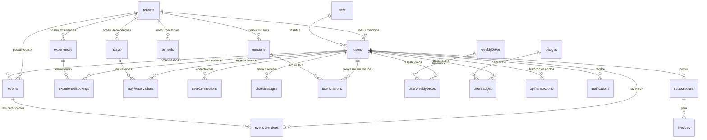

# Modelagem de Banco de Dados Sugerida (Database Schemas & ERD)

Este documento descreve a estrutura de tabelas, relacionamentos, chaves e tipos de dados recomendados para o banco de dados relacional (PostgreSQL) do backend, derivados diretamente das necessidades, interfaces e requisitos **White-Label Multi-Tenant** da plataforma.

---

## 🗺️ Diagrama de Relacionamentos (ERD)

---

## 🏢 Isolamento Multi-Tenant no Banco de Dados

Para suportar o sistema White-Label onde múltiplos clubes operam simultaneamente (ex: `clubkey`, `viverde`):
1. **Coluna `tenantId`**: Tabelas mestras (`users`, `events`, `stays`, `experiences`, `benefits`, `missions`, `weeklyDrops`, `subscriptions`) contêm a coluna `tenantId VARCHAR(50)` indexada.
2. **Consultas Escopadas**: Todas as consultas do backend devem filtrar automaticamente por `tenantId` correspondente ao cabeçalho `X-Tenant-ID` ou claim JWT da requisição.

---

## 🗄️ Esquemas de Tabelas Sugeridos

### 1. `users` (Membros & Associados)
| Coluna (camelCase) | Tipo | Descrição |
| :--- | :--- | :--- |
| `id` | `SERIAL` ou `UUID` (PK) | Identificador do membro |
| `tenantId` | `VARCHAR(50)` (FK) | Identificador do clube (`"clubkey"`, `"viverde"`) |
| `firstName` | `VARCHAR(100)` | Primeiro nome do membro |
| `lastName` | `VARCHAR(100)` | Sobrenome do membro |
| `email` | `VARCHAR(255)` (Unique por tenant) | E-mail corporativo |
| `passwordHash` | `VARCHAR(255)` | Hash da senha (bcrypt/argon2) |
| `role` | `VARCHAR(100)` | Cargo (ex: `"Founder & CEO"`) |
| `company` | `VARCHAR(100)` | Empresa (ex: `"FinTech Capital"`) |
| `city` | `VARCHAR(100)` | Cidade |
| `avatar` | `TEXT` | URL da foto de perfil |
| `coverImage` | `TEXT` | URL do banner de capa |
| `bio` | `TEXT` | Biografia do membro |
| `membershipTier` | `VARCHAR(50)` | Nome do tier (`"Membro"`, `"Associado"`, `"Titular"`, `"Investidor"`, `"Incorporador"`, `"Patrono"`) |
| `tierId` | `VARCHAR(50)` | Identificador do tier (`"membro"`, `"associado"`, etc.) |
| `memberSince` | `VARCHAR(20)` | Ano de adesão (ex: `"2024"`) |
| `xp` | `INTEGER` (Default: 0) | Saldo total de XP acumulado |
| `ribTokens` | `INTEGER` (Default: 0) | Saldo de Tokens RIB |
| `seeking` | `TEXT[]` | Tags de busca no networking |
| `offering` | `TEXT[]` | Tags de oferta no networking |
| `linkedin` | `VARCHAR(255)` | URL do LinkedIn |
| `instagram` | `VARCHAR(255)` | Usuário do Instagram |
| `phone` | `VARCHAR(50)` | Telefone / WhatsApp |
| `twoFactorEnabled` | `BOOLEAN` | Se 2FA está ativo |
| `createdAt` | `TIMESTAMP` | Data de cadastro |

---

### 2. `events` (Eventos)
| Coluna (camelCase) | Tipo | Descrição |
| :--- | :--- | :--- |
| `id` | `SERIAL` (PK) | Identificador do evento |
| `tenantId` | `VARCHAR(50)` | Clube (`"clubkey"`, etc.) |
| `organizerId` | `INTEGER` (FK) | Membro anfitrião / Host (`users.id`) |
| `title` | `VARCHAR(200)` | Nome do evento |
| `category` | `VARCHAR(50)` | `"networking"`, `"keynote"`, `"exclusive"`, `"gastronomy"` |
| `date` | `VARCHAR(50)` | Data formatada (ex: `"24 Out 2026"`) |
| `startTime` | `VARCHAR(20)` | Horário de início |
| `endTime` | `VARCHAR(20)` | Horário de término |
| `location` | `VARCHAR(200)` | Local do evento |
| `image` | `TEXT` | Imagem de capa |
| `description` | `TEXT` | Descrição resumida |
| `fullDescription` | `TEXT` | Descrição detalhada |
| `capacity` | `INTEGER` | Capacidade máxima de vagas |
| `initialConfirmed`| `INTEGER` | Confirmações iniciais |
| `participants` | `INTEGER[]` | IDs dos membros confirmados (`users.id`) |
| `dressCode` | `VARCHAR(100)` | Traje sugerido |
| `format` | `VARCHAR(100)` | Formato do evento |
| `highlights` | `JSONB` | Destaques da programação |
| `inclusions` | `TEXT[]` | Itens inclusos |
| `xpReward` | `INTEGER` | XP concedido |
| `ribTokensReward`| `INTEGER` | Tokens RIB concedidos |
| `isExclusive` | `BOOLEAN` | Exclusivo por tier |
| `minTierId` | `VARCHAR(50)` | Tier mínimo exigido |

---

### 3. `eventAttendees` (Inscrições / RSVP)
| Coluna (camelCase) | Tipo | Descrição |
| :--- | :--- | :--- |
| `id` | `SERIAL` (PK) | Identificador da inscrição |
| `eventId` | `INTEGER` (FK) | Evento (`events.id`) |
| `userId` | `INTEGER` (FK) | Membro (`users.id`) |
| `status` | `VARCHAR(20)` | `"confirmed"`, `"waitlist"`, `"cancelled"` |
| `confirmedAt` | `TIMESTAMP` | Data do RSVP |

---

### 4. `experiences` & `experienceBookings` (Experiências)
| Coluna (camelCase) | Tipo | Descrição |
| :--- | :--- | :--- |
| `id` | `SERIAL` (PK) | Identificador da experiência |
| `tenantId` | `VARCHAR(50)` | Clube |
| `title` | `VARCHAR(200)` | Título |
| `category` | `VARCHAR(50)` | `"wine"`, `"gastronomy"`, `"lifestyle"`, `"art"` |
| `price` | `NUMERIC(10,2)` | Valor por cota (BRL) |
| `ribTokensCost` | `INTEGER` | Custo opcional em Tokens RIB |
| `capacity` | `INTEGER` | Vagas totais |
| `xpReward` | `INTEGER` | XP por participação |

---

### 5. `stays` & `stayReservations` (Hospedagens)
| Coluna (camelCase) | Tipo | Descrição |
| :--- | :--- | :--- |
| `id` | `SERIAL` (PK) | Identificador do quarto |
| `tenantId` | `VARCHAR(50)` | Clube (`"clubkey"`, `"viverde"`) |
| `title` | `VARCHAR(150)` | Nome da suíte/vila |
| `roomType` | `VARCHAR(50)` | `"master_suite"`, `"executive_room"`, `"villa"` |
| `city` | `VARCHAR(100)` | Cidade |
| `state` | `VARCHAR(10)` | Estado |
| `pricePerNight` | `NUMERIC(10,2)` | Diária regular |
| `capacityGuests` | `INTEGER` | Limite de hóspedes |
| `images` | `TEXT[]` | Galeria de fotos |
| `amenities` | `TEXT[]` | Comodidades |

---

### 6. `benefits` (Benefícios)
| Coluna (camelCase) | Tipo | Descrição |
| :--- | :--- | :--- |
| `id` | `SERIAL` (PK) | Identificador |
| `tenantId` | `VARCHAR(50)` | Clube |
| `partnerName` | `VARCHAR(150)` | Nome do parceiro |
| `category` | `VARCHAR(50)` | `"gastronomy"`, `"mobility"`, `"lifestyle"`, `"wellness"` |
| `discountBadge` | `VARCHAR(50)` | Ex: `"20% OFF"` |
| `couponCode` | `VARCHAR(50)` | Cupom de desconto |
| `validUntil` | `VARCHAR(50)` | Data de validade |

---

### 7. `userConnections` & `chatMessages` (Networking & Chat)
| Coluna (camelCase) | Tipo | Descrição |
| :--- | :--- | :--- |
| `id` | `SERIAL` (PK) | Identificador |
| `requesterId` | `INTEGER` (FK) | Membro solicitante (`users.id`) |
| `receiverId` | `INTEGER` (FK) | Membro destinatário (`users.id`) |
| `status` | `VARCHAR(20)` | `"pending"`, `"connected"`, `"declined"` |

---

### 8. `missions`, `weeklyDrops`, `badges`, `xpTransactions` & `tiers` (KeyPass)
| Coluna (camelCase) | Tipo | Descrição |
| :--- | :--- | :--- |
| `id` | `VARCHAR(50)` (PK) | Identificador canônico da entidade |
| `tenantId` | `VARCHAR(50)` | Clube (`"clubkey"`) |
| `xpReward` | `INTEGER` | Pontos de XP concedidos |
| `tokensReward` | `INTEGER` | Tokens RIB concedidos |

---

### 9. `subscriptions` & `invoices` (Assinaturas)
| Coluna (camelCase) | Tipo | Descrição |
| :--- | :--- | :--- |
| `id` | `VARCHAR(50)` (PK) | Identificador da assinatura |
| `tenantId` | `VARCHAR(50)` | Clube |
| `userId` | `INTEGER` (FK) | Membro assinante (`users.id`) |
| `planName` | `VARCHAR(100)` | Nome do plano |
| `status` | `VARCHAR(50)` | `"active"`, `"past_due"`, `"canceled"` |
| `price` | `NUMERIC(10,2)` | Valor recorrente |
| `currentPeriodEnd` | `TIMESTAMP` | Próxima renovação |
