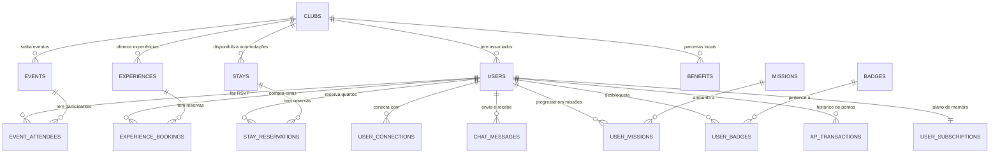

# Modelagem de Banco de Dados Sugerida (Database Schemas & ERD)

Este documento descreve a estrutura de tabelas, relacionamentos e tipos de dados recomendados para o banco de dados relacional (PostgreSQL) do backend, derivados diretamente das necessidades e interfaces do frontend.

---

## 🗺️ Diagrama de Relacionamentos (ERD)

---

## 🗄️ Esquemas de Tabelas Sugeridos

### 1. `clubs` (Sedes & Clubes)
| Coluna | Tipo | Descrição |
| :--- | :--- | :--- |
| `id` | `VARCHAR(50)` (PK) | Ex: `"club-sp"`, `"club-rio"`, `"club-curitiba"` |
| `name` | `VARCHAR(100)` | Nome do clube (ex: `"ClubKey São Paulo"`) |
| `city` | `VARCHAR(100)` | Cidade (ex: `"São Paulo"`) |
| `state` | `VARCHAR(10)` | Sigla do estado (ex: `"SP"`) |
| `address` | `TEXT` | Endereço completo |
| `created_at` | `TIMESTAMP` | Data de criação |

---

### 2. `users` (Membros & Associados)
| Coluna | Tipo | Descrição |
| :--- | :--- | :--- |
| `id` | `SERIAL` ou `UUID` (PK) | Identificador do membro |
| `email` | `VARCHAR(255)` (Unique) | E-mail corporativo |
| `password_hash` | `VARCHAR(255)` | Hash da senha (bcrypt/argon2) |
| `name` | `VARCHAR(150)` | Nome completo |
| `role` | `VARCHAR(100)` | Cargo (ex: `"Founder & CEO"`) |
| `company` | `VARCHAR(100)` | Empresa (ex: `"FinTech Capital"`) |
| `city` | `VARCHAR(100)` | Cidade |
| `avatar` | `TEXT` | URL da foto de perfil |
| `cover_image` | `TEXT` | URL do banner de capa |
| `bio` | `TEXT` | Biografia do membro |
| `membership_tier` | `VARCHAR(50)` | `"founding_member"`, `"patrono"`, `"conselheiro"`, etc. |
| `tier_id` | `VARCHAR(50)` | `"aspirante"`, `"membro"`, `"fellow"`, `"chanceler"`, `"embaixador"`, `"patrono"` |
| `member_since` | `VARCHAR(20)` | Ex: `"2024"` |
| `active_club_id` | `VARCHAR(50)` (FK) | Clube principal do membro |
| `xp` | `INTEGER` (Default: 0) | Saldo total de XP acumulado |
| `rib_tokens` | `INTEGER` (Default: 0) | Saldo de Tokens RIB |
| `seeking_tags` | `TEXT[]` | O que está buscando no networking |
| `offering_tags` | `TEXT[]` | O que tem a oferecer no networking |
| `linkedin` | `VARCHAR(255)` | URL do LinkedIn |
| `instagram` | `VARCHAR(255)` | Usuário do Instagram |
| `phone` | `VARCHAR(50)` | Telefone / WhatsApp |
| `two_factor_enabled` | `BOOLEAN` | Se 2FA está ativo |
| `profile_visibility` | `VARCHAR(20)` | `"public"`, `"members_only"`, `"connections_only"` |
| `allow_messages` | `VARCHAR(20)` | `"everyone"`, `"connections_only"`, `"none"` |
| `show_activity_status`| `BOOLEAN` | Mostrar status online |
| `created_at` | `TIMESTAMP` | Data de cadastro |

---

### 3. `events` (Eventos)
| Coluna | Tipo | Descrição |
| :--- | :--- | :--- |
| `id` | `SERIAL` (PK) | Identificador do evento |
| `club_id` | `VARCHAR(50)` (FK) | Clube que sedia |
| `title` | `VARCHAR(200)` | Nome do evento |
| `category` | `VARCHAR(50)` | `"networking"`, `"keynote"`, `"exclusive"`, `"gastronomy"` |
| `date` | `VARCHAR(50)` | Data formatada (ex: `"24 Out 2026"`) |
| `start_time` | `VARCHAR(20)` | Horário de início (ex: `"19:30"`) |
| `end_time` | `VARCHAR(20)` | Horário de término (ex: `"22:30"`) |
| `location` | `VARCHAR(200)` | Local do evento |
| `image` | `TEXT` | Imagem de capa |
| `description` | `TEXT` | Descrição resumida |
| `full_description` | `TEXT` | Descrição detalhada |
| `capacity` | `INTEGER` | Capacidade máxima de vagas |
| `xp_reward` | `INTEGER` | XP ganho ao participar (ex: `250`) |
| `rib_tokens_reward`| `INTEGER` | Tokens RIB ganhos (ex: `1`) |
| `is_exclusive` | `BOOLEAN` | Exclusivo para determinados tiers |
| `min_tier_id` | `VARCHAR(50)` | Tier mínimo exigido (opcional) |
| `created_at` | `TIMESTAMP` | Data de criação |

---

### 4. `event_attendees` (Inscrições / RSVP de Eventos)
| Coluna | Tipo | Descrição |
| :--- | :--- | :--- |
| `id` | `SERIAL` (PK) | Identificador da inscrição |
| `event_id` | `INTEGER` (FK) | Evento |
| `user_id` | `INTEGER` (FK) | Membro |
| `status` | `VARCHAR(20)` | `"confirmed"`, `"waitlist"`, `"attended"`, `"cancelled"` |
| `confirmed_at` | `TIMESTAMP` | Data do RSVP |

---

### 5. `experiences` (Experiências & Lifestyle)
| Coluna | Tipo | Descrição |
| :--- | :--- | :--- |
| `id` | `SERIAL` (PK) | Identificador |
| `club_id` | `VARCHAR(50)` (FK) | Clube |
| `title` | `VARCHAR(200)` | Título |
| `category` | `VARCHAR(50)` | `"wine"`, `"gastronomy"`, `"lifestyle"`, `"art"` |
| `date` | `VARCHAR(50)` | Data |
| `time` | `VARCHAR(20)` | Horário |
| `location` | `VARCHAR(200)` | Localização |
| `image` | `TEXT` | Imagem principal |
| `description` | `TEXT` | Resumo |
| `full_description` | `TEXT` | Descrição completa |
| `price` | `NUMERIC(10,2)` | Valor por cota (em BRL) |
| `rib_tokens_cost` | `INTEGER` | Preço em RIB Tokens (se aplicável) |
| `capacity` | `INTEGER` | Vagas totais |
| `xp_reward` | `INTEGER` | XP por participação |
| `created_at` | `TIMESTAMP` | Data de criação |

---

### 6. `experience_bookings` (Compras de Experiências)
| Coluna | Tipo | Descrição |
| :--- | :--- | :--- |
| `id` | `SERIAL` (PK) | Identificador da compra |
| `experience_id` | `INTEGER` (FK) | Experiência comprada |
| `user_id` | `INTEGER` (FK) | Membro comprador |
| `payment_method` | `VARCHAR(20)` | `"pix"`, `"credit_card"`, `"rib_tokens"` |
| `status` | `VARCHAR(20)` | `"confirmed"`, `"pending"`, `"cancelled"` |
| `amount_paid` | `NUMERIC(10,2)` | Valor total pago |
| `created_at` | `TIMESTAMP` | Data da compra |

---

### 7. `stays` (Acomodações / Quartos)
| Coluna | Tipo | Descrição |
| :--- | :--- | :--- |
| `id` | `SERIAL` (PK) | Identificador do quarto |
| `club_id` | `VARCHAR(50)` (FK) | Clube |
| `title` | `VARCHAR(150)` | Nome da suíte |
| `room_type` | `VARCHAR(50)` | `"master_suite"`, `"executive_room"`, `"villa"` |
| `description` | `TEXT` | Detalhes |
| `price_per_night` | `NUMERIC(10,2)` | Diária |
| `capacity_guests` | `INTEGER` | Limite de hóspedes |
| `images` | `TEXT[]` | Galeria de fotos |
| `amenities` | `TEXT[]` | Comodidades (Wi-Fi, Jacuzzi, etc.) |

---

### 8. `stay_reservations` (Reservas de Membro)
| Coluna | Tipo | Descrição |
| :--- | :--- | :--- |
| `id` | `VARCHAR(50)` (PK) | Ex: `"stay-res-001"` |
| `user_id` | `INTEGER` (FK) | Membro hóspede |
| `stay_name` | `VARCHAR(150)` | Nome da acomodação |
| `location` | `VARCHAR(150)` | Localização |
| `check_in` | `VARCHAR(50)` | Data de Check-in |
| `check_out` | `VARCHAR(50)` | Data de Check-out |
| `guests` | `INTEGER` | Número de hóspedes |
| `status` | `VARCHAR(20)` | `"confirmed"`, `"completed"`, `"cancelled"` |
| `confirmation_code`| `VARCHAR(50)` | Código do voucher (ex: `"CK-STAY-8821"`) |
| `total_price` | `NUMERIC(10,2)` | Valor total |
| `image` | `TEXT` | Foto da suíte |
| `created_at` | `TIMESTAMP` | Data da reserva |

---

### 9. `benefits` (Benefícios & Parcerias)
| Coluna | Tipo | Descrição |
| :--- | :--- | :--- |
| `id` | `SERIAL` (PK) | Identificador |
| `club_id` | `VARCHAR(50)` (FK) | Clube |
| `partner_name` | `VARCHAR(150)` | Nome do parceiro |
| `partner_logo` | `TEXT` | Logotipo do parceiro |
| `category` | `VARCHAR(50)` | `"gastronomy"`, `"mobility"`, `"lifestyle"`, `"wellness"` |
| `title` | `VARCHAR(200)` | Título do benefício |
| `discount_badge` | `VARCHAR(50)` | Ex: `"20% OFF"`, `"Isenção Rolha"` |
| `description` | `TEXT` | Regras e descrição |
| `redemption_type`| `VARCHAR(50)` | `"coupon"`, `"qr_code"`, `"direct_show"` |
| `coupon_code` | `VARCHAR(50)` | Código promocional (se houver) |
| `valid_until` | `VARCHAR(50)` | Data de validade |

---

### 10. `user_connections` (Rede de Networking)
| Coluna | Tipo | Descrição |
| :--- | :--- | :--- |
| `id` | `SERIAL` (PK) | Identificador |
| `requester_id` | `INTEGER` (FK) | Membro que solicitou |
| `receiver_id` | `INTEGER` (FK) | Membro que recebeu |
| `status` | `VARCHAR(20)` | `"pending"`, `"connected"`, `"declined"`, `"blocked"` |
| `created_at` | `TIMESTAMP` | Data do pedido |
| `updated_at` | `TIMESTAMP` | Data de aceitação |

---

### 11. `missions` & `user_missions` (KeyPass Missões)
| Coluna | Tipo | Descrição |
| :--- | :--- | :--- |
| `id` | `VARCHAR(50)` (PK) | Ex: `"mission-1"`, `"mission-profile-complete"` |
| `title` | `VARCHAR(150)` | Título da missão |
| `description` | `TEXT` | Regras de cumprimento |
| `category` | `VARCHAR(50)` | `"events"`, `"networking"`, `"stays"`, `"profile"`, `"ranking"` |
| `xp_reward` | `INTEGER` | XP concedido |
| `tokens_reward` | `INTEGER` | Tokens concedidos |
| `total_required` | `INTEGER` | Quantidade meta (ex: `3` conexões) |
| `action_url` | `VARCHAR(255)` | Rota de atalho no front (ex: `"/conexoes"`) |
| `action_label` | `VARCHAR(100)` | Label do botão (ex: `"Explorar Membros"`) |

**`user_missions`**:
| Coluna | Tipo | Descrição |
| :--- | :--- | :--- |
| `user_id` | `INTEGER` (FK) | Membro |
| `mission_id` | `VARCHAR(50)` (FK) | Missão |
| `current_progress`| `INTEGER` | Progresso atual (ex: `2` de `3`) |
| `is_completed` | `BOOLEAN` | Se atingiu a meta |
| `is_claimed` | `BOOLEAN` | Se já resgatou o prêmio |
| `claimed_at` | `TIMESTAMP` | Data de resgate |

---

### 12. `badges` & `user_badges` (Conquistas / Insígnias)
| Coluna | Tipo | Descrição |
| :--- | :--- | :--- |
| `id` | `VARCHAR(50)` (PK) | Ex: `"badge-first-event"`, `"badge-networker-pro"` |
| `name` | `VARCHAR(100)` | Nome da insígnia |
| `description` | `TEXT` | Como desbloquear |
| `category` | `VARCHAR(50)` | `"events"`, `"networking"`, `"stays"`, `"special"` |
| `icon_name` | `VARCHAR(50)` | Nome do ícone |
| `image_url` | `TEXT` | Imagem da insígnia |
| `xp_reward` | `INTEGER` | XP ganho |

**`user_badges`**:
| Coluna | Tipo | Descrição |
| :--- | :--- | :--- |
| `user_id` | `INTEGER` (FK) | Membro |
| `badge_id` | `VARCHAR(50)` (FK) | Insígnia |
| `unlocked_at` | `TIMESTAMP` | Data do desbloqueio |

---

### 13. `xp_transactions` (Extrato de Atividades)
| Coluna | Tipo | Descrição |
| :--- | :--- | :--- |
| `id` | `SERIAL` (PK) | Identificador |
| `user_id` | `INTEGER` (FK) | Membro |
| `title` | `VARCHAR(150)` | Descrição da atividade |
| `amount` | `INTEGER` | Quantidade de XP (+ ou -) |
| `category` | `VARCHAR(50)` | `"event"`, `"networking"`, `"stay"`, `"bonus"`, `"mission"` |
| `tokens_bonus` | `INTEGER` | Bônus de RIB tokens |
| `created_at` | `TIMESTAMP` | Data/hora da pontuação |

---

### 14. `chat_messages` (Mensagens Diretas)
| Coluna | Tipo | Descrição |
| :--- | :--- | :--- |
| `id` | `SERIAL` (PK) | Identificador |
| `sender_id` | `INTEGER` (FK) | Membro remetente |
| `receiver_id` | `INTEGER` (FK) | Membro destinatário |
| `text` | `TEXT` | Conteúdo da mensagem |
| `is_read` | `BOOLEAN` | Status de leitura |
| `created_at` | `TIMESTAMP` | Data e hora de envio |
