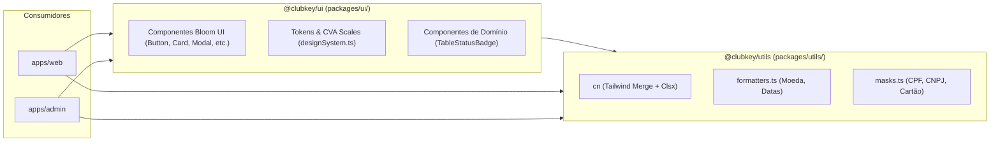

# Especificação do Design System & Diretrizes Visuais (Bloom UI)

Este documento detalha o sistema de design, convenções de interface, tokens visuais, tipografia e diretrizes de estilização adotadas em todo o ecossistema **ClubKey Monorepo**, centralizadas no pacote compartilhado **`@clubkey/ui`** (`packages/ui/`) e utilitários em **`@clubkey/utils`** (`packages/utils/`).

---

## 🎨 Diretrizes Estritas de Tema Neutro (Neutral Theme Policy)

A identidade visual da plataforma segue um padrão **executivo, sóbrio e minimalista**:

1. **Superfícies de Cards & Contêineres**:
   - **Modo Claro (Light Mode)**: Deve ser **estritamente branco puro** (`bg-white`), com bordas sutis em cinza neutro (`border-zinc-200`).
   - **Modo Escuro (Dark Mode)**: Deve ser **estritamente cinza neutro profundo** (`bg-zinc-900`, `dark:bg-zinc-900`, bordas `border-zinc-200`, `dark:border-zinc-800`).
2. **Proscrição de Contêineres Azulados ou Coloridos**:
   - É **proibido** utilizar contêineres, painéis ou cards com fundos azulados, azuis-petróleo ou tingidos.
3. **Aplicação das Cores de Destaque**:
   - A cor primária da marca (injetada dinamicamente via variáveis CSS por preset) e cores semânticas (`emerald`, `amber`, `red`) devem ser aplicadas **exclusivamente** em tipografia/títulos, ícones de status, badges, tags e acentos. As superfícies permanecem rigorosamente neutras.

---

## 📦 Arquitetura de Pacotes do Design System



---

## 📐 Escalas de Tokens de Design (CVA Scale)

Centralizado em [`packages/ui/src/lib/designSystem.ts`](file:///c:/Users/Guilherme/Desktop/ID/clubkey/packages/ui/src/lib/designSystem.ts):

### 1. Escala de Tamanhos (`BloomSize`)
| Token | Padding & Altura | Tipografia | Uso Recomendado |
| :--- | :--- | :--- | :--- |
| `"xs"` | `px-2 py-1 h-6` | `text-xs` | Badges compactos, tags secundárias |
| `"sm"` | `px-3 py-1.5 h-7` | `text-sm` | Botões de ação secundária, filtros |
| `"md"` | `px-4 py-2 h-9` | `text-sm` | Tamanho padrão de botões e inputs |
| `"lg"` | `px-5 py-2.5 h-11` | `text-base` | Ações de destaque, botões principais |
| `"xl"` | `px-6 py-3 h-12` | `text-lg` | Botões de hero e checkout |
| `"2xl"`| `px-7 py-3.5 h-14` | `text-xl` | Banners promocionais |
| `"3xl"`| `px-8 py-4 h-16` | `text-2xl` | Chamadas de alto impacto |

### 2. Escala de Raios de Borda (`BloomRadius`)
- `"none"`: `rounded-none`
- `"xs"`: `rounded-xs`
- `"sm"`: `rounded-sm` *(Padrão executivo de cards e botões)*
- `"md"`: `rounded-md`
- `"lg"`: `rounded-lg`
- `"xl"`: `rounded-xl`
- `"2xl"`: `rounded-2xl`
- `"3xl"`: `rounded-3xl`
- `"full"`: `rounded-full` *(Pílulas de status, tags e avatares)*

### 3. Paleta de Cores Semânticas (`BloomColor`)
- `"default"`: Zinco neutro (`zinc-900` / `zinc-100`)
- `"primary"`: Cor primária dinâmica do tenant (`var(--brand-primary)`)
- `"secondary"`: Tom escuro institucional (`#141416` / `#161616`)
- `"accent"`: Magenta / Rosa executivo para destaques
- `"success"`: Verde Esmeralda (`emerald-500`) para aprovações e confirmações
- `"warning"`: Âmbar / Laranja (`amber-500`) para alertas e pendências
- `"danger"`: Vermelho Carmesim (`red-500`) para cancelamentos e erros

### 4. Variantes de Componentes (`BloomVariant`)
- `"default"`: Fundo sólido com contraste total.
- `"bordered"`: Fundo transparente com borda destacada.
- `"light"`: Fundo transparente com realce sutil no hover.
- `"flat"`: Fundo com opacidade suave (10% a 20%) e texto saturado.
- `"ghost"`: Sem borda ou fundo até a interação do cursor.
- `"shadow"`: Fundo sólido com projeção de sombra difusa.
- `"link"`: Estilização de hiperlink inline com sublinhado.

---

## 🏷️ Componente `TableStatusBadge` (`@clubkey/ui`)

O componente `TableStatusBadge` ([`packages/ui/src/components/tableStatusBadge.tsx`](file:///c:/Users/Guilherme/Desktop/ID/clubkey/packages/ui/src/components/tableStatusBadge.tsx)) é o padrão institucional para exibição de status, cargos de governança e indicadores de segurança:

- **Dot Indicator**: Ponto circular de cor saturada correspondente à variante.
- **Marca D'água Opcional (`watermarkIcon`)**: Ícone temático renderizado com opacidade reduzida ao fundo da badge (ex: ícone `Crown` para `SUPER ADMIN`, ícone `ShieldCheck` para `2FA Ativo`).
- **Variantes Semânticas**:
  - `"emerald"`: Status ativo, aprovado, 2FA habilitado.
  - `"amber"`: Pendente, em análise, moderação.
  - `"rose"`: Cancelado, bloqueado, inativo.
  - `"blue"`: Informativo, processando.
  - `"zinc"`: Neutro, arquivado, padrão.
  - `"purple"`: Especial, Super Admin, VIP.

### Exemplo de Uso:

```tsx
import { TableStatusBadge } from "@clubkey/ui"
import { Crown, ShieldCheck } from "@phosphor-icons/react"

// Badge de Cargo Executivo com Marca D'água
<TableStatusBadge
  variant="purple"
  label="SUPER ADMIN"
  watermarkIcon={Crown}
/>

// Badge de Segurança 2FA com Marca D'água
<TableStatusBadge
  variant="emerald"
  label="2FA Ativo"
  watermarkIcon={ShieldCheck}
/>
```

---

## 🎨 Injeção Dinâmica de Variáveis CSS por Marca

Para garantir que o Design System reaja instantaneamente ao preset da marca ativa em tempo de execução sem recarregar bundles externos:

```css
:root {
  --primary: var(--brand-primary);
  --brand-primary: #FF6847;          /* Cor Primária Ativa */
  --brand-primary-hover: #E85535;    /* Cor de Hover */
  --brand-primary-light: #FFF0ED;    /* Fundo Translúcido Claro */
  --brand-secondary: #141416;        /* Cor Secundária / Neutro */
  --selection-bg: rgba(255, 104, 71, 0.2);
  --selection-text: #FF6847;
}
```

---

## 🛠️ Utilitários de Interface, Formatação & Máscaras (`@clubkey/utils`)

### 1. Formatadores (`packages/utils/src/formatters.ts`)
- `formatCurrency(value, options)`: Formata valores monetários no padrão brasileiro (`R$ 1.850,00`).
- `formatBRL(amount)`: Formata inteiros em moeda sem centavos (`R$ 1.850`).
- `formatShortDate(date, options)`: Formata datas abreviadas (`24 Out 2026`).
- `formatDateRange(start, end)`: Formata intervalos de datas para reservas (`14 Nov — 18 Nov`).
- `formatNumber(value)`: Formata números com separador de milhar (`16.850`).

### 2. Máscaras (`packages/utils/src/masks.ts`)
- `maskCpf(value)`: Aplica máscara de CPF (`000.000.000-00`).
- `maskCnpj(value)`: Aplica máscara de CNPJ (`00.000.000/0000-00`).
- `maskDate(value)`: Aplica máscara de data (`DD/MM/AAAA`).
- `maskCardNumber(value)`: Agrupa dígitos do cartão em blocos de 4 (`0000 0000 0000 0000`).
- `maskCardExpiry(value)`: Formata validade do cartão (`MM/AA`).
- `maskCvv(value)`: Limita CVV a 3 ou 4 dígitos numéricos.
