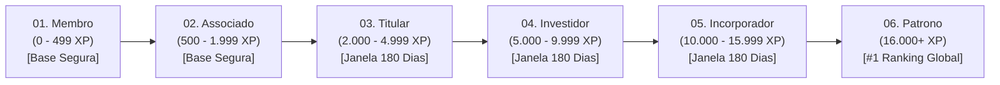

# Manual de Regras de Negócio & Algoritmos de Gamificação (KeyPass)

Este documento descreve detalhadamente o funcionamento dos motores de cálculo de **XP**, **Tiers de Associação**, **Tokens RIB**, **Marcos Intermediários**, **Drops Semanais** e **Retenção de Tiers** do ecossistema **ClubKey**.

---

## 1. 🌟 Os Pilares do Sistema KeyPass

O KeyPass é estruturado em 3 moedas/patrimônios do membro:
1. **XP (Experience Points)**: Pontos de experiência acumulativos que determinam a posição no ranking e a qualificação para os Tiers. **O saldo total de XP nunca é zerado**.
2. **Tiers (Patamares)**: Níveis hierárquicos institucionais (do Tier 01 Membro ao Tier 06 Patrono) que destravam descontos progressivos em estadias (até 35% OFF), atendimento prioritário, deal flow e acessos VIP.
3. **Tokens RIB**: Moeda premium de recompensa recebida ao subir de tier (+2 RIB), ao completar marcos (+0.5 RIB) ou via drops especiais. Pode ser utilizada para abater valores na compra de experiências ou estadias.

---

## 2. 📊 Tabela Oficial de Ações & Concessão de XP

Sempre que um associado realizar uma ação qualificadora na plataforma, o backend deve criar um registro em `xpTransactions`, somar o XP em `users.xp` e disparar a verificação de subida de nível:

| Ação do Membro | Categoria | XP Concedido | Tokens RIB Bônus | Condição de Disparo |
| :--- | :--- | :--- | :--- | :--- |
| **Cadastro Inicial de Membro** | `onboarding` | `+250 XP` | `0` | Conclusão dos dados de perfil |
| **Ativação do 2FA (Dois Fatores)** | `onboarding` | `+250 XP` | `0` | Primeiro 2FA ativo (+ Insígnia *Blindagem Digital*) |
| **Conexão Bilateral Aceita** | `conexao` | `+50 XP` | `0` | Concedido a **ambos** os participantes |
| **RSVP em Evento Regular** | `evento` | `+200 XP` | `0` | Confirmação de presença em evento |
| **RSVP em Evento Especial/Mesa** | `evento` | `+350 XP` | `0` | Eventos com tag de destaque |
| **Reserva Concluída de Estadia** | `hospedagem`| `+300 XP` | `0` | Confirmação da reserva de acomodação |
| **Compra de Cota de Experiência** | `experiencia`| `+250 XP` | `0` | Checkout aprovado de experiência |
| **Resgate de Missão Cumprida** | `missao` | `+250 a +500 XP` | `0 a 1 RIB` | Conforme definido em `missions.xpReward` |
| **Resgate de Drop Semanal** | `bonus` | `+250 a +500 XP` | `0 a 1 RIB` | Conforme definido em `weeklyDrops.xpReward` |
| **Promoção de Tier (Level Up)** | `bonus` | `0` (XP de base) | `+2 RIB` | Disparado automaticamente ao subir de tier |
| **Desbloqueio de Marco (1 a 4)**| `bonus` | `0` | `+0.5 RIB` | Disparado ao resgatar o marco intermediário |

---

## 3. 🏛️ Progressão dos 6 Tiers Oficiais



### Detalhamento por Patamar:

1. **Tier 01 — Membro (`membro`)**:
   - **Faixa de XP**: 0 a 499 XP
   - **Status**: **Base Segura Protegida** (Sem risco de rebaixamento).
   - **Benefícios**: Acesso básico ao catálogo de acomodações, diretório de membros e visualização de eventos.
2. **Tier 02 — Associado (`associado`)**:
   - **Faixa de XP**: 500 a 1.999 XP
   - **Status**: **Base Segura Protegida** (Sem risco de rebaixamento).
   - **Benefícios**: Tarifas com até 20% OFF em estadias, confirmação em eventos regulares, conexões bilaterais e +2 Tokens RIB na promoção.
3. **Tier 03 — Titular (`titular`)**:
   - **Faixa de XP**: 2.000 a 4.999 XP
   - **Status**: Ciclo de atividade de 180 dias.
   - **Benefícios**: Tarifas com até 25% OFF, prioridade em listas de espera, jantares fechados, atendimento exclusivo e +2 Tokens RIB na promoção.
4. **Tier 04 — Investidor (`investidor`)**:
   - **Faixa de XP**: 5.000 a 9.999 XP
   - **Status**: Ciclo de atividade de 180 dias.
   - **Benefícios**: Tarifas com até 30% OFF, reuniões de deal flow e co-investimento, suporte VIP dedicado 24/7 e +2 Tokens RIB na promoção.
5. **Tier 05 — Incorporador (`incorporador`)**:
   - **Faixa de XP**: 10.000 a 15.999 XP
   - **Status**: Patamar máximo por pontuação. Ciclo de atividade de 180 dias.
   - **Benefícios**: Desconto máximo de até 35% OFF em estadias, acesso irrestrito a regatas e vivências, canal direto com os fundadores, mesa cativa anual e +2 Tokens RIB na promoção.
6. **Tier 06 — Patrono (`patrono`)**:
   - **Requisito**: Membro com a **posição #1 no Ranking Geral Global** com mais de 16.000 XP acumulados.
   - **Status**: Título supremo singular e dinâmico (recalculado em tempo real).
   - **Benefícios**: Insígnia suprema dourada em todo o ecossistema, cota especial de +5 Tokens RIB por trimestre, acesso livre a propriedades VIP e destaque fixo no Hall da Fama.

---

## 4. 🔄 Algoritmo de Cálculo de Tier (`getTierByXp`)

A função que calcula o tier ativo de um associado obedece à seguinte lógica de precedência:

```typescript
function calculateUserTier(params: {
  xp: number,
  isGlobalRankOne: boolean,
  isTierFrozen: boolean,
  claimedMilestones: Record<string, boolean>
}): TierId {
  // 1. Regra do Patrono: se for #1 do ranking global com >= 16.000 XP
  if (params.isGlobalRankOne && params.xp >= 16000) {
    return "patrono"
  }

  // 2. Regra de Congelamento por Inatividade: se inativo há > 180 dias e tiver tier Titular+
  if (params.isTierFrozen && params.xp >= 2000) {
    return "associado" // Opera temporariamente como associado até realizar 1 ação
  }

  // 3. Regra de Progressão Regular por XP e Marcos
  const checkMilestones = (tierId: string) => 
    [1, 2, 3, 4].every(idx => Boolean(params.claimedMilestones[`${tierId}_${idx}`]))

  if (params.xp >= 10000) {
    return checkMilestones("investidor") ? "incorporador" : "investidor"
  }
  if (params.xp >= 5000) {
    return checkMilestones("titular") ? "investidor" : "titular"
  }
  if (params.xp >= 2000) {
    return checkMilestones("associado") ? "titular" : "associado"
  }
  if (params.xp >= 500) {
    return checkMilestones("membro") ? "associado" : "membro"
  }
  return "membro"
}
```

---

## 5. 🎯 Sistema de Marcos Intermediários (Milestones)

Para manter o membro altamente engajado mesmo durante a jornada de acúmulo de XP entre um tier e outro:
- Cada Tier possui **4 marcos intermediários** (25%, 50%, 75% e 100% da faixa de XP).
- Cada marco resgatado concede **`+0.5 Token RIB`** diretamente na carteira do associado.
- Os marcos são gravados no array/JSON `claimedMilestones` no formato: `"${tierId}_${milestoneIndex}"` (ex: `"membro_1"`, `"membro_2"`, `"associado_3"`).

---

## 6. ⏱️ Regra de Retenção de 180 Dias & Descongelamento Imediato

1. **Base Vitalícia Protegida**: Os tiers **Membro (01)** e **Associado (02)** nunca sofrem rebaixamento ou congelamento.
2. **Ciclo de Manutenção (Titular, Investidor, Incorporador)**:
   - O membro deve realizar ao menos **1 atividade qualificadora** (reserva de estadia, presença em evento, compra de experiência ou aceite de conexão) a cada **180 dias**.
   - Se permanecer inativo por mais de 180 dias, o atributo `isTierFrozen` passa para `true`. O usuário mantém seu histórico de XP e Tokens RIB intactos, mas seu nível ativo desce temporariamente para **Associado**.
3. **Descongelamento Instantâneo**:
   - No instante em que o membro realiza **qualquer nova ação**, o backend seta `isTierFrozen = false` e restaura instantaneamente o seu Tier pleno com todas as vantagens máximas.

---

## 7. 🎁 Drops Semanais (Weekly Drops)

- Ciclos semanais com prazo de expiração (contagem regressiva em segundos).
- Apresentam desafios rotativos com altas recompensas de XP e Tokens RIB.
- Ao atingir a meta (`currentProgress >= totalRequired`), o status `isCompleted` torna-se `true` e o botão *"Resgatar Recompensa"* é habilitado.
- O resgate seta `isClaimed = true`, credita o XP/Tokens e gera o registro no extrato `xpTransactions`.
