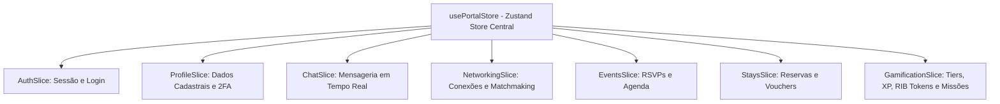
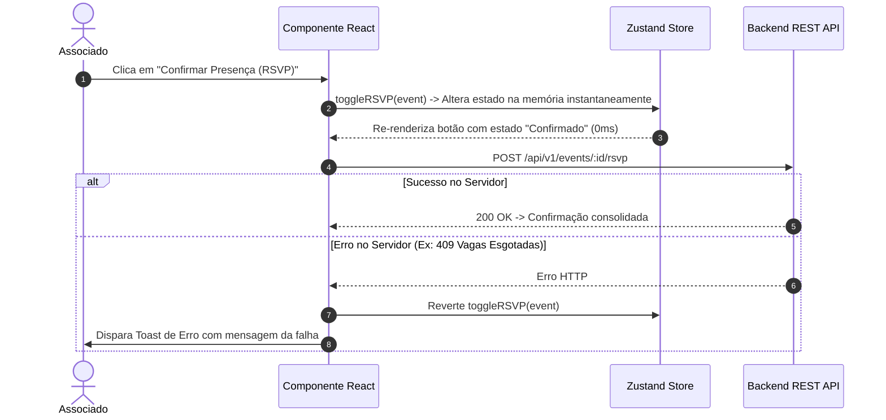

# Arquitetura de Gerenciamento de Estado (State Management & Slices)

Este documento descreve a arquitetura, convenções e funcionamento do **Gerenciamento de Estado Global** do frontend, construído sobre o **Zustand 5**, com tipagem estrita em TypeScript, modularização via **Slice Pattern** e persistência local sincronizada e isolada por tenant.

---

## 🧭 Visão Geral & Decisões de Arquitetura

O estado global do portal centraliza a sessão do associado, preferências, interações em tempo real (chat), progresso no KeyPass, reservas de estadias e agenda de eventos:

- **Biblioteca**: `zustand` (versão 5.x) + `zustand/middleware` (`persist`).
- **Padrão de Projeto**: **Slice Pattern** (decomposição por domínio de negócio), assegurando os princípios **Single Responsibility Principle (SRP)** e **Interface Segregation Principle (ISP)**.
- **Isolamento Multi-Tenant**: O storage local é escopado pelo ID da marca ativa (`${brandConfig.id}-portal-storage-v9`), garantindo que dados de sessão de um tenant não colidam com os de outro no mesmo navegador.
- **Resiliência e Migração**: Função `migrate` e hook `onRehydrateStorage` para tratar upgrades de versão do schema e fallbacks seguros para valores padrão.

---

## 🏛️ Composição Modular do Store (`PortalState`)

O store principal em [`src/store/usePortalStore.ts`](file:///c:/Users/Guilherme/Desktop/ID/clubkey/src/store/usePortalStore.ts) compõe **7 fatias modulares** localizadas em `src/store/slices/`:



### Definição do Tipo Global:

```typescript
export type PortalState = AuthSlice &
  ProfileSlice &
  ChatSlice &
  NetworkingSlice &
  EventsSlice &
  StaysSlice &
  GamificationSlice
```

---

## 🧩 Detalhamento das Fatias de Domínio (Slices)

### 1. `AuthSlice` (`src/store/slices/authSlice.ts`)
Gerencia o estado de autenticação, tokens de acesso e credenciais da sessão.
- **State**:
  - `isAuthenticated: boolean` (se o associado está autenticado)
  - `authToken: string | null` (token JWT de sessão)
- **Actions**:
  - `login(payload: LoginPayload): void`
  - `logout(): void`
  - `setAuthenticated(status: boolean): void`

---

### 2. `ProfileSlice` (`src/store/slices/profileSlice.ts`)
Centraliza os dados cadastrais do membro logado, tags de networking e segurança.
- **State**:
  - `userProfile: UserProfile` (dados pessoais, cargo, empresa, cidade, bio, avatar, capa)
  - `is2FAEnabled: boolean` (status da autenticação em dois fatores)
- **Actions**:
  - `updateUserProfile(updates: Partial<UserProfile>): void`
  - `toggle2FA(enabled: boolean): void`
  - `updateNetworkingTags(seeking: string[], offering: string[]): void`

---

### 3. `ChatSlice` (`src/store/slices/chatSlice.ts`)
Controla o mensageiro instantâneo flutuante e histórico de conversas diretas.
- **State**:
  - `chatMessages: ChatMessage[]` (histórico de mensagens)
  - `activeChatMemberId: number | null` (ID do membro com conversa aberta no momento)
  - `isChatOpen: boolean` (se a janela do chat está expandida)
  - `isChatMinimized: boolean` (se a janela está minimizada na barra inferior)
- **Actions**:
  - `openChat(memberId: number): void`
  - `closeChat(): void`
  - `minimizeChat(minimized: boolean): void`
  - `sendMessage(receiverId: number, text: string): void`
  - `markMessagesAsRead(senderId: number): void`

---

### 4. `NetworkingSlice` (`src/store/slices/networkingSlice.ts`)
Gerencia o grafo social de relacionamentos entre membros.
- **State**:
  - `connectedMembers: Record<number, "pending" | "connected">` (mapa de status de conexão indexado por `memberId`)
  - `receivedInvites: number[]` (IDs dos membros com solicitações pendentes de aprovação)
- **Actions**:
  - `sendConnectionRequest(memberId: number): void`
  - `acceptConnectionRequest(memberId: number): void`
  - `removeConnection(memberId: number): void`
  - `getConnectionStatus(memberId: number): MemberConnectionStatus`

---

### 5. `EventsSlice` (`src/store/slices/eventsSlice.ts`)
Controla inscrições em eventos, confirmações de presença e agenda pessoal.
- **State**:
  - `myEvents: UserEventRSVP[]` (lista de eventos com presença confirmada)
  - `confirmedEventIds: number[]` (array rápido de IDs de eventos confirmados)
- **Actions**:
  - `toggleRSVP(event: EventSummary): boolean`
  - `cancelEventRSVP(eventId: number): void`
  - `isEventConfirmed(eventId: number): boolean`

---

### 6. `StaysSlice` (`src/store/slices/staysSlice.ts`)
Gerencia reservas ativas de acomodações, vouchers e histórico de hospedagens.
- **State**:
  - `memberStays: StayReservation[]` (reservas confirmadas, em análise ou concluídas)
  - `favoriteStayIds: (string | number)[]` (acomodações marcadas como favoritas)
- **Actions**:
  - `addStayReservation(reservation: StayReservation): void`
  - `cancelStayReservation(reservationId: string): void`
  - `toggleFavoriteStay(stayId: string | number): void`

---

### 7. `GamificationSlice` (`src/store/slices/gamificationSlice.ts`)
Motor de pontuação do KeyPass, saldo de XP, Tokens RIB, missões, drops e conquistas.
- **State**:
  - `xp: number` (saldo total de pontos de experiência)
  - `ribTokens: number` (saldo de tokens de recompensa executiva)
  - `missions: MissionItem[]` (missões qualificadoras ativas e histórico de resgates)
  - `weeklyDrops: WeeklyDrop[]` (drops sazonais de pontuação)
  - `badges: BadgeItem[]` (insígnias e conquistas do membro)
  - `claimedMilestones: Record<string, boolean>` (marcos intermediários resgatados)
  - `leaderboardTimeframe: LeaderboardTimeframe` (filtro de ranking ativo)
- **Actions**:
  - `addXp(amount: number, reason: string, category: XpTransactionCategory): void`
  - `addRibTokens(amount: number): void`
  - `claimMissionReward(missionId: string): void`
  - `claimWeeklyDrop(dropId: string): void`
  - `claimMilestone(milestoneKey: string, xpReward: number, tokensReward: number): void`
  - `unlockBadge(badgeId: string): void`

---

## ⚡ Padrão de Atualização Otimista (Optimistic UI)

Para proporcionar uma experiência instantânea e sem atrasos perceptíveis, as mutações de interface no frontend aplicam atualizações otimistas no Zustand Store antes de aguardar a resposta da API:



---

## 🛡️ Melhores Práticas para Consumo do Store

1. **Uso de Seletores Atômicos**: Sempre selecione apenas as propriedades necessárias para evitar re-renderizações desnecessárias:
   ```typescript
   // ✅ RECOMENDADO: Re-renderiza apenas se o saldo de XP mudar
   const xp = usePortalStore((state) => state.xp)
   const addXp = usePortalStore((state) => state.addXp)

   // ❌ EVITAR: Re-renderiza o componente para qualquer alteração no store global
   const store = usePortalStore()
   ```

2. **Desacoplamento em Client Components**: Server Components não possuem acesso ao estado do Zustand. Passe dados iniciais via props para o Client Component correspondente (`...Client.tsx`).
