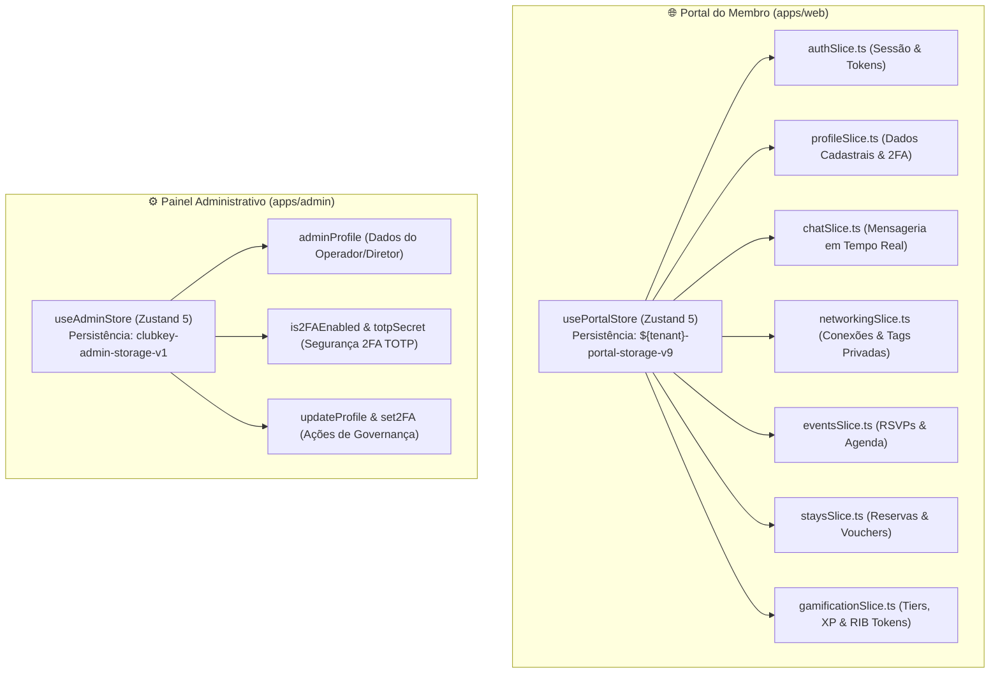

# Arquitetura de Gerenciamento de Estado (State Management & Slices)

Este documento descreve a arquitetura, convenções e funcionamento do **Gerenciamento de Estado Global** no ecossistema **ClubKey Monorepo**, construído sobre o **Zustand 5**, com tipagem estrita em TypeScript, modularização via **Slice Pattern** e persistência local isolada por aplicação e tenant.

---

## 🧭 Visão Geral & Separação por Aplicação

O ecossistema adota stores independentes para cada uma das duas aplicações do monorepo, garantindo isolamento total de responsabilidades, ciclos de vida de sessão distintos e zero contaminação cruzada de dados:


```mermaid
flowchart TD
    subgraph WebApp ["🌐 Portal do Membro (apps/web)"]
        WebStore["usePortalStore (Zustand 5)<br/>Persistência: ${tenant}-portal-storage-v9"]
        WebStore --> S1["authSlice.ts (Sessão & Tokens)"]
        WebStore --> S2["profileSlice.ts (Dados Cadastrais & 2FA)"]
        WebStore --> S3["chatSlice.ts (Mensageria em Tempo Real)"]
        WebStore --> S4["networkingSlice.ts (Conexões & Tags Privadas)"]
        WebStore --> S5["eventsSlice.ts (RSVPs & Agenda)"]
        WebStore --> S6["staysSlice.ts (Reservas & Vouchers)"]
        WebStore --> S7["gamificationSlice.ts (Tiers, XP & RIB Tokens)"]
    end

    subgraph AdminApp ["⚙️ Painel Administrativo (apps/admin)"]
        AdminStore["useAdminStore (Zustand 5)<br/>Persistência: clubkey-admin-storage-v1"]
        AdminStore --> A1["adminProfile (Dados do Operador/Diretor)"]
        AdminStore --> A2["is2FAEnabled & totpSecret (Segurança 2FA TOTP)"]
        AdminStore --> A3["updateProfile & set2FA (Ações de Governança)"]
    end
```

---

## 🌐 1. Estado do Portal do Membro (`apps/web/src/store/usePortalStore.ts`)

O store principal do portal compõe **7 fatias modulares** localizadas em `apps/web/src/store/slices/`:

### Definição do Tipo Composto:

```typescript
export type PortalState = AuthSlice &
  ProfileSlice &
  ChatSlice &
  NetworkingSlice &
  EventsSlice &
  StaysSlice &
  GamificationSlice
```

### Isolamento Multi-Tenant do Storage:
O storage local é nomeado dinamicamente com base no identificador da marca ativa (`${brandConfig.id}-portal-storage-v9`), prevenindo colisões quando um mesmo usuário acessa múltiplos tenants no mesmo navegador.

### Detalhamento das 7 Fatias (Slices):

#### 1. `authSlice.ts`
Gerencia a sessão do membro associado:
- **State**: `isAuthenticated: boolean`, `authToken: string | null`.
- **Actions**: `login(payload)`, `logout()`, `setAuthenticated(status)`.

#### 2. `profileSlice.ts`
Centraliza dados cadastrais, preferências e segurança:
- **State**: `userProfile: UserProfile`, `is2FAEnabled: boolean`.
- **Actions**: `updateUserProfile(updates)`, `toggle2FA(enabled)`, `updateNetworkingTags(seeking, offering)`.

#### 3. `chatSlice.ts`
Controla a mensageria instantânea flutuante entre membros:
- **State**: `chatMessages: ChatMessage[]`, `activeChatMemberId: number | null`, `isChatOpen: boolean`, `isChatMinimized: boolean`.
- **Actions**: `openChat(memberId)`, `closeChat()`, `minimizeChat(minimized)`, `sendMessage(receiverId, text)`, `markMessagesAsRead(senderId)`.

#### 4. `networkingSlice.ts`
Gerencia o grafo social de relacionamentos e etiquetas customizadas:
- **State**: `connectedMembers: Record<number, "pending" | "connected">`, `receivedPendingInvites: number[]`, `customTags: MemberCustomTags`.
- **Actions**: `toggleConnect(memberId)`, `getConnectionStatus(memberId)`, `acceptInvite(memberId)`, `declineInvite(memberId)`, `setMemberCustomTags(memberId, tags)`.

#### 5. `eventsSlice.ts`
Controla RSVPs e ingressos do membro associado:
- **State**: `myEvents: Record<number, { isRsvp: boolean; batchId: number }>`, `eventAttendees: Record<number, number[]>`.
- **Actions**: `toggleEventRsvp(eventId, batchId)`, `getEventStatus(eventId)`.

#### 6. `staysSlice.ts`
Gerencia reservas ativas de vilas e vouchers de hospedagem:
- **State**: `reservations: StayReservation[]`, `activeVoucherId: string | null`.
- **Actions**: `createReservation(stayId, dates, guests)`, `cancelReservation(reservationId)`, `setActiveVoucher(voucherId)`.

#### 7. `gamificationSlice.ts`
Controla a progressão do KeyPass, XP e RIB tokens:
- **State**: `currentTier: TierId`, `currentXp: number`, `ribTokensBalance: number`, `userMissions: Record<string, MissionProgress>`, `weeklyDrops: Record<string, boolean>`.
- **Actions**: `addXp(amount, reason)`, `claimMission(missionId)`, `claimWeeklyDrop(dropId)`, `spendRibTokens(amount)`.

---

## ⚙️ 2. Estado do Painel Administrativo (`apps/admin/src/store/useAdminStore.ts`)

O store do backoffice gerencia a identidade administrativa, controle de acesso e políticas de segurança:

```typescript
export interface AdminProfile {
  id: string
  name: string
  email: string
  role: "SUPER_ADMIN" | "MANAGER" | "CONCIERGE"
  department: string
  avatar: string
  phone: string
  timezone: string
  language: string
  createdAt: string
}

interface AdminState {
  adminProfile: AdminProfile
  is2FAEnabled: boolean
  totpSecret: string
  updateProfile: (data: Partial<AdminProfile>) => void
  set2FA: (enabled: boolean, secret?: string) => void
  resetToMock: () => void
}
```

### Regras de Negócio e Governança do Admin Store:
1. **Governança de Cargo & Departamento**: Os campos `role` e `department` são protegidos contra alteração direta pelo próprio usuário em tela, sendo restritos a rotinas administrativas centrais de governança corporativa.
2. **Ciclo de Vida do 2FA TOTP**: O segredo TOTP (`totpSecret`) é gerado na inicialização e confirmado mediante digitação de código numérico de 6 dígitos no modal de configuração.
3. **Persistência Segura**: Os dados de perfil e estado de 2FA são sincronizados no `localStorage` sob a chave `clubkey-admin-storage-v1`.

---

## 🎯 Padrão de Consumo com Seletores Atômicos

Para garantir alta performance e evitar re-renderizações desnecessárias em componentes React, os componentes devem consumir seletores atômicos:

```tsx
// ✅ Correto: O componente só re-renderiza se o nome do perfil mudar
const userName = usePortalStore((state) => state.userProfile.name)

// ✅ Correto no Admin: Seleciona apenas o status de 2FA
const is2FAEnabled = useAdminStore((state) => state.is2FAEnabled)

// ❌ Incorreto: Desestruturar o store completo causa re-renderizações em qualquer alteração
const { userProfile, is2FAEnabled } = usePortalStore()
```
