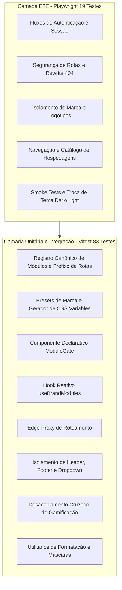

# Estratégia de Testes Automatizados & Pipeline de Qualidade

Este documento detalha a arquitetura de testes, ferramentas, padrões de cobertura e esteira de validação contínua (CI) implementada no ecossistema **ClubKey & White-Label**.

---

## 🧭 Visão Geral & Pirâmide de Testes

A integridade do sistema, a segurança de rotas multi-tenant e a consistência visual são garantidas por uma suíte completa de **102 testes automatizados** divididos em duas camadas complementares:

---

## 🧪 1. Testes Unitários & Integração (Vitest + React Testing Library)

- **Executor**: `vitest run`
- **Ambiente**: `happy-dom`
- **Total**: **83 testes** em **13 arquivos de teste** (`src/__tests__/*.test.{ts,tsx}`).

### Arquivos de Teste & Escopo de Cobertura:

| Arquivo de Teste | Quantidade | Escopo de Validação |
| :--- | :---: | :--- |
| [`modules.test.ts`](file:///c:/Users/Guilherme/Desktop/ID/clubkey/src/__tests__/modules.test.ts) | 24 | Registro dos 7 módulos, validação de `isPathAllowed`, `getModuleByPath` e emissão de erro 404 por `assertModuleEnabled`. |
| [`formatters.test.ts`](file:///c:/Users/Guilherme/Desktop/ID/clubkey/src/__tests__/formatters.test.ts) | 13 | Formatação de moeda BRL (`formatCurrency`, `formatBRL`), datas abreviadas, intervalos de datas e números. |
| [`brandConfig.test.ts`](file:///c:/Users/Guilherme/Desktop/ID/clubkey/src/__tests__/brandConfig.test.ts) | 8 | Resolução de presets de marca (`brandPresets`), fallback seguro para tenant padrão e gerador de variáveis CSS. |
| [`moduleGate.test.tsx`](file:///c:/Users/Guilherme/Desktop/ID/clubkey/src/__tests__/moduleGate.test.tsx) | 7 | Renderização condicional de filhos, supressão de conteúdo para módulos inativos e renderização de fallbacks. |
| [`useBrandModules.test.ts`](file:///c:/Users/Guilherme/Desktop/ID/clubkey/src/__tests__/useBrandModules.test.ts) | 5 | Custom hook `useBrandModules`, verificação de `isModuleEnabled` e lista de `enabledModules`. |
| [`gamificationIsolation.test.tsx`](file:///c:/Users/Guilherme/Desktop/ID/clubkey/src/__tests__/gamificationIsolation.test.tsx) | 5 | Supressão de badges de XP e tiers em perfis quando o módulo `keypass` está inativo. |
| [`proxy.test.ts`](file:///c:/Users/Guilherme/Desktop/ID/clubkey/src/__tests__/proxy.test.ts) | 4 | Edge Proxy (`src/proxy.ts`), bypass de assets estáticos (`/_next`, `/utils`, `/logos`) e rewrite para `/not-found`. |
| [`portalHome.test.tsx`](file:///c:/Users/Guilherme/Desktop/ID/clubkey/src/__tests__/portalHome.test.tsx) | 4 | Composição da página inicial, saudação do usuário e visibilidade estrita de cards por módulo habilitado. |
| [`crossModuleDecoupling.test.tsx`](file:///c:/Users/Guilherme/Desktop/ID/clubkey/src/__tests__/crossModuleDecoupling.test.tsx) | 4 | Desacoplamento entre módulos interdependentes (ex: links de eventos dentro do perfil de membros). |
| [`headerNavigation.test.tsx`](file:///c:/Users/Guilherme/Desktop/ID/clubkey/src/__tests__/headerNavigation.test.tsx) | 3 | Filtragem dinâmica de links no cabeçalho superior conforme matriz de módulos do tenant. |
| [`footerNavigation.test.tsx`](file:///c:/Users/Guilherme/Desktop/ID/clubkey/src/__tests__/footerNavigation.test.tsx) | 3 | Filtragem dinâmica de links no rodapé e exibição de copyright e contatos da marca ativa. |
| [`userDropdownMenu.test.tsx`](file:///c:/Users/Guilherme/Desktop/ID/clubkey/src/__tests__/userDropdownMenu.test.tsx) | 2 | Omissão de atalhos de módulos inativos no menu de perfil do usuário. |
| [`components.test.tsx`](file:///c:/Users/Guilherme/Desktop/ID/clubkey/src/__tests__/components.test.tsx) | 1 | Renderização dos componentes universais de contêiner e layout. |

---

## 🌐 2. Testes Ponta a Ponta (Playwright E2E)

- **Executor**: `playwright test`
- **Navegador**: Chromium (Desktop)
- **Total**: **19 testes** em **5 especificações** (`src/__tests__/e2e/*.spec.ts`).

### Especificações E2E:

1. **[`moduleSecurity.spec.ts`](file:///c:/Users/Guilherme/Desktop/ID/clubkey/src/__tests__/e2e/moduleSecurity.spec.ts)**:
   - Valida que todas as **Rotas Universais Isentas** (`/`, `/entrar`, `/cadastro`, `/assinatura`) respondem com status HTTP 200 OK.
   - Valida que rotas de módulos habilitados são acessadas normalmente.
   - Valida que qualquer tentativa de acesso direto via URL a rotas de módulos desabilitados pelo tenant resulta em bloqueio com página 404 no navegador real.
2. **[`navigationWhiteLabel.spec.ts`](file:///c:/Users/Guilherme/Desktop/ID/clubkey/src/__tests__/e2e/navigationWhiteLabel.spec.ts)**:
   - Valida logotipos dinâmicos no Header, links sociais no Footer e isolamento de rotas inativas.
3. **[`authFlow.spec.ts`](file:///c:/Users/Guilherme/Desktop/ID/clubkey/src/__tests__/e2e/authFlow.spec.ts)**:
   - Fluxo completo de login do associado, validação do painel inicial, verificação do dropdown de usuário e logout.
4. **[`staysCatalog.spec.ts`](file:///c:/Users/Guilherme/Desktop/ID/clubkey/src/__tests__/e2e/staysCatalog.spec.ts)**:
   - Navegação pelo catálogo de hospedagens, filtragem por destino e abertura da página de detalhes.
5. **[`smoke.spec.ts`](file:///c:/Users/Guilherme/Desktop/ID/clubkey/src/__tests__/e2e/smoke.spec.ts)**:
   - Carregamento da aplicação, integridade de assets essenciais e alternância entre tema claro e escuro.

---

## 🚀 Comandos da Suíte de Testes

| Comando | Descrição |
| :--- | :--- |
| `pnpm test` | Executa todos os testes unitários e de integração via **Vitest**. |
| `pnpm test:watch` | Inicia o **Vitest** em modo interativo de observação de arquivos. |
| `pnpm test:e2e` | Executa todos os testes ponta a ponta via **Playwright**. |
| `pnpm test:all` | Executa a **suíte completa** (Vitest + Playwright) em sequência. |
| `pnpm typecheck` | Executa a verificação estrita de tipos do **TypeScript** (`tsc --noEmit`). |
| `pnpm lint` | Executa a análise estática com **ESLint**. |

---

## 🔒 Pipeline de Qualidade & Git Hooks (Husky)

O repositório possui validação automatizada em 3 estágios de Git Hooks:

1. **`pre-commit` (`lint-staged`)**:
   - Dispara automaticamente `eslint --fix` e `prettier --write` exclusivamente nos arquivos estagiados.
2. **`commit-msg` (`commitlint`)**:
   - Força o padrão **Conventional Commits** exclusivamente em **inglês** (`subject-must-be-english`).
3. **`pre-push`**:
   - Executa a sequência obrigatória: `pnpm typecheck && pnpm lint && pnpm lint:secrets && pnpm test`.
   - Impede pushes caso haja qualquer erro de tipagem, lint, credenciais expostas ou testes falhando.
