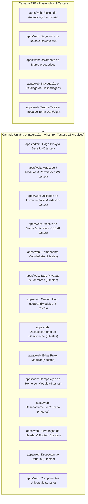

# Estratégia de Testes Automatizados & Pipeline de Qualidade

Este documento detalha a arquitetura de testes, ferramentas, padrões de cobertura e esteira de validação contínua (CI) implementada no ecossistema **ClubKey Monorepo & White-Label**.

---

## 🧭 Visão Geral & Pirâmide de Testes no Monorepo

A integridade do sistema, a segurança de rotas multi-tenant, os controles de sessão administrativa e a consistência visual são garantidos por uma suíte completa de **113 testes automatizados** (94 testes unitários/integração + 19 testes E2E):

```mermaid
flowchart TD
    subgraph E2ELayer ["Camada E2E - Playwright (19 Testes)"]
        E1["apps/web: Fluxos de Autenticação e Sessão"]
        E2["apps/web: Segurança de Rotas e Rewrite 404"]
        E3["apps/web: Isolamento de Marca e Logotipos"]
        E4["apps/web: Navegação e Catálogo de Hospedagens"]
        E5["apps/web: Smoke Tests e Troca de Tema Dark/Light"]
    end

    subgraph UnitLayer ["Camada Unitária e Integração - Vitest (94 Testes / 15 Arquivos)"]
        A_Proxy["apps/admin: Edge Proxy & Sessão (5 testes)"]
        W_Modules["apps/web: Matriz de 7 Módulos & Permissões (24 testes)"]
        W_Format["apps/web: Utilitários de Formatação & Moeda (13 testes)"]
        W_Brand["apps/web: Presets de Marca & Variáveis CSS (8 testes)"]
        W_Gate["apps/web: Componente ModuleGate (7 testes)"]
        W_Tags["apps/web: Tags Privadas de Membros (6 testes)"]
        W_Hook["apps/web: Custom Hook useBrandModules (5 testes)"]
        W_Gami["apps/web: Desacoplamento de Gamificação (5 testes)"]
        W_Proxy["apps/web: Edge Proxy Modular (4 testes)"]
        W_Home["apps/web: Composição da Home por Módulo (4 testes)"]
        W_Cross["apps/web: Desacoplamento Cruzado (4 testes)"]
        W_Nav["apps/web: Navegação de Header & Footer (6 testes)"]
        W_Menu["apps/web: Dropdown de Usuário (2 testes)"]
        W_Comp["apps/web: Componentes Universais (1 teste)"]
    end

    E2ELayer --> UnitLayer
```

---

## 🧪 1. Testes Unitários & Integração (Vitest Multi-Workspace)

- **Executor**: `vitest run --pool=threads`
- **Ambiente de Simulação**: `happy-dom`
- **Total**: **94 testes** em **15 arquivos de teste**.

### Arquivos de Teste & Escopo de Cobertura:

| Workspace | Arquivo de Teste | Quantidade | Escopo de Validação |
| :--- | :--- | :---: | :--- |
| **`apps/admin`** | [`proxy.test.ts`](file:///c:/Users/Guilherme/Desktop/ID/clubkey/apps/admin/src/__tests__/proxy.test.ts) | 5 | Edge Proxy administrativo (`clubkey_admin_session`), proteção de rotas privadas (`/dashboard`, `/perfil`), bypass de assets e redirecionamento de usuários logados em `/login`. |
| **`apps/web`** | [`modules.test.ts`](file:///c:/Users/Guilherme/Desktop/ID/clubkey/apps/web/src/__tests__/modules.test.ts) | 24 | Registro dos 7 módulos, validação de `isPathAllowed`, `getModuleByPath` e emissão de erro 404 por `assertModuleEnabled`. |
| **`apps/web`** | [`formatters.test.ts`](file:///c:/Users/Guilherme/Desktop/ID/clubkey/apps/web/src/__tests__/formatters.test.ts) | 13 | Formatação de moeda BRL (`formatCurrency`, `formatBRL`), datas abreviadas, intervalos de datas e números. |
| **`apps/web`** | [`brandConfig.test.ts`](file:///c:/Users/Guilherme/Desktop/ID/clubkey/apps/web/src/__tests__/brandConfig.test.ts) | 8 | Resolução de presets de marca (`brandPresets`), fallback seguro para tenant padrão e gerador de variáveis CSS. |
| **`apps/web`** | [`moduleGate.test.tsx`](file:///c:/Users/Guilherme/Desktop/ID/clubkey/apps/web/src/__tests__/moduleGate.test.tsx) | 7 | Renderização condicional de filhos, supressão de conteúdo para módulos inativos e renderização de fallbacks. |
| **`apps/web`** | [`memberCustomTags.test.ts`](file:///c:/Users/Guilherme/Desktop/ID/clubkey/apps/web/src/__tests__/memberCustomTags.test.ts) | 6 | Persistência e isolamento de etiquetas privadas de categorização de membros no networking slice. |
| **`apps/web`** | [`useBrandModules.test.ts`](file:///c:/Users/Guilherme/Desktop/ID/clubkey/apps/web/src/__tests__/useBrandModules.test.ts) | 5 | Custom hook `useBrandModules`, verificação de `isModuleEnabled` e lista de `enabledModules`. |
| **`apps/web`** | [`gamificationIsolation.test.tsx`](file:///c:/Users/Guilherme/Desktop/ID/clubkey/apps/web/src/__tests__/gamificationIsolation.test.tsx) | 5 | Supressão de badges de XP e tiers em perfis quando o módulo `keypass` está inativo. |
| **`apps/web`** | [`proxy.test.ts`](file:///c:/Users/Guilherme/Desktop/ID/clubkey/apps/web/src/__tests__/proxy.test.ts) | 4 | Edge Proxy (`apps/web/src/proxy.ts`), bypass de assets estáticos (`/_next`, `/utils`, `/logos`) e rewrite para `/not-found`. |
| **`apps/web`** | [`portalHome.test.tsx`](file:///c:/Users/Guilherme/Desktop/ID/clubkey/apps/web/src/__tests__/portalHome.test.tsx) | 4 | Composição da página inicial, saudação do usuário e visibilidade estrita de cards por módulo habilitado. |
| **`apps/web`** | [`crossModuleDecoupling.test.tsx`](file:///c:/Users/Guilherme/Desktop/ID/clubkey/apps/web/src/__tests__/crossModuleDecoupling.test.tsx) | 4 | Desacoplamento entre módulos interdependentes (ex: links de eventos dentro do perfil de membros). |
| **`apps/web`** | [`headerNavigation.test.tsx`](file:///c:/Users/Guilherme/Desktop/ID/clubkey/apps/web/src/__tests__/headerNavigation.test.tsx) | 3 | Filtragem dinâmica de links no cabeçalho superior conforme matriz de módulos do tenant. |
| **`apps/web`** | [`footerNavigation.test.tsx`](file:///c:/Users/Guilherme/Desktop/ID/clubkey/apps/web/src/__tests__/footerNavigation.test.tsx) | 3 | Filtragem dinâmica de links no rodapé e exibição de copyright e contatos da marca ativa. |
| **`apps/web`** | [`userDropdownMenu.test.tsx`](file:///c:/Users/Guilherme/Desktop/ID/clubkey/apps/web/src/__tests__/userDropdownMenu.test.tsx) | 2 | Omissão de atalhos de módulos inativos no menu de perfil do usuário. |
| **`apps/web`** | [`components.test.tsx`](file:///c:/Users/Guilherme/Desktop/ID/clubkey/apps/web/src/__tests__/components.test.tsx) | 1 | Renderização dos componentes universais de contêiner e layout. |

---

## 🌐 2. Testes Ponta a Ponta (Playwright E2E)

- **Executor**: `playwright test`
- **Navegador**: Chromium (Desktop)
- **Total**: **19 testes** em **5 especificações** (`apps/web/src/__tests__/e2e/*.spec.ts`).

### Especificações E2E:

1. **`moduleSecurity.spec.ts`**:
   - Valida que todas as **Rotas Universais Isentas** (`/`, `/entrar`, `/cadastro`, `/assinatura`) respondem com status HTTP 200 OK.
   - Valida que rotas de módulos habilitados são acessadas normalmente.
   - Valida que qualquer tentativa de acesso direto via URL a rotas de módulos desabilitados pelo tenant resulta em bloqueio com página 404 no navegador real.
2. **`navigationWhiteLabel.spec.ts`**:
   - Valida logotipos dinâmicos no Header, links sociais no Footer e isolamento de rotas inativas.
3. **`authFlow.spec.ts`**:
   - Fluxo completo de login do associado, validação do painel inicial, verificação do dropdown de usuário e logout.
4. **`staysCatalog.spec.ts`**:
   - Navegação pelo catálogo de hospedagens, filtragem por destino e abertura da página de detalhes.
5. **`smoke.spec.ts`**:
   - Carregamento da aplicação, integridade de assets essenciais e alternância entre tema claro e escuro.

---

## 🚀 Comandos da Suíte de Testes & Qualidade

| Comando | Descrição |
| :--- | :--- |
| `pnpm test` | Executa todos os testes unitários e de integração via **Vitest** em todos os workspaces. |
| `pnpm test:watch` | Inicia o **Vitest** em modo interativo de observação de arquivos. |
| `pnpm test:e2e` | Executa todos os testes ponta a ponta via **Playwright**. |
| `pnpm typecheck` | Executa a verificação estrita de tipos do **TypeScript** em todas as aplicações e pacotes. |
| `pnpm lint` | Executa a análise estática com **ESLint** cobrindo `apps/` e `packages/`. |
| `pnpm test:secrets` | Executa o **Secretlint** para prevenção de vazamento de chaves ou credenciais. |
| `pnpm validate` | **Pipeline Completa:** executa em cadeia `typecheck`, `lint`, `test:secrets` e `test`. |

---

## 🔒 Pipeline de Qualidade & Git Hooks (Husky)

O repositório utiliza **Husky** para garantir que nenhum código quebre as regras do projeto:

1. **`commit-msg`**: Força a padronização do **Conventional Commits** exclusivamente em **inglês**.
2. **`pre-push`**: Dispara a validação automatizada antes de enviar alterações para o repositório remoto.
