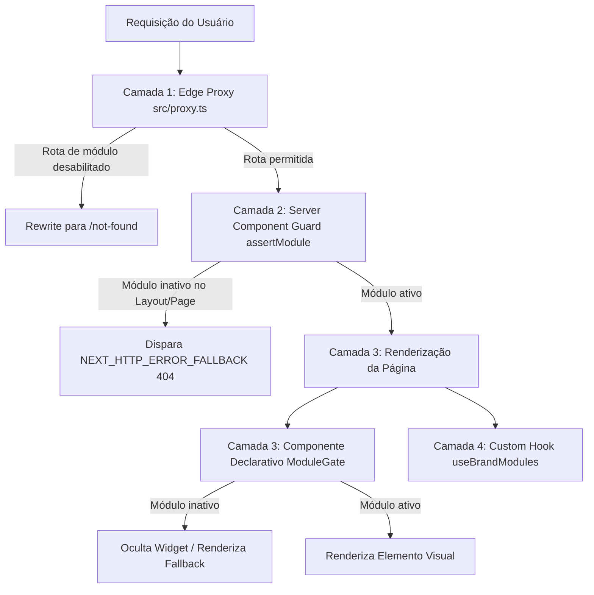

# Especificação Técnica: White-Label & Arquitetura Modular

Este documento descreve detalhadamente a regra de negócio, a estrutura técnica e o funcionamento do **Sistema White-Label e Arquitetura Modular Dinâmica** da plataforma.

O sistema foi concebido para permitir que múltiplos clubes e marcas parceiras (como **ClubKey** e **Viverde**) operem a partir de uma **única base de código compartilhada** (Single Codebase Multi-Tenant), onde cada parceiro possui sua própria identidade de marca (cores, logotipos, tipografia, slogan, links) e **ativa ou desativa módulos inteiros do sistema sob demanda**.

---

## 🧭 Visão Geral & Motivação

Em plataformas SaaS multi-tenant voltadas a comunidades e clubes executivos, cada marca parceira possui seu modelo de negócio, proposta de valor e escopo operacional:

- **ClubKey (Tenant Completo)**: Ecossistema abrangente para membros e executivos de alta performance com todos os **7 módulos ativos** (Cockpit, Hospedagens, Conexões/Networking, Eventos & Jantares, Experiências Gastronômicas, Benefícios de Parceiros e Gamificação KeyPass com Tokens RIB e Tiers).
- **Viverde (Tenant de Hospitalidade & Refúgios)**: Marca focada em acomodações de alto padrão na serra e conexões qualificadas. Por regra de negócio, opera **exclusivamente com os módulos Início (`home`), Hospedagens (`stays`) e Conexões (`networking`)**, mantendo *Eventos*, *Experiências*, *Benefícios* e *KeyPass* **100% desativados e inacessíveis**.

### Premissas do White-Label:
1. **Zero Exposição Visual**: Menus (Header/Sidebar/Footer), Cockpit, cards de membros e dropdowns de usuário nunca exibem botões, links ou seções de módulos desabilitados na marca ativa.
2. **Segurança e Bloqueio de Rotas (404 Not Found)**: Qualquer tentativa de acesso direto a rotas de módulos desativados via URL (ex: `/eventos`, `/agenda`, `/keypass` no tenant Viverde) é interceptada e resulta em **404 Not Found**.
3. **Desacoplamento Cruzado**: Elementos visuais compostos (ex: badges de XP/Tier do KeyPass dentro dos cards do diretório de membros) se adaptam automaticamente e omitem campos de módulos inativos sem quebrar a árvore de componentes.
4. **Isolamento em 4 Camadas (Defesa em Profundidade)**: Validação no Edge Proxy, nos Server Components, em componentes declarativos (`<ModuleGate>`) e em custom hooks de cliente (`useBrandModules`).

---

## ⚙️ Configuração dos Presets de Marca (`brandPresets`)

O núcleo do sistema White-Label fica centralizado em [`src/config/brand.config.ts`](file:///c:/Users/Guilherme/Desktop/ID/clubkey/src/config/brand.config.ts).

### 1. Resolução do Tenant Ativo
A marca ativa em tempo de execução/build é definida pela variável de ambiente `NEXT_PUBLIC_TENANT`. Caso não seja informada, o sistema aplica fallback seguro para `"clubkey"`:

```typescript
const rawTenant = process.env.NEXT_PUBLIC_TENANT || ""
const activeTenantKey = rawTenant.toLowerCase().trim() || "clubkey"

export const brandConfig: BrandConfig =
  brandPresets[activeTenantKey] || brandPresets.clubkey
```

### 2. Anatomia da Interface `BrandConfig`

```typescript
export interface BrandConfig {
  id: string                     // Slug identificador único do tenant ("clubkey", "viverde")
  name: string                   // Nome oficial da marca ("ClubKey", "Viverde")
  shortName: string              // Nome curto para cabeçalhos mobile e notificações
  tagline: string                // Slogan ou posicionamento
  description: string            // Descrição da proposta de valor e SEO
  colors: {
    light: BrandColors           // Paleta de cores para o tema claro
    dark: BrandColors            // Paleta de cores para o tema escuro
  }
  assets: BrandAssets            // Logos SVG (light/dark), ícones, favicons, OG Image
  links: BrandLinks              // Links institucionais, WhatsApp, checkout, redes sociais
  modules: BrandModulesConfig    // Matriz de ativação/desativação dos 7 módulos
}
```

---

## 🧩 Matriz de Módulos (`BrandModulesConfig`)

A propriedade `modules` define quais áreas de negócio estão disponíveis para os membros daquele tenant.

```typescript
export interface BrandModulesConfig {
  home: boolean          // Cockpit central e feed dinâmico do associado
  stays: boolean         // Hospedagens, vilas, reservas e vouchers
  networking: boolean    // Diretório de membros, filtros e chat em tempo real
  events: boolean        // Eventos executivos, jantares, RSVPs e agenda
  experiences: boolean   // Experiências e vivências lifestyle/gastronomia
  benefits: boolean      // Clube de benefícios e vantagens de parceiros
  keypass: boolean       // Gamificação, tiers, missões, XP e RIB tokens
}
```

### Comparação Prática entre Presets no Código:

```typescript
export const brandPresets: Record<string, BrandConfig> = {
  // Preset ClubKey: Todos os 7 módulos habilitados
  clubkey: {
    id: "clubkey",
    name: "ClubKey",
    shortName: "ClubKey",
    tagline: "Ative sua Key e pague menos para viajar",
    description: "Acesso exclusivo a milhares de hospedagens premium com descontos de até 60% e curadoria de especialistas.",
    modules: {
      home: true,
      stays: true,
      networking: true,
      events: true,
      experiences: true,
      benefits: true,
      keypass: true,
    },
    colors: {
      light: {
        primary: "#FF6847",
        primaryHover: "#E85535",
        primaryLight: "#FFF0ED",
        primaryDark: "#E85535",
        primaryMuted: "rgba(255, 104, 71, 0.15)",
        primaryGlow: "rgba(255, 104, 71, 0.4)",
        secondary: "#141416",
        selectionBg: "rgba(255, 104, 71, 0.2)",
        selectionText: "#FF6847",
      },
      dark: {
        primary: "#FF6847",
        primaryHover: "#E85535",
        primaryLight: "#241410",
        primaryDark: "#E85535",
        primaryMuted: "rgba(255, 104, 71, 0.15)",
        primaryGlow: "rgba(255, 104, 71, 0.4)",
        secondary: "#161616",
        selectionBg: "rgba(255, 104, 71, 0.2)",
        selectionText: "#FF6847",
      },
    },
    assets: {
      logoText: "CLUBKEY",
      logoMain: "/logos/logo_white.svg",
      logoDark: "/logos/logo_white.svg",
      logoLight: "/logos/logo_black.svg",
      iconDark: "/logos/icon_white.svg",
      iconLight: "/logos/icon_black.svg",
      iconWhite: "/logos/icon_white.svg",
      productCard: "/utils/subscription/clubkey/product_card.webp",
      favicon: "/favicon.ico",
      ogImage: "/og.png",
    },
    links: {
      subscription: "/assinatura",
      rooms: "/hospedagens",
      login: "/entrar",
      instagram: "https://instagram.com/clubkey.io",
      contactEmail: "contato@clubkey.io",
      website: "https://clubkey.io",
    },
  },

  // Preset Viverde: Focado em Hospedagens e Conexões (4 módulos desligados)
  viverde: {
    id: "viverde",
    name: "Viverde",
    shortName: "Viverde",
    tagline: "Um jeito mais leve de viver",
    description: "Acesso exclusivo a acomodações selecionadas, refúgios de alto padrão na serra e hospitalidade.",
    modules: {
      home: true,
      stays: true,
      networking: true,
      events: false,        // DESATIVADO
      experiences: false,   // DESATIVADO
      benefits: false,      // DESATIVADO
      keypass: false,       // DESATIVADO
    },
    colors: {
      light: {
        primary: "#B88A2D",
        primaryHover: "#9E7421",
        primaryLight: "#FDFBF7",
        primaryDark: "#9E7421",
        primaryMuted: "rgba(184, 138, 45, 0.15)",
        primaryGlow: "rgba(184, 138, 45, 0.4)",
        secondary: "#24271D",
        selectionBg: "rgba(184, 138, 45, 0.2)",
        selectionText: "#B88A2D",
      },
      dark: {
        primary: "#B88A2D",
        primaryHover: "#D8CCA8",
        primaryLight: "#261E10",
        primaryDark: "#9E7421",
        primaryMuted: "rgba(184, 138, 45, 0.15)",
        primaryGlow: "rgba(184, 138, 45, 0.4)",
        secondary: "#161616",
        selectionBg: "rgba(184, 138, 45, 0.2)",
        selectionText: "#B88A2D",
      },
    },
    assets: {
      logoText: "VIVERDE",
      logoMain: "/logos/viverde/logo_white.svg",
      logoDark: "/logos/viverde/logo_white.svg",
      logoLight: "/logos/viverde/logo_black.svg",
      iconDark: "/logos/viverde/icon_white.svg",
      iconLight: "/logos/viverde/icon_black.svg",
      iconCream: "/logos/viverde/icon_cream.svg",
      iconWhite: "/logos/viverde/icon_white.svg",
      productCard: "/utils/subscription/viverde/product_card.webp",
      favicon: "/logos/viverde/favicon.ico",
      ogImage: "/og.png",
    },
    links: {
      subscription: "/assinatura",
      rooms: "/hospedagens",
      login: "/entrar",
      instagram: "https://instagram.com/viverdeitaipava",
      whatsapp: "(21) 99786-2692",
      contactEmail: "contato@viverdeitaipava.com.br",
      website: "https://viverdeitaipava.com.br",
    },
  },
}
```

---

## 🎨 Injeção Dinâmica de Variáveis CSS

Para que os tokens de cores da marca alimentem o Tailwind CSS e o Bloom UI sem recarregar stylesheets externos, a função `generateBrandCssVariables` gera variáveis CSS customizadas injetadas no `<head>` do `src/app/layout.tsx`:

```css
:root {
  --primary: var(--brand-primary);
  --brand-primary: #FF6847; /* ou #B88A2D no Viverde */
  --brand-primary-hover: #E85535;
  --brand-primary-light: #FFF0ED;
  --brand-secondary: #141416;
  --selection-bg: rgba(255, 104, 71, 0.2);
  --selection-text: #FF6847;
}
```

---

## 📋 Registro Canônico de Módulos (`SYSTEM_MODULE_REGISTRY`)

Centralizado em [`src/config/modules.config.ts`](file:///c:/Users/Guilherme/Desktop/ID/clubkey/src/config/modules.config.ts):

| ID do Módulo | Rótulo | Prefixos de Rota (`routePrefixes`) | Rota Padrão | Requer Auth |
| :--- | :--- | :--- | :--- | :---: |
| `home` | **Início** | `["/"]` | `/` | Não |
| `stays` | **Hospedagens** | `["/hospedagens", "/minhas-hospedagens", "/hospedagens/minhas-hospedagens"]` | `/hospedagens` | Não |
| `networking` | **Conexões** | `["/conexoes", "/pessoas", "/conexoes/minhas-conexoes"]` | `/conexoes` | Sim |
| `events` | **Eventos** | `["/eventos", "/agenda", "/meus-eventos", "/eventos/meus-eventos"]` | `/eventos` | Sim |
| `experiences` | **Experiências**| `["/experiencias"]` | `/experiencias` | Sim |
| `benefits` | **Benefícios** | `["/beneficios"]` | `/beneficios` | Sim |
| `keypass` | **KeyPass** | `["/keypass"]` | `/keypass` | Sim |

### Rotas Universais Isentas
Rotas comuns e estruturais do sistema nunca são bloqueadas:
- **Autenticação**: `/entrar`, `/login`, `/cadastro`, `/esqueci-minha-senha`, `/redefinir-senha`
- **Perfil do Membro**: `/perfil`, `/perfil/minha-assinatura`, `/perfil/seguranca`
- **Checkout**: `/assinatura`

---

## 🛡️ Defesa em Profundidade: 4 Camadas de Segurança e Isolamento

O sistema implementa **4 camadas coordenadas** para garantir isolamento absoluto de rotas e interface:



---

### Camada 1: Edge Proxy (`src/proxy.ts`)
Executado na borda (Edge Runtime do Next.js 16) antes de qualquer processamento de rota:
- Examina `pathname` contra `isPathAllowed(pathname, brandConfig.modules)`.
- Se o membro tentar acessar diretamente uma rota desativada pelo preset, o proxy reescreve a resposta para `/not-found` com status 404.
- Faz bypass automático para arquivos estáticos (`/_next/*`, `/utils/*`, `/logos/*`, `favicon.ico`).

```typescript
// src/proxy.ts
export function proxy(request: NextRequest) {
  const { pathname } = request.nextUrl

  if (
    pathname.startsWith("/_next") ||
    pathname.startsWith("/api") ||
    pathname.startsWith("/utils") ||
    pathname.startsWith("/logos") ||
    pathname.startsWith("/favicon") ||
    pathname.includes(".")
  ) {
    return NextResponse.next()
  }

  if (!isRouteAllowed(pathname)) {
    return NextResponse.rewrite(new URL("/not-found", request.url))
  }

  return NextResponse.next()
}
```

---

### Camada 2: Server Component Guards (`assertModule`)
Implementada em `layout.tsx` e `page.tsx` de rotas sensíveis:
- Garante proteção no servidor sem depender de requisições de rede ou bundles de cliente.
- Caso `assertModule(module)` seja chamada para um módulo inativo, emite o erro HTTP 404 canônico do Next.js (`NEXT_HTTP_ERROR_FALLBACK;404`), renderizando `not-found.tsx`.

```typescript
// Exemplo: src/app/(portal)/eventos/layout.tsx
import { assertModule, brandConfig } from "@/src/config/brand.config"

export default function EventosLayout({ children }: { children: React.ReactNode }) {
  assertModule("events") // Se events for false, interrompe o render com 404

  return <>{children}</>
}
```

---

### Camada 3: Componente Declarativo `<ModuleGate>`
Localizado em [`src/components/common/moduleGate.tsx`](file:///c:/Users/Guilherme/Desktop/ID/clubkey/src/components/common/moduleGate.tsx):
- Envelopa blocos JSX e widgets no feed, cockpit ou dashboards.
- Se o módulo estiver habilitado, renderiza os filhos normais. Se estiver desligado, renderiza `fallback` ou `null`.

```tsx
// Exemplo: Ocultando o carrossel de eventos no feed da Home
<ModuleGate module="events">
  <FeaturedEventsCarousel events={events} />
</ModuleGate>

// Com fallback amigável
<ModuleGate module="keypass" fallback={<StandardMemberBadge />}>
  <KeyPassTierProgressBar xp={user.xp} />
</ModuleGate>
```

---

### Camada 4: Custom Hook Reativo `useBrandModules()`
Localizado em [`src/hooks/useBrandModules.ts`](file:///c:/Users/Guilherme/Desktop/ID/clubkey/src/hooks/useBrandModules.ts):
- Fornece aos componentes de cliente (`use client`) acesso seguro às configurações da marca:

```typescript
const {
  activeBrand,          // Preset completo BrandConfig
  modules,              // Matriz booleana { stays: true, events: false, ... }
  isModuleEnabled,      // Helper: (mod: SystemModule) => boolean
  enabledModules,       // Array ['home', 'stays', 'networking']
  getModuleInfo         // Retorna a ModuleDefinition de um módulo
} = useBrandModules()
```

---

## 🖥️ Desacoplamento Visual & Navegação Dinâmica

Todos os componentes visuais do portal consultam `brandConfig.modules` e `brandConfig.assets`:

1. **Header & Menu Superior (`src/components/portal/header.tsx`)**:
   - As abas de navegação são filtradas em tempo de renderização.
   - O logotipo é carregado dinamicamente de `brandConfig.assets.logoMain` / `logoDark` / `logoLight`.
2. **Rodapé & Links Institucionais (`src/components/portal/footer.tsx`)**:
   - As colunas de links removem automaticamente as rotas de módulos desativados.
   - O copyright, slogan e links sociais exibem os dados do tenant ativo.
3. **Dropdown de Usuário (`src/components/portal/userDropdownMenu.tsx`)**:
   - Atalhos para *Minhas Hospedagens*, *Meus Eventos* e *KeyPass* só são adicionados se o módulo estiver ativo.
4. **Cockpit / Feed Inicial (`src/app/(portal)/page.tsx`)**:
   - No **ClubKey**: Exibe feed com eventos em destaque, experiências, indicador de XP do KeyPass e carrossel de estadias.
   - No **Viverde**: Oculta automaticamente as seções de Eventos, Experiências e KeyPass, apresentando um cockpit limpo focado em *Hospedagens Selecionadas* e *Conexões*.
5. **Cards de Membros & Diretório**:
   - No perfil público (`memberProfileHero.tsx`), badges de nível de KeyPass e pontuações de XP são exibidas exclusivamente se `isModuleEnabled("keypass") === true`.

---

## 🚀 Como Cadastrar um Novo Tenant White-Label

Para adicionar uma nova marca parceira:

1. Abra [`src/config/brand.config.ts`](file:///c:/Users/Guilherme/Desktop/ID/clubkey/src/config/brand.config.ts) e adicione o novo objeto no `brandPresets`:
   ```typescript
   novamarca: {
     id: "novamarca",
     name: "Nova Marca",
     shortName: "NovaMarca",
     tagline: "Experiências e Hospedagens de Alto Padrão",
     description: "Clube privado de viagens e lifestyle.",
     modules: {
       home: true,
       stays: true,
       networking: false,
       events: true,
       experiences: true,
       benefits: false,
       keypass: false,
     },
     colors: {
       light: {
         primary: "#0A84FF",
         primaryHover: "#0066CC",
         // ... demais tokens de cor
       },
       dark: {
         primary: "#0A84FF",
         primaryHover: "#409CFF",
         // ... demais tokens de cor
       },
     },
     assets: {
       logoText: "NOVAMARCA",
       logoMain: "/logos/novamarca/logo_white.svg",
       logoDark: "/logos/novamarca/logo_white.svg",
       logoLight: "/logos/novamarca/logo_black.svg",
       iconDark: "/logos/novamarca/icon_white.svg",
       iconLight: "/logos/novamarca/icon_black.svg",
       productCard: "/utils/subscription/novamarca/product_card.webp",
       favicon: "/logos/novamarca/favicon.ico",
       ogImage: "/og.png",
     },
     links: {
       subscription: "/assinatura",
       rooms: "/hospedagens",
       login: "/entrar",
       instagram: "https://instagram.com/novamarca",
       contactEmail: "contato@novamarca.com",
       website: "https://novamarca.com",
     },
   },
   ```

2. Defina a variável de ambiente:
   ```env
   NEXT_PUBLIC_TENANT=novamarca
   ```

3. Valide a integridade através da suíte de testes:
   ```bash
   pnpm test:all
   ```

---

## 🧪 Suíte de Testes Automatizados

A robustez da arquitetura White-Label é garantida por testes unitários e end-to-end:

### Testes Unitários (Vitest — 83 testes)
- [`src/__tests__/modules.test.ts`](file:///c:/Users/Guilherme/Desktop/ID/clubkey/src/__tests__/modules.test.ts): Validação de registro de módulos, caminhos e função `assertModuleEnabled`.
- [`src/__tests__/brandConfig.test.ts`](file:///c:/Users/Guilherme/Desktop/ID/clubkey/src/__tests__/brandConfig.test.ts): Presets de marca, fallback de tenant e gerador de variáveis CSS.
- [`src/__tests__/moduleGate.test.tsx`](file:///c:/Users/Guilherme/Desktop/ID/clubkey/src/__tests__/moduleGate.test.tsx): Renderização declarativa e ocultação via `<ModuleGate>`.
- [`src/__tests__/useBrandModules.test.ts`](file:///c:/Users/Guilherme/Desktop/ID/clubkey/src/__tests__/useBrandModules.test.ts): Reatividade e helpers do custom hook.
- [`src/__tests__/proxy.test.ts`](file:///c:/Users/Guilherme/Desktop/ID/clubkey/src/__tests__/proxy.test.ts): Comportamento do Edge Proxy para rotas autorizadas, rotas bloqueadas e bypass de assets.
- [`src/__tests__/headerNavigation.test.tsx`](file:///c:/Users/Guilherme/Desktop/ID/clubkey/src/__tests__/headerNavigation.test.tsx) & [`src/__tests__/footerNavigation.test.tsx`](file:///c:/Users/Guilherme/Desktop/ID/clubkey/src/__tests__/footerNavigation.test.tsx): Isolamento de menus e rodapés.
- [`src/__tests__/gamificationIsolation.test.tsx`](file:///c:/Users/Guilherme/Desktop/ID/clubkey/src/__tests__/gamificationIsolation.test.tsx) & [`src/__tests__/crossModuleDecoupling.test.tsx`](file:///c:/Users/Guilherme/Desktop/ID/clubkey/src/__tests__/crossModuleDecoupling.test.tsx): Validação de desacoplamento cruzado.

### Testes Ponta a Ponta (Playwright E2E — 19 testes)
- [`src/__tests__/e2e/moduleSecurity.spec.ts`](file:///c:/Users/Guilherme/Desktop/ID/clubkey/src/__tests__/e2e/moduleSecurity.spec.ts): Valida que rotas permitidas retornam 200 OK e rotas bloqueadas resultam em tela 404 no navegador real.
- [`src/__tests__/e2e/navigationWhiteLabel.spec.ts`](file:///c:/Users/Guilherme/Desktop/ID/clubkey/src/__tests__/e2e/navigationWhiteLabel.spec.ts): Valida logotipos, links, rodapé e visual white-label.
