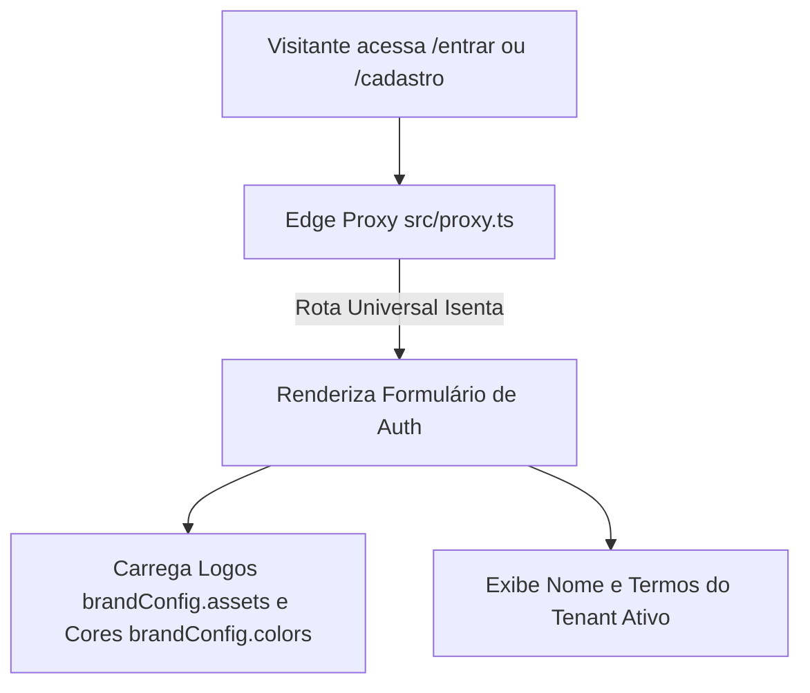
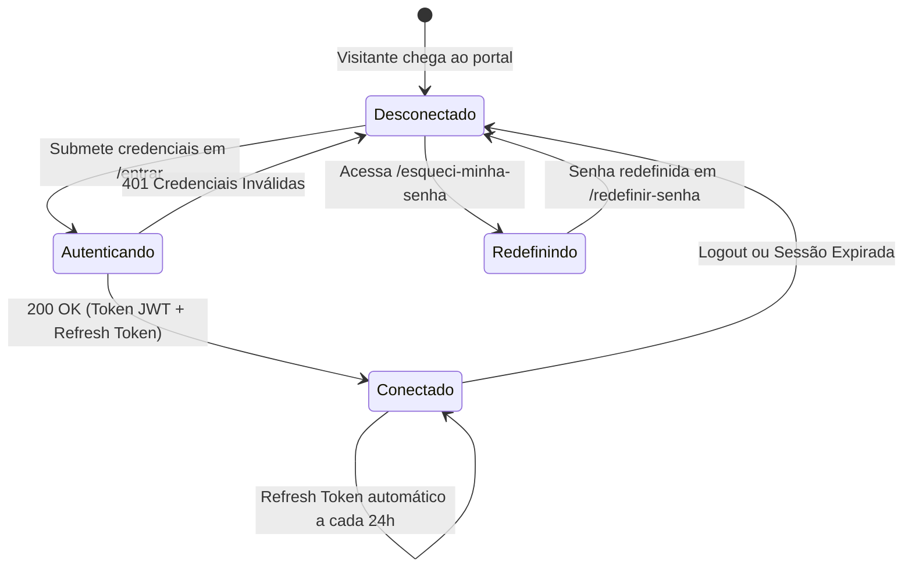

# Especificação de Módulo: Autenticação & Acesso (`/auth`, `/entrar`, `/cadastro`)

O módulo de **Autenticação & Acesso** gerencia o controle de entrada, adesão ao clube por convite, recuperação segura de credenciais, geração de tokens JWT e ciclo de vida da sessão do associado.

---

## 🛡️ Controle de Acesso Modular & White-Label

As rotas de autenticação são classificadas como **Rotas Universais Isentas** (`getModuleByPath(pathname) === null`), permanecendo públicas e acessíveis em qualquer tenant.



### Comportamento White-Label:
- **Logotipos**: O card e o painel lateral exibem os assets dinâmicos `brandConfig.assets.logoMain` ou `logoDark`/`logoLight`.
- **Cores & Botões**: O botão CTA principal consome a variável `--primary` configurada pelo preset da marca ativa.
- **Textos Institucionais**: Slogan e termos de uso fazem referência direta à marca configurada em `brandConfig.name`.

---

## 🗺️ Rotas do Módulo & Hierarquia

| Rota | Descrição | Tipo | Acesso |
| :--- | :--- | :--- | :--- |
| `/entrar` | Tela de autenticação com e-mail e senha | Client Component | Público |
| `/login` | Rota alias para `/entrar` | Server Component | Público |
| `/cadastro` | Solicitação de adesão com código de convite opcional | Client Component | Público |
| `/esqueci-minha-senha` | Solicitação de link de redefinição por e-mail | Client Component | Público |
| `/redefinir-senha` | Criação de nova senha através de token de segurança | Client Component | Público |

---

## 🔄 Ciclo de Vida da Sessão de Autenticação



---

## 🖥️ Arquitetura Visual & Componentes por Tela

### 1. Login de Membro (`/entrar`)
- **Layout**: Painel dividido com banner institucional escuro à esquerda e formulário neutro à direita.
- **Campos (`signInForm.tsx`)**:
  - E-mail corporativo (`email`).
  - Senha (`password`) com `passwordInput` e visualização alternante.
  - Checkbox *"Lembrar-me"* (`rememberMe`).
  - Link *"Esqueci minha senha"* $\rightarrow$ `/esqueci-minha-senha`.
  - Botão CTA *"Entrar no {brandConfig.name}"*.

### 2. Solicitação de Adesão (`/cadastro`)
- **Campos (`signUpForm.tsx` com validação Zod)**:
  - Nome, Sobrenome, E-mail Corporativo, Telefone/WhatsApp com máscara.
  - Empresa, Cargo Executivo, Cidade e Estado.
  - Senha com medidor de força e confirmação de senha.
  - Código de Convite VIP opcional (`referralCode`).
  - Checkbox obrigatório dos Termos de Associação.

### 3. Recuperação e Redefinição de Senha
- Formulários com feedback de envio de e-mail e validação de token criptográfico.

---

## 📊 Interfaces TypeScript Consumidas

```typescript
export interface SignInPayload {
  email: string
  password: string
  rememberMe?: boolean
}

export interface SignInResponse {
  token: string
  refreshToken: string
  expiresIn: number
  user: {
    id: number
    firstName: string
    lastName: string
    email: string
    role: string
    company: string
    city: string
    avatar: string
    tierId: string
    membershipTier: string
  }
}

export interface SignUpPayload {
  firstName: string
  lastName: string
  email: string
  phone: string
  company: string
  role: string
  city: string
  state: string
  password: string
  referralCode?: string
}
```

---

## 📡 Especificação dos Endpoints de API

### 1. `POST /api/v1/auth/sign-in`
Autentica o membro e retorna tokens JWT.

### 2. `POST /api/v1/auth/sign-up`
Registra nova conta de associado.

### 3. `POST /api/v1/auth/forgot-password` & `POST /api/v1/auth/reset-password`
Fluxo de redefinição de senha por e-mail com token seguro.

### 4. `POST /api/v1/auth/refresh-token` & `POST /api/v1/auth/logout`
Renovação de credenciais e encerramento de sessão.

---

## 🛡️ Regras de Segurança & Casos de Borda

1. **Proteção contra Força Bruta**: Rate limiting de 5 tentativas por minuto por IP/e-mail.
2. **Expiração de Tokens**: Links de redefinição expiram em 60 minutos.
3. **Bônus de Indicação**: Se informado `referralCode` válido, credita recompensas de boas-vindas no momento da aprovação do cadastro.
