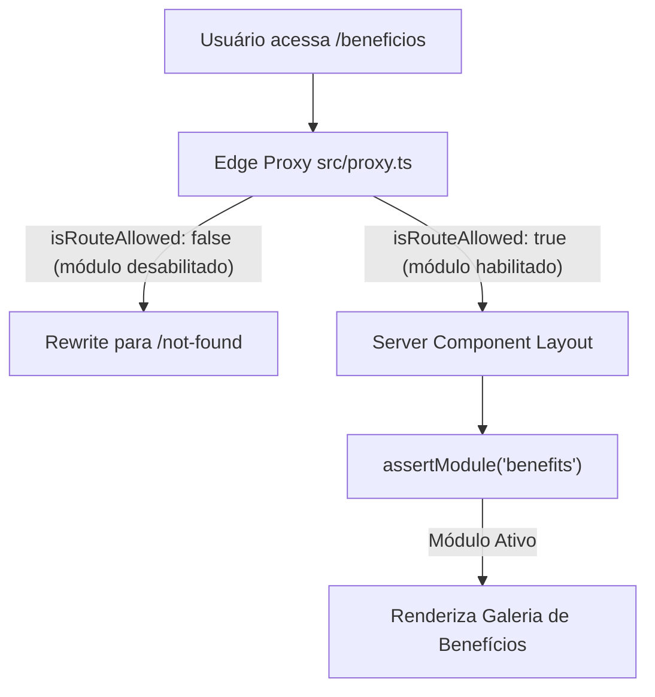
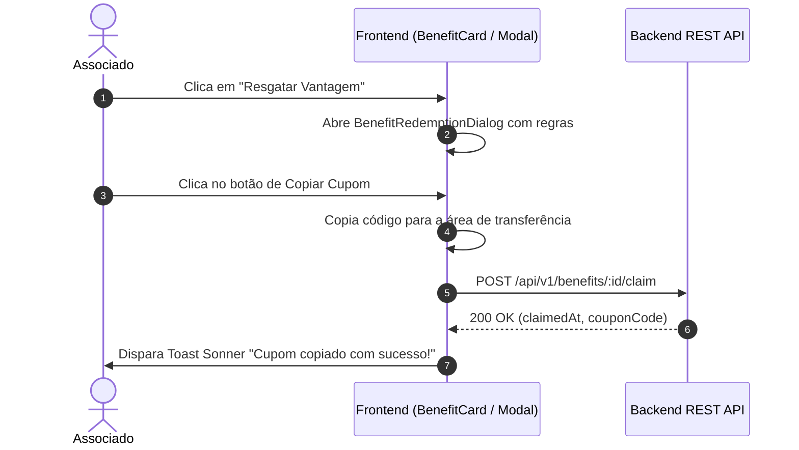

# Especificação de Módulo: Benefícios & Parcerias (`/beneficios`)

O módulo de **Benefícios & Parcerias** concentra as vantagens exclusivas negociadas com marcas de luxo, restaurantes renomados, aviação executiva, spas de alto padrão e serviços de hospitalidade internacional para membros do clube.

---

## 🛡️ Controle de Acesso Modular & White-Label

O módulo de Benefícios é governado pela flag `modules.benefits` em [`src/config/brand.config.ts`](file:///c:/Users/Guilherme/Desktop/ID/clubkey/src/config/brand.config.ts).



### Regras de Isolamento por Preset:
- **Quando o módulo está ativo no preset (`benefits: true`)**: Acesso total à galeria de benefícios, regras de parceria e resgate de cupons.
- **Quando o módulo está desabilitado no preset (`benefits: false`)**: O módulo fica **desativado**. Links de navegação no Header, Footer, Dropdown e atalhos no feed da página inicial são suprimidos via `<ModuleGate>`. Qualquer tentativa de acesso direto retorna **404 Not Found**.

---

## 🗺️ Rotas do Módulo & Hierarquia

| Rota | Descrição | Tipo | Proteção Modular |
| :--- | :--- | :--- | :---: |
| `/beneficios` | Galeria geral de benefícios com filtros por categoria e modal de resgate | Client Component | `assertModule("benefits")` |

---

## 🔄 Fluxo de Resgate de Vantagem



---

## 🖥️ Arquitetura Visual & Componentes por Tela

### 1. Galeria de Benefícios (`/beneficios`)
- **Hero & Filtros de Categoria**:
  - Título `"BENEFÍCIOS EXCLUSIVOS & PARCERIAS DE LUXO"`.
  - Pílulas de seleção de categoria: `"Todos"`, `"Gastronomia & Vinhos"` (`gastronomy`), `"Mobilidade & Aviação"` (`mobility`), `"Lifestyle & Moda"` (`lifestyle`), `"Wellness & Saúde"` (`wellness`).
  - Campo de pesquisa em tempo real por nome do parceiro ou tipo de vantagem.
- **Grid de Cards de Benefício (`BenefitCard`)**:
  - Logotipo da marca parceira (`partnerLogo`).
  - Nome do parceiro (`partnerName`) e badge de destaque (`discountBadge`: ex: `"20% OFF"`, `"Isenção de Rolha"`, `"Upgrade"`).
  - Título da oportunidade (`title`) e resumo das condições.
  - Data de validade da parceria (`validUntil`).
  - Botão de ação *"Resgatar Vantagem"* $\rightarrow$ Abre o modal detalhado de resgate.

### 2. Modal de Resgate de Cupom (`BenefitRedemptionDialog`)
- **Cabeçalho**: Logotipo oficial do parceiro, título da vantagem e selo de garantia.
- **Bloco de Cupom / Código**:
  - Caixa de código estilizada em fonte monoespaçada (ex: `"PARCEIRO-VIP-2026"`).
  - Botão interativo de cópia com um clique (`Copy`), disparando Toast de confirmação.
- **Instruções de Utilização**:
  - Passo 1: Informar o código no checkout ou apresentar a carteira digital.
  - Passo 2: Condições de reserva prévia (se aplicável).
- **Botão de Ação Externa**: Link seguro para abrir o portal do parceiro ou chamar o suporte no WhatsApp.

---

## 📊 Interfaces TypeScript Consumidas

```typescript
export interface BenefitItem {
  id: number
  partnerName: string
  partnerLogo: string
  category: "gastronomy" | "mobility" | "lifestyle" | "wellness"
  title: string
  discountBadge: string
  description: string
  fullRules?: string
  redemptionType: "coupon" | "qr_code" | "direct_show"
  couponCode?: string
  actionUrl?: string
  validUntil: string
}
```

---

## 📡 Especificação dos Endpoints de API

### 1. `GET /api/v1/benefits`
Lista os parceiros e benefícios disponíveis com filtros.
- **Query Params**: `category`, `search`
- **Response (200 OK)**: Array de `BenefitItem`.

### 2. `GET /api/v1/benefits/:id`
Retorna as regras completas e detalhes de um benefício específico.
- **Response (200 OK)**: Objeto `BenefitItem` individual.

### 3. `POST /api/v1/benefits/:id/claim`
Registra a visualização/cópia do cupom pelo associado para contabilização de métricas de conversão do parceiro.
- **Headers**: `Authorization: Bearer <jwt_token>`
- **Response (200 OK)**:
```json
{
  "benefitId": 1,
  "claimedAt": "2026-09-17T17:40:00Z",
  "couponCode": "PARCEIRO-VIP-2026"
}
```

---

## 🛡️ Regras de Negócio & Casos de Borda

1. **Benefício Expirado**: Benefícios cuja data `validUntil` tenha sido ultrapassada são ocultados automaticamente da listagem.
2. **Categorização Obrigatória**: Todo benefício pertence a uma das quatro categorias oficiais (`gastronomy`, `mobility`, `lifestyle`, `wellness`).
