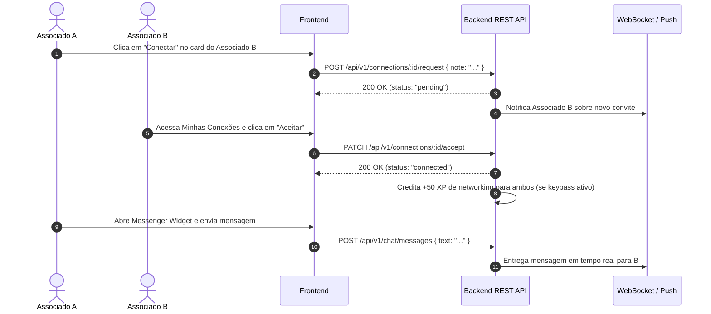

# Especificação de Módulo: Conexões & Networking (`/conexoes`)

O módulo de **Conexões & Networking** é o ecossistema relacional e profissional da plataforma. Ele viabiliza o matchmaking inteligente entre associados por meio de cruzamento de interesses de negócios (*O que Busco* e *O que Ofereço*), perfis públicos executivos e mensageria direta em tempo real.

---

## 🛡️ Controle de Acesso Modular & White-Label

O módulo de Conexões é governado pela flag `modules.networking` em [`src/config/brand.config.ts`](file:///c:/Users/Guilherme/Desktop/ID/clubkey/src/config/brand.config.ts).

```mermaid
flowchart TD
    Req[Usuário acessa /conexoes ou /pessoas] --> Proxy[Edge Proxy src/proxy.ts]
    Proxy -- isRouteAllowed: false (módulo desabilitado) --> 404[Rewrite para /not-found]
    Proxy -- isRouteAllowed: true (módulo habilitado) --> Layout[Server Component Layout]
    Layout --> Guard[assertModule('networking')]
    Guard -- Módulo Ativo --> Page[Renderiza Diretório de Membros]
```

### Desacoplamento Cruzado de Módulos:
- **Isolamento de Gamificação**: Caso o módulo `keypass` esteja desabilitado no preset do tenant ativo, os cards de associados e o perfil público (`memberProfileHero.tsx`) **ocultam automaticamente as badges de XP, pontuações e nível de KeyPass**, mantendo a interface limpa e focada estritamente no networking profissional.
- **Isolamento de Eventos**: Na visualização detalhada do perfil, a seção de histórico de participação em eventos só é renderizada se `isModuleEnabled("events") === true`.

---

## 🗺️ Rotas do Módulo & Hierarquia

| Rota | Descrição | Tipo | Proteção Modular |
| :--- | :--- | :--- | :---: |
| `/conexoes` | Diretório geral de membros com busca e filtros de tags | Client Component | `assertModule("networking")` |
| `/pessoas` | Rota alias para `/conexoes` | Server Component | `assertModule("networking")` |
| `/conexoes/[id]/[slug]` | Perfil público detalhado do associado | Server + Client | `assertModule("networking")` |
| `/pessoas/[id]` | Rota alias para `/conexoes/[id]/[slug]` | Server Component | `assertModule("networking")` |
| `/conexoes/minhas-conexoes` | Gestão de conexões ativas, convites recebidos e enviados | Client Component | `assertModule("networking")` |
| *(Global)* `memberMessengerWidget.tsx` | Chat flutuante de mensagens diretas no canto inferior direito | Client Component | `assertModule("networking")` |

---

## 🔄 Fluxo de Matchmaking & Mensageria



---

## 🖥️ Arquitetura Visual & Componentes por Tela

### 1. Diretório de Membros (`/conexoes`)
- **Barra de Busca e Filtros de Matchmaking**:
  - Busca por nome, cargo ou empresa.
  - Filtros cruzados por tags:
    - *O que Busco* (`seeking`): ex: `"Investimentos"`, `"AgroTech"`, `"M&A"`, `"Board Member"`.
    - *O que Ofereço* (`offering`): ex: `"Venture Capital"`, `"Mentoria"`, `"Governança"`, `"Expansão Global"`.
    - Filtro por Cidade e Nível de Tier.
- **Grid de Associados (`memberCard.tsx`)**:
  - Foto de perfil (`avatar`) com fallback de iniciais estilizado (`getInitials`).
  - Nome completo, cargo executivo, empresa e cidade.
  - Badges de tags de busca e oferta.
  - Botão de Ação de Conexão com 4 estados reativos: `none` (*"Conectar"*), `pending` (*"Pendente"*), `received` (*"Aceitar Convite"*), `connected` (*"Conectado"*).

### 2. Perfil Público do Associado (`/conexoes/[id]/[slug]`)
- **`memberProfileDetailClient.tsx`** (subcomponentes modulares em `src/components/portal/memberProfile/`):
  - `backButton.tsx`: Retorna à listagem anterior.
  - `shareButton.tsx`: Link compartilhável do perfil.
  - **Banner de Capa & Foto (`memberProfileHero.tsx`)**: Imagem panorâmica de fundo (`coverImage`), avatar em alta resolução e badge de tier.
  - **Informações Executivas (`memberProfileDetailsGrid.tsx`)**: Nome, cargo, empresa, cidade, biografia executiva expansível (`memberProfileBioModal.tsx`), canais verificados (LinkedIn, Instagram, WhatsApp) e tags.
  - **Insígnias Desbloqueadas** (`ModuleGate module="keypass"`): Grid de conquistas com tooltips e datas de concessão.
  - **Histórico em Eventos do Clube** (`ModuleGate module="events"`): Eventos em que o membro participou.
  - **Envio de Mensagem Rápida**: Caixa de texto integrada para DM direta.

### 3. Minhas Conexões (`/conexoes/minhas-conexoes`)
- **Abas de Controle**: Conexões Ativas, Solicitações Recebidas e Convites Enviados.

### 4. Mensageiro Flutuante (`memberMessengerWidget.tsx`)
- Widget fixo no canto inferior direito com conversas recentes, contagem de não lidas e confirmação de leitura.

---

## 📊 Interfaces TypeScript Consumidas

```typescript
export interface Member {
  id: number
  firstName: string
  lastName: string
  email: string
  role: string
  company: string
  city: string
  avatar: string
  coverImage?: string
  bio: string
  membershipTier: string
  tierId: "membro" | "associado" | "titular" | "investidor" | "incorporador" | "patrono"
  memberSince: string
  seeking: string[]
  offering: string[]
  unlockedBadgeIds?: string[]
  linkedin?: string
  instagram?: string
  phone?: string
  connectionStatus?: "none" | "pending" | "received" | "connected"
}

export interface ChatMessage {
  id: string | number
  senderId: number
  receiverId: number
  text: string
  isRead: boolean
  createdAt: string
}
```

---

## 📡 Especificação dos Endpoints de API

### 1. `GET /api/v1/members`
Lista membros da rede com busca e filtros.
- **Query Params**: `search`, `seeking`, `offering`, `tierId`, `city`, `page`, `limit`
- **Response (200 OK)**: Objeto paginado com array de `Member`.

### 2. `GET /api/v1/members/:id`
Retorna todos os detalhes do perfil público do associado.
- **Response (200 OK)**: Objeto `Member` individual.

### 3. `GET /api/v1/connections/my-connections`
Retorna conexões ativas e solicitações recebidas/enviadas.
- **Response (200 OK)**: `{ connected: [], receivedInvites: [], sentInvites: [] }`.

### 4. `POST /api/v1/connections/:memberId/request`
Envia solicitação de conexão.
- **Request Body**: `{ "note": "Olá..." }`
- **Response (200 OK)**: `{ "status": "pending", "memberId": 2 }`

### 5. `PATCH /api/v1/connections/:memberId/accept`
Aceita solicitação de conexão.
- **Response (200 OK)**: `{ "status": "connected", "memberId": 4 }`

### 6. `DELETE /api/v1/connections/:memberId`
Recusa, cancela ou desfaz conexão.
- **Response (200 OK)**: `{ "status": "none", "memberId": 2 }`

### 7. `GET /api/v1/chat/conversations` & `GET /api/v1/chat/:memberId/messages`
Retorna conversas ativas e histórico de mensagens.

### 8. `POST /api/v1/chat/messages`
Envia nova mensagem privada no chat.
- **Request Body**: `{ "receiverId": 2, "text": "..." }`
- **Response (201 Created)**: Objeto `ChatMessage`.

---

## 🛡️ Regras de Negócio & Casos de Borda

1. **Auto-Conexão**: O associado logado nunca é exibido para si mesmo com botão de conectar.
2. **Privacidade de Contatos**: WhatsApp e redes sociais completas só são visíveis se a conexão estiver no estado `connected`.
3. **XP de Networking**: Cada conexão aceita credita +50 XP para ambos os associados (quando `keypass: true`).
