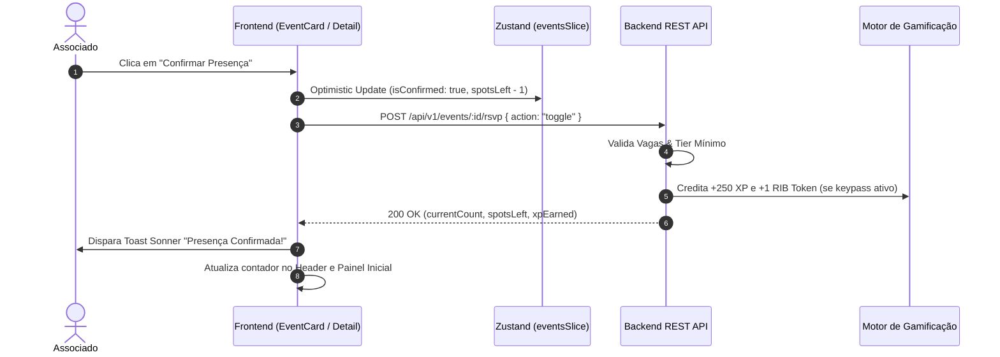

# Especificação de Módulo: Eventos (`/eventos`)

O módulo de **Eventos** gerencia toda a programação presencial exclusiva do clube, incluindo jantares executivos (*Private Dinners*), painéis estratégicos (*Keynotes*), encontros de c-levels (*Exclusive Roundtables*) e vivências de alta gastronomia.

---

## 🛡️ Controle de Acesso Modular & White-Label

O módulo de Eventos é governado pela flag `modules.events` do preset ativo em [`src/config/brand.config.ts`](file:///c:/Users/Guilherme/Desktop/ID/clubkey/src/config/brand.config.ts).

```mermaid
flowchart TD
    Req[Usuário acessa /eventos ou /agenda] --> Proxy[Edge Proxy src/proxy.ts]
    Proxy -- isRouteAllowed: false (módulo desabilitado) --> 404[Rewrite para /not-found]
    Proxy -- isRouteAllowed: true (módulo habilitado) --> Layout[Server Component Layout]
    Layout --> Guard[assertModule('events')]
    Guard -- Módulo Ativo --> Page[Renderiza Catálogo de Eventos]
```

### Regras de Isolamento por Preset:
- **Quando o módulo está ativo no preset (`events: true`)**: Acesso total ao catálogo, detalhes, RSVP, lista "Quem Vai" e Meus Eventos.
- **Quando o módulo está desabilitado no preset (`events: false`)**: O módulo fica **100% inativo**. Links no Header, Footer, Dropdown de usuário e seções no feed inicial são omitidos via `<ModuleGate>`. Qualquer tentativa de acesso direto via URL resulta imediatamente em **404 Not Found**.

---

## 🗺️ Rotas do Módulo & Hierarquia

| Rota | Descrição | Tipo | Proteção Modular |
| :--- | :--- | :--- | :---: |
| `/eventos` | Catálogo geral de eventos com filtros e busca | Client Component | `assertModule("events")` |
| `/agenda` | Rota alias para `/eventos` | Server Component | `assertModule("events")` |
| `/eventos/[id]/[slug]` | Página de detalhes completos do evento | Server + Client | `assertModule("events")` |
| `/eventos/[id]/[slug]/quem-vai` | Lista de membros confirmados ("Quem Vai") | Server + Client | `assertModule("events")` |
| `/eventos/meus-eventos` | Agenda pessoal do associado com eventos confirmados | Client Component | `assertModule("events")` |
| `/meus-eventos` | Rota alias para `/eventos/meus-eventos` | Server Component | `assertModule("events")` |
| `/eventos/meus-eventos/[id]/[slug]` | Voucher / Ingresso digital do associado com QR Code | Server + Client | `assertModule("events")` |

---

## 🔄 Fluxo de Confirmação de Presença (RSVP)



---

## 🖥️ Arquitetura Visual & Componentes por Tela

### 1. Catálogo de Eventos (`/eventos`)
- **Hero & Filtros**:
  - Título `"PROGRAMAÇÃO EXECUTIVA & EVENTOS"`.
  - Pílulas de filtro de categoria: `"Todos"`, `"Networking"`, `"Keynotes"`, `"Exclusivos"`, `"Gastronomia"`.
  - Barra de busca em tempo real com ícone de lupa.
- **Grid de Cards (`eventCard.tsx`)**:
  - Banner do evento (`image`), badge de categoria, badge de exclusividade de tier (se houver).
  - Título, data (`day` + `month`), horário (`time`), local (`location`).
  - Pilha de avatares dos primeiros associados confirmados (`participants`).
  - Vagas restantes (`spotsLeft` de `capacity`) e XP concedido (`xpReward`).
  - Botão interativo de confirmação rápida (RSVP) com estado alternante (*"Confirmar Presença"* $\leftrightarrow$ *"Presença Confirmada"*).

### 2. Detalhes do Evento (`/eventos/[id]/[slug]`)
- **`eventDetailClient.tsx`**:
  - `backButton.tsx`: Retorna para `/eventos`.
  - `shareButton.tsx`: Compartilha link via Web Share API ou cópia para área de transferência.
  - `addToCalendarButton.tsx`: Dropdown para adicionar o evento ao Google Calendar, Apple iCal e Outlook.
  - **Banner Principal & Badges**: Exibe categoria, recompensa de XP e RIB Tokens, formato e traje exigido (`dressCode`).
  - **Card do Host / Anfitrião**: Foto, nome, cargo, empresa e tier do membro anfitrião (`organizer`).
  - **Barra de Ocupação**: `Progress` com porcentagem de vagas preenchidas (`fillPercentage`) e contagem de vagas restantes.
  - **Destaques da Programação (`highlights`)**: Blocos com cronograma e regras (ex: Regra Chatham House, Mesa Redonda).
  - **Itens Inclusos (`inclusions`)**: Lista de benefícios inclusos (ex: Welcome Drink, Jantar em 4 etapas, Vagas reservadas).
  - **Widget "Quem Vai"**: Miniatura dos participantes confirmados com link para a visualização expandida.
  - **Navegação Entre Eventos (`relatedEventsCard.tsx`)**: Cards para navegar rapidamente para o evento anterior e próximo.

### 3. Tela "Quem Vai" (`/eventos/[id]/[slug]/quem-vai`)
- Cabeçalho com o nome do evento e contagem total de confirmados.
- Campo de busca para filtrar participantes por nome, cargo ou empresa.
- Grid de `memberCard.tsx` com foto, nome, cargo, empresa, tags de negócios e botão de conexão rápida (`toggleConnect`).

### 4. Meus Eventos & Voucher Digital (`/eventos/meus-eventos/[id]/[slug]`)
- **`memberEventDetailClient.tsx`**:
  - Card de Ingresso / Passe Digital com código de validação único (ex: `"CK-EVT-8821"`).
  - QR Code dinâmico para validação na recepção do evento.
  - Instruções de Check-in, horário de abertura das portas e traje.
  - Botão de ação perigosa *"Cancelar Presença no Evento"* com modal de confirmação (`confirmActionDialog.tsx`).

---

## 📊 Interfaces TypeScript Consumidas

```typescript
export interface EventItem {
  id: number
  organizerId: number
  title: string
  category: "networking" | "keynote" | "exclusive" | "gastronomy"
  date: string
  day: string
  month: string
  time: string
  location: string
  image: string
  description: string
  fullDescription: string
  capacity: number
  initialConfirmed: number
  participants: number[] // IDs dos membros (users.id)
  dressCode?: string
  format?: string
  highlights?: Array<{ title: string; desc: string }>
  inclusions?: string[]
  xpReward: number
  ribTokensReward?: number
  isExclusive?: boolean
  minTierId?: string
}

export interface EventRSVPResponse {
  eventId: number
  isConfirmed: boolean
  currentCount: number
  spotsLeft: number
  xpEarned: number
  ribTokensEarned: number
}
```

---

## 📡 Especificação dos Endpoints de API

### 1. `GET /api/v1/events`
Lista os eventos com paginação e filtros.
- **Query Params**:
  - `category` (opcional): `"networking"` | `"keynote"` | `"exclusive"` | `"gastronomy"`
  - `search` (opcional): Termo de busca em título ou descrição.
  - `page` (default: `1`), `limit` (default: `12`)
- **Response (200 OK)**:
```json
{
  "items": [
    {
      "id": 1,
      "organizerId": 1,
      "title": "Private Dinner: Macroeconomia & Family Offices 2026",
      "category": "networking",
      "date": "24 Out 2026",
      "day": "24",
      "month": "OUT",
      "time": "19:30 - 22:30",
      "location": "Salão Nobre • Sede Central",
      "image": "/utils/banners/img_01.png",
      "description": "Encontro exclusivo entre fundadores e gestores de patrimônio...",
      "capacity": 24,
      "initialConfirmed": 20,
      "spotsLeft": 4,
      "participants": [1, 2, 3, 5],
      "xpReward": 250,
      "ribTokensReward": 1,
      "isExclusive": true,
      "minTierId": "titular",
      "isUserConfirmed": false
    }
  ],
  "total": 8,
  "page": 1,
  "totalPages": 1
}
```

### 2. `GET /api/v1/events/:id`
Retorna todos os detalhes de um evento específico.
- **Path Params**: `id` (número inteiro do evento).
- **Response (200 OK)**: Retorna objeto completo `EventItem` com `organizer`, `highlights` e `inclusions`.

### 3. `GET /api/v1/events/:id/attendees`
Retorna a lista completa de associados confirmados para a tela *"Quem Vai"*.
- **Response (200 OK)**: Array de `RecommendedMember`.

### 4. `GET /api/v1/events/my-events`
Retorna a lista de eventos nos quais o usuário autenticado confirmou presença.
- **Response (200 OK)**: Array de ingressos com `confirmationCode` e `confirmedAt`.

### 5. `POST /api/v1/events/:id/rsvp`
Confirma ou cancela a presença do usuário logado no evento.
- **Request Body**: `{ "action": "toggle" }`
- **Response (200 OK)**: `EventRSVPResponse`.

---

## 🛡️ Regras de Negócio & Casos de Borda

1. **Exclusividade por Tier**: Se o evento possuir `isExclusive: true` e o usuário tiver um `tierId` inferior a `minTierId`, o botão de RSVP é desabilitado com o texto *"Exclusivo para {minTier}"*.
2. **Capacidade Esgotada**: Se `spotsLeft === 0` e o usuário não estiver confirmado, o botão exibe *"Vagas Esgotadas"*.
3. **Cancelamento no Dia do Evento**: Cancelamentos a menos de 4 horas geram alerta sobre retenção de pontos de reputação.
