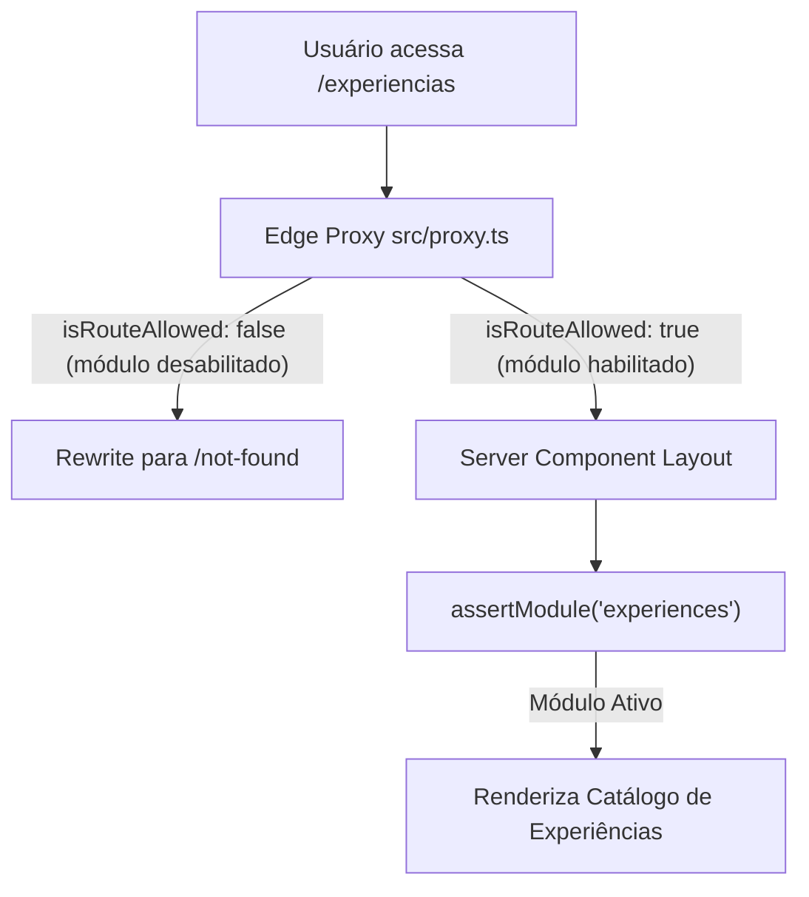
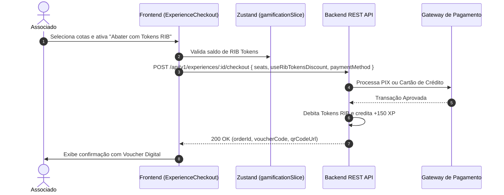

# Especificação de Módulo: Experiências & Lifestyle (`/experiencias`)

O módulo de **Experiências** gerencia vivências exclusivas, jantares sensoriais conduzidos por chefs renomados, masterclasses de enologia e degustações raras em caves privadas para associados do clube.

---

## 🛡️ Controle de Acesso Modular & White-Label

O módulo de Experiências é governado pela flag `modules.experiences` no preset ativo em [`src/config/brand.config.ts`](file:///c:/Users/Guilherme/Desktop/ID/clubkey/src/config/brand.config.ts).



### Regras de Isolamento por Preset:
- **Quando o módulo está ativo no preset (`experiences: true`)**: Acesso completo ao catálogo, compra de cotas, abatimento com Tokens RIB (se keypass ativo) e lista "Quem Vai".
- **Quando o módulo está desabilitado no preset (`experiences: false`)**: O módulo fica **desativado**. Links de navegação no Header, Footer, Dropdown e seções no feed da página inicial são suprimidos com `<ModuleGate>`. Qualquer tentativa de acesso direto retorna **404 Not Found**.

---

## 🗺️ Rotas do Módulo & Hierarquia

| Rota | Descrição | Tipo | Proteção Modular |
| :--- | :--- | :--- | :---: |
| `/experiencias` | Catálogo geral com filtros por categoria e busca | Client Component | `assertModule("experiences")` |
| `/experiencias/[id]/[slug]` | Página de detalhes completos da experiência | Server + Client | `assertModule("experiences")` |
| `/experiencias/[id]/[slug]/reserva` | Fluxo de reserva e checkout (PIX / Cartão / Tokens RIB) | Client Component | `assertModule("experiences")` |
| `/experiencias/[id]/[slug]/quem-vai` | Lista de membros com presença confirmada | Server + Client | `assertModule("experiences")` |

---

## 🔄 Fluxo de Reserva e Checkout com Tokens RIB



---

## 🖥️ Arquitetura Visual & Componentes por Tela

### 1. Catálogo de Experiências (`/experiencias`)
- **Hero de Apresentação**:
  - Título `"EXPERIÊNCIAS & LIFESTYLE EXCLUSIVO"`.
  - Subtítulo com destaque para curadoria gastronômica e vivências de alto padrão.
- **Barra de Filtros & Busca**:
  - Filtros de categoria: `"Todos"`, `"Vinhos & Degustação"`, `"Alta Gastronomia"`, `"Lifestyle"`, `"Arte & Cultura"`.
  - Input de busca por nome da experiência, chef ou local.
- **Grid de Cards (`experienceCard.tsx`)**:
  - Foto em alta definição (`image`), categoria e subtítulo de duração/vagas (`sub`).
  - Preço por cota em BRL (`price`) e custo opcional em Tokens RIB (`ribTokensCost`).
  - Vagas restantes (`spotsLeft` de `capacity`) e recompensa em XP (`xpReward`).
  - Botão CTA *"Garantir Cota"* $\rightarrow$ `/experiencias/[id]/[slug]`.

### 2. Detalhes da Experiência (`/experiencias/[id]/[slug]`)
- **`experienceDetailClient.tsx`**:
  - `backButton.tsx`: Retorna para `/experiencias`.
  - `shareButton.tsx`: Compartilha a vivência via link direto.
  - **Banner Hero & Dados Gerais**: Data, horário, endereço e categoria.
  - **Card do Chef / Especialista**: Mini-bio do anfitrião com foto, especialidade e conquistas.
  - **Descrição Completa & Menu Degustação**: Detalhamento prato a prato.
  - **Itens Inclusos (`includes`)**: Harmonização de rótulos raros, transporte executivo, material didático.
  - **Widget "Quem Vai"**: Miniatura dos participantes confirmados com link para `/quem-vai`.
  - **Botão de Reserva Principal**: Leva diretamente para a tela de reserva (`/reserva`).

### 3. Checkout & Reserva de Experiência (`/experiencias/[id]/[slug]/reserva`)
- **Resumo do Pedido**: Nome da experiência, data, horário, valor unitário e seletor de cotas (`1` a `4`).
- **Abatimento com Tokens RIB (`useRibTokensDiscount`)**:
  - Switch/Checkbox permitindo abater valor financeiro utilizando o saldo disponível de Tokens RIB.
  - Exibe o valor do desconto calculado dinamicamente em Reais.
- **Métodos de Pagamento (`paymentMethod`)**:
  - **PIX**: Gera QR Code dinâmico, código Pix Copia-e-Cola e contador de expiração.
  - **Cartão de Crédito**: Formulário seguro com validação de campos e parcelamento.
- **Botão "Confirmar Pagamento & Garantir Vagas"**:
  - Processa a transação, credita XP de compra e exibe voucher digital.

---

## 📊 Interfaces TypeScript Consumidas

```typescript
export interface ExperienceItem {
  id: number
  title: string
  sub: string
  category: "wine" | "gastronomy" | "lifestyle" | "art"
  date: string
  time: string
  location: string
  image: string
  description: string
  fullDescription: string
  includes: string[]
  participants: number[]
  price: number
  ribTokensCost?: number
  capacity: number
  spotsLeft?: number
  xpReward: number
}

export interface ExperienceCheckoutPayload {
  experienceId: number
  seats: number
  paymentMethod: "pix" | "credit_card" | "rib_tokens"
  useRibTokensDiscount?: boolean
  tokensToRedeem?: number
  creditCard?: {
    cardNumber: string
    holderName: string
    expiry: string
    cvv: string
    installments?: number
  }
}
```

---

## 📡 Especificação dos Endpoints de API

### 1. `GET /api/v1/experiences`
Lista todas as experiências com filtros de categoria e busca.
- **Query Params**: `category`, `search`
- **Response (200 OK)**: Array de `ExperienceItem`.

### 2. `GET /api/v1/experiences/:id`
Retorna todos os dados detalhados da experiência.
- **Response (200 OK)**: Objeto completo `ExperienceItem` com `includes` e `participants`.

### 3. `GET /api/v1/experiences/:id/attendees`
Retorna os associados confirmados para a tela *"Quem Vai"*.
- **Response (200 OK)**: Array de `RecommendedMember`.

### 4. `POST /api/v1/experiences/:id/checkout`
Processa o pagamento das cotas da experiência.
- **Headers**: `Authorization: Bearer <jwt_token>`
- **Request Body**: `ExperienceCheckoutPayload`
- **Response (200 OK)**:
```json
{
  "orderId": "ORD-EXP-2026-091",
  "status": "confirmed",
  "amountPaid": 650.00,
  "discountApplied": 200.00,
  "tokensUsed": 2,
  "xpEarned": 150,
  "voucherCode": "CK-EXP-7712",
  "qrCodeUrl": "https://api.clubkey.com.br/qrcodes/CK-EXP-7712.png"
}
```

---

## 🛡️ Regras de Negócio & Casos de Borda

1. **Saldo Insuficiente de Tokens RIB**: O checkbox de desconto só fica elegível se o membro possuir saldo de tokens maior que zero.
2. **Capacidade Esgotada**: Se as vagas forem preenchidas simultaneamente por outro associado durante o checkout, o backend responde com `409 Conflict`.
3. **Reembolso & Cancelamento**: Cancelamentos solicitados com até 48h de antecedência estornam o valor integral e devolvem os Tokens RIB à conta.
