# Especificação de Página: Home / Painel Principal do Associado (`/`)

A página inicial do portal atua como o **painel central e visão geral inteligente do associado**. Ela sintetiza o status de membro, próximos compromissos na agenda, oportunidades de networking qualificadas por matchmaking, experiências em destaque e progressão do passe executivo em um feed dinâmico e personalizado.

Por meio da **Arquitetura White-Label e Modular**, a página inicial adapta suas seções, widgets e atalhos em tempo real conforme a marca ativa (`brandConfig`) e sua matriz de módulos habilitados (`brandConfig.modules`).

---

## 🗺️ Rotas & Metadados

- **URL da Rota**: `/`
- **Acesso**: Privado (requer autenticação JWT do associado).
- **Título SEO / Head**: `{brandConfig.name} — Painel do Associado`
- **Layout**: `(portal)/layout.tsx` (Header dinâmico, Sidebar de navegação, widget de Mensagens em tempo real e Toaster).

---

## 🏛️ Composição Modular & White-Label no Painel Inicial

```mermaid
flowchart TD
    subgraph PresetComTodosModulos ["Exemplo: Tenant com Todos os 7 Módulos Habilitados"]
        H1["Hero Banner de Boas-Vindas"] --> G1["Grid de 4 Indicadores Rápidos"]
        G1 --> C1["Centrais de Navegação - 5 Atalhos"]
        C1 --> E1["Próximo Encontro Confirmado"]
        E1 --> E2["Próximos Eventos em Destaque"]
        E2 --> M1["Conexões Sugeridas Matchmaking"]
        M1 --> X1["Experiências & Lifestyle"]
    end

    subgraph PresetModulosFocados ["Exemplo: Tenant com Módulos Selecionados"]
        H2["Hero Banner de Boas-Vindas"] --> G2["Grid de Indicadores dos Módulos Ativos"]
        G2 --> C2["Centrais dos Módulos Ativos"]
        C2 --> S2["Carrossel de Hospedagens Selecionadas"]
        S2 --> M2["Conexões Sugeridas da Rede"]
    end
```

A página inicial utiliza o componente declarativo [`<ModuleGate>`](file:///c:/Users/Guilherme/Desktop/ID/clubkey/src/components/common/moduleGate.tsx) e o hook [`useBrandModules()`](file:///c:/Users/Guilherme/Desktop/ID/clubkey/src/hooks/useBrandModules.ts) para renderizar ou omitir seções com base na configuração do tenant ativo.



### Matriz de Visibilidade dos Blocos da Página Inicial

| Bloco / Seção da Home | Módulo Associado | Comportamento com Módulo Habilitado (`true`) | Comportamento com Módulo Desabilitado (`false`) |
| :--- | :--- | :--- | :--- |
| **Hero Banner (Avatar + Boas-vindas)** | `home` (Universal) | Renderiza saudação, avatar, plano e dados executivos | Sempre visível |
| **Card: Próximo Evento** | `events` (`<ModuleGate module="events">`) | Exibe data, título e contador de eventos da agenda | Bloco completamente ocultado do grid |
| **Card: Hospedagem Ativa** | `stays` (`<ModuleGate module="stays">`) | Exibe reserva ativa ou status de acomodação | Bloco completamente ocultado do grid |
| **Card: Rede de Conexões** | `networking` (`<ModuleGate module="networking">`) | Exibe total de conexões e pedidos pendentes | Bloco completamente ocultado do grid |
| **Card: Assinatura & Acesso** | `home` (Universal) | Exibe plano atual, status e link para assinatura | Sempre visível |
| **Centrais do Associado (Atalhos)** | Dinâmico (`useBrandModules`) | Renderiza botões para cada módulo ativo (`enabledModules`) | Filtra apenas os módulos ativos |
| **Próximo Encontro Confirmado** | `events` (`<ModuleGate module="events">`) | Exibe card de destaque do próximo RSVP do associado | Seção inteira ocultada do feed |
| **Próximos Eventos em Destaque** | `events` (`<ModuleGate module="events">`) | Grid com 3 cards de eventos abertos para RSVP | Seção inteira ocultada do feed |
| **Conexões Sugeridas (Matchmaking)** | `networking` (`<ModuleGate module="networking">`) | Grid com 3 cards de membros recomendados por tags | Seção inteira ocultada do feed |
| **Experiências & Lifestyle** | `experiences` (`<ModuleGate module="experiences">`) | Carrossel de experiências e vivências gastronômicas | Seção inteira ocultada do feed |
| **Widget de XP / KeyPass** | `keypass` (`<ModuleGate module="keypass">`) | Barra de progresso de tier e saldo de Tokens RIB | Bloco ocultado ou substituído por badge padrão |

---

## 🖥️ Arquitetura Visual & Componentes

A tela é composta pelas seguintes seções verticais ordenadas:

1. **Hero Banner de Boas-Vindas (`#welcome-hero`)**:
   - Imagem de fundo imersiva com overlay em degradê neutro (`/utils/banners/img_02.png`).
   - Avatar do usuário com fallback de iniciais e moldura com a cor primária da marca (`border-brand-primary`).
   - Badge translúcida (`GlassBadge`) indicando o nível do plano (`memberSubscription.tierBadge` ou `"Membro VIP"`).
   - Título de boas-vindas: `"BEM-VINDO(A), {firstName}"`.
   - Subtítulo informativo: `"{role} na {company} • {city}"`.
2. **Grid de Indicadores Rápidos**:
   - **Próximo Evento** (`ModuleGate module="events"`): Data (`day` + `month`), título e total de eventos na agenda. Ao clicar, navega para `/eventos/meus-eventos`.
   - **Hospedagem Ativa** (`ModuleGate module="stays"`): Nome da suíte/vila e data de check-in (ou status *"Nenhuma reserva ativa"*). Ao clicar, navega para `/hospedagens/minhas-hospedagens`.
   - **Rede de Conexões** (`ModuleGate module="networking"`): Total de conexões ativas e pedidos pendentes. Ao clicar, navega para `/conexoes/minhas-conexoes`.
   - **Assinatura & Acesso**: Plano do associado (`planName`), badge de status ativo (verde esmeralda). Ao clicar, navega para `/perfil/minha-assinatura`.
3. **Centrais do Associado (Navegação Rápida)**:
   - Cards interativos filtrados dinamicamente via `enabledModules`:
     - `/hospedagens` (ícone `BuildingApartment`) — *se stays habilitado*
     - `/eventos` (ícone `Calendar`) — *se events habilitado*
     - `/experiencias` (ícone `Compass`) — *se experiences habilitado*
     - `/beneficios` (ícone `Gift`) — *se benefits habilitado*
     - `/conexoes` (ícone `Users`) — *se networking habilitado*
4. **Seção: Próximo Encontro Confirmado (`ModuleGate module="events"`)**:
   - Renderiza o card estendido do evento mais próximo com RSVP confirmado.
   - Caso não haja eventos confirmados, exibe **Empty State** com botão CTA *"Explorar Agenda de Eventos"*.
5. **Seção: Próximos Eventos em Destaque (`ModuleGate module="events"`)**:
   - Grid com 3 `EventCard` com tags de categoria, data, local, vagas restantes e botão de RSVP.
   - Link de cabeçalho: *"Ver Agenda Completa"* $\rightarrow$ `/eventos`.
6. **Seção: Conexões Sugeridas (`ModuleGate module="networking"`)**:
   - Grid com 3 `MatchCard` de associados recomendados por algoritmo de matchmaking (*Seeking* vs *Offering*).
   - Exibe foto, cargo, empresa, tags coincidentes, botão *"Conectar"* e link para o perfil.
   - Link de cabeçalho: *"Explorar Todos os Membros"* $\rightarrow$ `/conexoes`.
7. **Seção: Experiências & Lifestyle (`ModuleGate module="experiences"`)**:
   - Grid de cards de alta gastronomia e vivências (`ExperienceCard`), com fotos em alta resolução, anfitrião, vagas, valor em BRL e desconto em Tokens RIB.
   - Link de cabeçalho: *"Ver Todas as Experiências"* $\rightarrow$ `/experiencias`.

---

## 📊 Interfaces TypeScript Consumidas

```typescript
// Perfil do Usuário Autenticado
export interface UserProfile {
  id: number
  firstName: string
  lastName: string
  email: string
  role: string
  company: string
  city: string
  avatar: string
  coverImage?: string
  bio: string
  membershipTier: string
  tierId: "membro" | "associado" | "titular" | "investidor" | "incorporador" | "patrono"
  memberSince: string
  xp: number
  ribTokens: number
  seeking: string[]
  offering: string[]
  linkedin?: string
  instagram?: string
  phone?: string
  twoFactorEnabled: boolean
}

// Resumo da Assinatura
export interface SubscriptionInfo {
  planName: string
  tierBadge: string
  status: "active" | "canceled" | "past_due"
  priceFormatted: string
  nextBillingDate: string
}

// Card de Evento do Feed
export interface EventSummary {
  id: number
  title: string
  category: "networking" | "keynote" | "exclusive" | "gastronomy"
  date: string
  day: string
  month: string
  time: string
  location: string
  image: string
  description: string
  capacity: number
  initialConfirmed: number
  spotsLeft: number
  xpReward: number
  ribTokensReward?: number
  isExclusive?: boolean
  minTierId?: string
  isUserConfirmed: boolean
}

// Card de Conexão Recomendada
export interface RecommendedMember {
  id: number
  firstName: string
  lastName: string
  role: string
  company: string
  city: string
  avatar: string
  tierId: string
  membershipTier: string
  seeking: string[]
  offering: string[]
  matchingTags: string[]
  connectionStatus: "none" | "pending" | "received" | "connected"
}
```

---

## 📡 Especificação das Rotas de API Necessárias

### 1. `GET /api/v1/profile/me`
Retorna as informações do associado logado para compor o Hero Banner de boas-vindas.
- **Headers**: `Authorization: Bearer <jwt_token>`
- **Response (200 OK)**:
```json
{
  "id": 1,
  "firstName": "Rodrigo",
  "lastName": "Salles",
  "email": "rodrigo.salles@venture.com.br",
  "role": "Founder & Managing Partner",
  "company": "Venture Capital Partners",
  "city": "São Paulo, SP",
  "avatar": "https://images.unsplash.com/photo-1534528741775-53994a69daeb?w=400",
  "tierId": "patrono",
  "membershipTier": "Patrono",
  "memberSince": "2024",
  "xp": 16850,
  "ribTokens": 18
}
```

### 2. `GET /api/v1/profile/subscription`
Retorna os dados da assinatura ativa para o card de acesso e plano.
- **Response (200 OK)**:
```json
{
  "planName": "Membro Fundador Anual",
  "tierBadge": "Patrono",
  "status": "active",
  "priceFormatted": "R$ 1.890 / mês",
  "nextBillingDate": "14 de Novembro de 2026"
}
```

### 3. `GET /api/v1/events?featured=true&limit=4` *(Módulo: `events`)*
Lista os eventos em destaque para o feed inicial quando o módulo está habilitado.
- **Query Params**: `featured=true&limit=4`
- **Response (200 OK)**:
```json
[
  {
    "id": 1,
    "title": "Private Dinner: Macroeconomia & Family Offices 2026",
    "category": "networking",
    "date": "24 Out 2026",
    "day": "24",
    "month": "OUT",
    "time": "19:30 - 22:30",
    "location": "Salão Nobre • Sede Central",
    "image": "/utils/banners/img_01.png",
    "description": "Encontro exclusivo entre fundadores e gestores de patrimônio.",
    "capacity": 24,
    "initialConfirmed": 20,
    "spotsLeft": 4,
    "xpReward": 250,
    "ribTokensReward": 1,
    "isExclusive": true,
    "minTierId": "titular",
    "isUserConfirmed": false
  }
]
```

### 4. `GET /api/v1/events/my-events?upcoming=true&limit=1` *(Módulo: `events`)*
Retorna o próximo evento no qual o associado já confirmou presença para a seção *"Seus Compromissos"*.
- **Response (200 OK)**: Retorna o objeto `EventSummary` do próximo compromisso ou `null` caso não haja.

### 5. `GET /api/v1/stays/my-stays?status=confirmada&limit=1` *(Módulo: `stays`)*
Retorna a próxima reserva de estadia confirmada para o card de indicador *"Hospedagem Ativa"*.
- **Response (200 OK)**:
```json
{
  "id": "stay-res-001",
  "stayName": "Suíte Presidencial Faria Lima",
  "location": "São Paulo • Torre Sul",
  "checkIn": "14 Nov 2026",
  "checkOut": "18 Nov 2026",
  "guests": 2,
  "status": "confirmada"
}
```

### 6. `GET /api/v1/members?recommended=true&limit=3` *(Módulo: `networking`)*
Retorna associados recomendados por algoritmo de matchmaking com base nas tags de busca e oferta.
- **Response (200 OK)**:
```json
[
  {
    "id": 2,
    "firstName": "Fernanda",
    "lastName": "Camargo",
    "role": "Chief Investment Officer",
    "company": "Atlas Asset Management",
    "city": "São Paulo, SP",
    "avatar": "https://images.unsplash.com/photo-1573496359142-b8d87734a5a2?w=400",
    "tierId": "incorporador",
    "membershipTier": "Incorporador",
    "seeking": ["AgroTech", "Deals Seed", "Fintechs"],
    "offering": ["Investimentos", "Venture Capital", "M&A"],
    "matchingTags": ["Investimentos", "Venture Capital"],
    "connectionStatus": "none"
  }
]
```

### 7. `GET /api/v1/experiences?featured=true&limit=3` *(Módulo: `experiences`)*
Lista as experiências gastronômicas e vivências de destaque.
- **Response (200 OK)**:
```json
[
  {
    "id": 1,
    "title": "Masterclass de Vinhos Raros da Borgonha",
    "sub": "Degustação de 6 safras premiadas com o Sommelier",
    "category": "wine",
    "date": "28 Outubro 2026",
    "time": "19:00",
    "location": "Cave Privée • Jardins",
    "image": "/utils/banners/img_03.png",
    "price": 850.00,
    "ribTokensCost": 4,
    "capacity": 10,
    "spotsLeft": 2,
    "xpReward": 150
  }
]
```

---

## ⚡ Interações & Comportamento do Usuário

1. **Cliques nos Cards de Indicadores Rápidos**: Redirecionamento instantâneo via Next.js `Link` para as páginas detalhadas dos respectivos módulos.
2. **Toggle RSVP no Feed**: Atualização otimista do botão de confirmação, alteração do contador de vagas em tela e crédito imediato dos pontos no saldo de XP do associado.
3. **Conectar com Membro Sugerido**: O card muda instantaneamente para o estado `pending` com ícone de relógio/aguardando.

---

## 🛡️ Regras de Negócio & Casos de Borda

1. **Isolamento de Marca no Feed**: Se um módulo estiver desabilitado na configuração da marca ativa (`modules[module] === false`), as requisições correspondentes não são disparadas no cliente e seus blocos visuais não são renderizados.
2. **Usuário sem Conexões**: Exibe contagem de 0 conexões ativas com o link *"Explorar Diretório"*.
3. **Usuário sem Eventos Confirmados**: O bloco de próximo compromisso exibe um estado vazio ilustrado com botão para a página `/eventos`.
4. **Evento com Vagas Esgotadas (`spotsLeft === 0`)**: O botão de confirmação exibe *"Lista de Espera"* ou fica desabilitado com o rótulo *"Vagas Esgotadas"*.
5. **Evento com Exclusividade de Tier (`isExclusive: true`)**: Caso o `tierId` do usuário seja inferior a `minTierId`, o card exibe badge de cadeado e ao tentar o RSVP avisa que o evento é reservado para patamares superiores.
