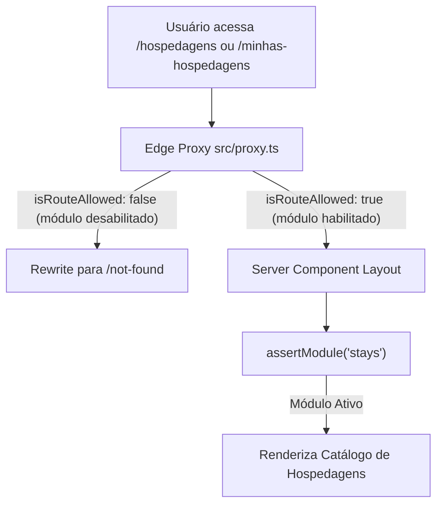
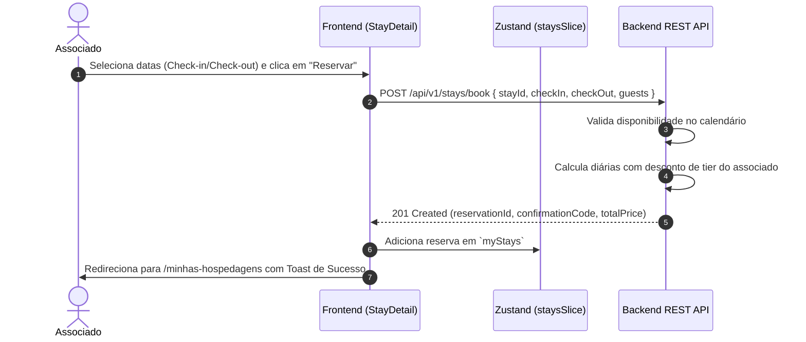

# Especificação de Módulo: Hospedagens & Acomodações (`/hospedagens`)

O módulo de **Hospedagens** disponibiliza a coleção privada de vilas, refúgios de campo, suítes executivas e boutique hotels parceiros em destinos selecionados, com tarifas diferenciadas e benefícios exclusivos para membros.

---

## 🛡️ Controle de Acesso Modular & White-Label

O módulo de Hospedagens é governado pela flag `modules.stays` em [`src/config/brand.config.ts`](file:///c:/Users/Guilherme/Desktop/ID/clubkey/src/config/brand.config.ts).



### Personalização White-Label por Preset:
- **Quando o módulo está ativo (`stays: true`)**: Acesso completo à pesquisa de acomodações, verificação de disponibilidade por calendário, reserva, gestão de estadias ativas e emissão de vouchers com QR Code.
- **Customização por Marca**: Cada preset de marca pode customizar a curadoria de acomodações, cidades em destaque, canais de concierge e paleta de cores para se alinhar ao posicionamento daquele clube ou operador hoteleiro (ex: foco em hotelaria urbana/executiva ou refúgios de natureza/serra).

---

## 🗺️ Rotas do Módulo & Hierarquia

| Rota | Descrição | Tipo | Proteção Modular |
| :--- | :--- | :--- | :---: |
| `/hospedagens` | Catálogo geral com barra de busca e carrosséis temáticos | Client Component | `assertModule("stays")` |
| `/hospedagens/[id]/[slug]` | Página de detalhes da acomodação e solicitação de reserva | Server + Client | `assertModule("stays")` |
| `/hospedagens/minhas-hospedagens` | Painel de estadias ativas e histórico de reservas | Client Component | `assertModule("stays")` |
| `/minhas-hospedagens` | Rota alias para `/hospedagens/minhas-hospedagens` | Server Component | `assertModule("stays")` |
| `/hospedagens/minhas-hospedagens/[id]/[slug]` | Voucher digital com QR Code de check-in e cancelamento | Server + Client | `assertModule("stays")` |

---

## 🔄 Fluxo de Reserva e Emissão de Voucher



---

## 🖥️ Arquitetura Visual & Componentes por Tela

### 1. Catálogo de Hospedagens (`/hospedagens`)
- **Barra de Busca Inteligente (`roomsSearchFilterBar.tsx`)**:
  - **Destino**: Input com autocompletar e sugestões de cidades/regiões.
  - **Período (Check-in & Check-out)**: Popover com calendário duplo (`datePicker`).
  - **Hóspedes**: Seletor numérico (`1` a `6+` hóspedes).
- **Carrosséis por Seção Temática (`sectionCarousel.tsx`)**:
  - Seções temáticas configuradas por curadoria (ex: coleções urbanas, refúgios de serra, vilas de praia).
  - Cada card exibe galeria de fotos, título da suíte, localização, capacidade, diária padrão, diária com desconto do tier e botão de favoritar (`toggleFavorite`).

### 2. Detalhes da Acomodação (`/hospedagens/[id]/[slug]`)
- **Galeria de Imagens**: Carrossel em alta definição com lightbox.
- **Ficha Técnica & Comodidades**: Localização, tipo (`roomType`), amenidades (Wi-Fi, Jacuzzi, Heliponto, Adega).
- **Card Lateral de Reserva**:
  - Seletor de datas e cálculo automático de noites (`nights`).
  - Preço por diária e cálculo do valor total (`totalPrice`) com desconto de membro.
  - Botão CTA *"Reservar Acomodação"*.

### 3. Minhas Hospedagens (`/hospedagens/minhas-hospedagens`)
- **Abas de Navegação**: *"Reservas Ativas & Futuras"* e *"Histórico de Estadias"*.
- **Cards de Reserva (`memberStayCard.tsx`)**: Foto, nome, endereço, período, hóspedes e badge de status colorido (`confirmada`, `em_analise`, `concluida`, `cancelled`).

### 4. Voucher Digital de Estadia (`/hospedagens/minhas-hospedagens/[id]/[slug]`)
- **`memberStayDetailClient.tsx`**:
  - Cartão de confirmação com código localizador único.
  - QR Code dinâmico para validação na recepção.
  - Horários oficiais de Check-in e Check-out.
  - Botão de ação perigosa *"Cancelar Reserva"* com diálogo de confirmação (`confirmActionDialog.tsx`).

---

## 📊 Interfaces TypeScript Consumidas

```typescript
export interface StayItem {
  id: string | number
  title: string
  roomType: "master_suite" | "executive_room" | "villa" | "bungalow" | "chalet"
  description: string
  pricePerNight: number
  capacityGuests: number
  images: string[]
  amenities: string[]
  city: {
    name: string
    state: string
  }
}

export interface StayReservation {
  id: string
  stayId: number | string
  stayName: string
  location: string
  checkIn: string
  checkOut: string
  nights: number
  guests: number
  roomType: string
  status: "confirmada" | "em_analise" | "concluida" | "cancelled"
  confirmationCode: string
  totalPrice: number
  image: string
}
```

---

## 📡 Especificação dos Endpoints de API

### 1. `GET /api/v1/stays`
Lista todas as propriedades e suítes disponíveis com filtros.
- **Query Params**: `destination`, `checkIn`, `checkOut`, `guests`
- **Response (200 OK)**: Array de `StayItem`.

### 2. `GET /api/v1/stays/:id`
Retorna os detalhes completos de uma acomodação específica.
- **Response (200 OK)**: Objeto `StayItem` com galeria e regras da casa.

### 3. `POST /api/v1/stays/book`
Cria uma nova reserva para o associado logado.
- **Headers**: `Authorization: Bearer <jwt_token>`
- **Request Body**:
```json
{
  "stayId": 1,
  "checkIn": "2026-11-14",
  "checkOut": "2026-11-18",
  "guests": 2,
  "roomType": "master_suite",
  "specialRequests": "Check-in antecipado às 13h."
}
```
- **Response (201 Created)**:
```json
{
  "reservationId": "stay-res-001",
  "status": "confirmada",
  "confirmationCode": "CK-STAY-8821",
  "totalPrice": 4800.00,
  "nights": 4,
  "xpEarned": 400
}
```

### 4. `GET /api/v1/stays/my-stays`
Lista todas as reservas do associado autenticado.
- **Response (200 OK)**: Array de `StayReservation`.

### 5. `DELETE /api/v1/stays/reservations/:id`
Cancela uma reserva de hospedagem.
- **Response (200 OK)**: Objeto com confirmação e status `cancelled`.

---

## 🛡️ Regras de Negócio & Casos de Borda

1. **Validação de Calendário**: O backend impede conflitos de datas para a mesma suíte através de travas transacionais no banco de dados.
2. **Descontos por Tier**: O valor final da diária aplica automaticamente a porcentagem de desconto do tier ativo do usuário.
3. **Cancelamento Gratuito**: Cancelamentos solicitados até 7 dias antes do check-in recebem estorno integral.
