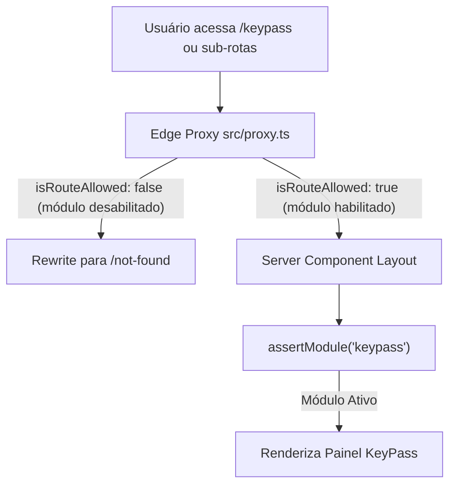
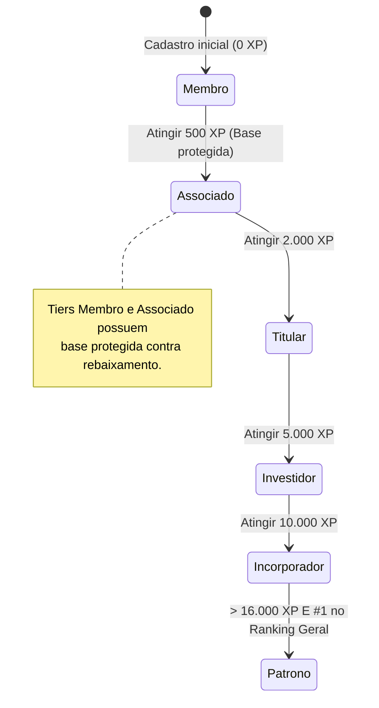

# Especificação de Módulo: KeyPass — Tiers, Missões, Conquistas & Ranking (`/keypass`)

O **KeyPass** é o ecossistema de progressão executiva, reconhecimento de engajamento e bonificação da plataforma. Ele incentiva a participação ativa em eventos, estadias, expansão da rede de relacionamentos e negócios entre associados.

> ⚠️ **Diretriz de Terminologia**: O termo técnico *"Gamificação"* **NUNCA** é exibido para o usuário final. Na interface, utilizamos termos executivos: **"KeyPass"**, **"Tiers & Recompensas"**, **"Passe Executivo"**, **"Conquistas"**, **"Missões Qualificadoras"** e **"Drops Semanais"**.

---

## 🛡️ Controle de Acesso Modular & White-Label

O módulo KeyPass é governado pela flag `modules.keypass` em [`src/config/brand.config.ts`](file:///c:/Users/Guilherme/Desktop/ID/clubkey/src/config/brand.config.ts).



### Regras de Isolamento por Preset:
- **Quando o módulo está ativo no preset (`keypass: true`)**: Acesso irrestrito a todas as 4 telas do KeyPass, widgets de XP no Header, barra de progresso no painel inicial e badges nos perfis de membros.
- **Quando o módulo está desabilitado no preset (`keypass: false`)**: O módulo fica **100% desativado**. O atalho no Header, o item no dropdown de usuário, a barra de progresso no feed inicial e as insígnias nos perfis de membros são **completamente suprimidos** via `<ModuleGate>`. Qualquer tentativa de acesso direto retorna **404 Not Found**.

---

## 🗺️ Rotas do Módulo & Hierarquia

| Rota | Descrição | Tipo | Proteção Modular |
| :--- | :--- | :--- | :---: |
| `/keypass` | Painel Central do KeyPass (Tier, Progresso, Marcos, Drops e Extrato) | Client Component | `assertModule("keypass")` |
| `/keypass/missoes` | Central de Missões Qualificadoras por categoria com resgate | Client Component | `assertModule("keypass")` |
| `/keypass/ranking` | Tabela de Classificação Global e Sazonal com metas comparativas | Client Component | `assertModule("keypass")` |
| `/keypass/regras` | Manual oficial de pontuação, critérios de ascensão e diretrizes | Client Component | `assertModule("keypass")` |

---

## 🎖️ Estrutura Oficial de Tiers Executivos

| Nível | Tier | XP Mínimo | XP Máximo | Benefícios Principais |
| :--- | :--- | :--- | :--- | :--- |
| **I** | **Membro** | 0 XP | 499 XP | Tier de entrada vitalício. Acesso básico ao catálogo e eventos abertos |
| **II** | **Associado** | 500 XP | 1.999 XP | Tier vitalício e verificado. Até 20% OFF em estadias e conexões diretas |
| **III** | **Titular** | 2.000 XP | 4.999 XP | Até 25% OFF em estadias, jantares fechados e atendimento exclusivo |
| **IV** | **Investidor** | 5.000 XP | 9.999 XP | Até 30% OFF em estadias, deal flow, suporte VIP 24/7 e experiências internacionais |
| **V** | **Incorporador**| 10.000 XP | 15.999 XP | Até 35% OFF em estadias, canal direto com fundadores e mesa cativa |
| **VI** | **Patrono** | 16.000+ XP | $\infty$ | Título supremo (#1 no Ranking Geral Global), insígnia dourada e cotas VIP irrestritas |

---

## 🔄 Ciclo de Vida & Progressão de XP



---

## 🖥️ Arquitetura Visual & Componentes por Tela

### 1. Painel Geral do KeyPass (`/keypass`)
- **Card do Tier Atual & Progressão**:
  - Emblema 3D do Tier (`/utils/gamification/tiers/0X_tier.webp`), nome do tier, nível e cor representativa.
  - Barra de progresso de XP indicando pontuação atual versus meta para o próximo nível.
  - **Marcos Intermediários (Milestones)**: Pílulas clicáveis que desbloqueiam bônus intermediários em XP e Tokens RIB ao atingir 25%, 50% e 75% da faixa do tier.
- **Card de Drop Semanal (`WeeklyDropCard`)**:
  - Contagem regressiva do ciclo de liberação (7 dias).
  - Objetivo semanal e recompensas em XP e Tokens RIB com botão de resgate imediato.
- **Extrato de Atividades Recentes (`XpHistoryCard`)**:
  - Histórico cronológico de movimentações de XP com data, categoria, pontuação creditada e tokens ganhos.

### 2. Central de Missões Qualificadoras (`/keypass/missoes`)
- **Filtros de Categoria**: Pílulas: `"Todas"`, `"Networking"`, `"Eventos"`, `"Hospedagens"`, `"Perfil"`, `"Ranking"`.
- **Cards de Missão (`MissionCard`)**:
  - Ícone temático, título, barra de progresso visual (`currentProgress` / `totalRequired`) e botão de ação/resgate.

### 3. Tabela de Classificação & Ranking (`/keypass/ranking`)
- **Filtros de Período**: *"Geral / All-time"*, *"Mês Atual"*, *"Temporada Trimestral Q4"*.
- **Card do Líder #1 (Patrono do Clube)**: Destaque com foto, coroa dourada e pontuação.
- **Card Comparativo de Alvo (`LeaderboardTargetCard`)**: Apresenta o associado posicionado imediatamente acima e a diferença de XP necessária para ultrapassá-lo.
- **Tabela de Classificação (`LeaderboardTable`)**: Colunas de Rank, Membro, Cargo, Cidade, Tier, XP, Tokens RIB e Variação.

---

## 📊 Interfaces TypeScript Consumidas

```typescript
export interface KeyPassMeResponse {
  xp: number
  ribTokens: number
  currentTier: {
    id: "membro" | "associado" | "titular" | "investidor" | "incorporador" | "patrono"
    name: string
    badge: string
    minXp: number
    maxXp: number | null
    level: number
    image: string
  }
  nextTier: {
    id: string
    name: string
    minXp: number
  } | null
  claimedMilestones: Record<string, boolean>
}

export interface MissionItem {
  id: string
  title: string
  description: string
  category: "events" | "networking" | "stays" | "profile" | "ranking"
  xpReward: number
  tokensReward: number
  currentProgress: number
  totalRequired: number
  isCompleted: boolean
  isClaimed: boolean
  actionUrl: string
  actionLabel: string
}
```

---

## 📡 Especificação dos Endpoints de API

### 1. `GET /api/v1/keypass/me`
Retorna a pontuação, tier atual e progresso do associado logado.

### 2. `GET /api/v1/keypass/missions`
Lista todas as missões qualificadoras e o progresso individual.

### 3. `POST /api/v1/keypass/missions/:id/claim`
Resgata a recompensa de uma missão cumprida.
- **Response (200 OK)**: `{ "missionId": "...", "xpAdded": 100, "ribTokensAdded": 1, "newTotalXp": 14300 }`

### 4. `GET /api/v1/keypass/ranking?timeframe=all_time`
Retorna a classificação dos associados no período selecionado.

### 5. `GET /api/v1/keypass/weekly-drops` & `POST /api/v1/keypass/weekly-drops/:id/claim`
Consulta e resgata o drop semanal ativo.

### 6. `GET /api/v1/keypass/tiers`
Retorna a lista canônica dos 6 Tiers Executivos.

---

## 🛡️ Regras de Negócio & Casos de Borda

1. **Proteção de Base de Tiers (Base Protection)**: Membros no patamar *Associado* e *Membro* possuem base vitalícia protegida contra rebaixamento.
2. **Critério Singular do Patrono**: O título *Patrono* é singular e concedido ao associado com mais de 16.000 XP que ocupar a 1ª posição no ranking global.
3. **Prevenção de Duplo Resgate**: O backend valida atomicamente se `isClaimed === true` antes de creditar XP ou tokens.
