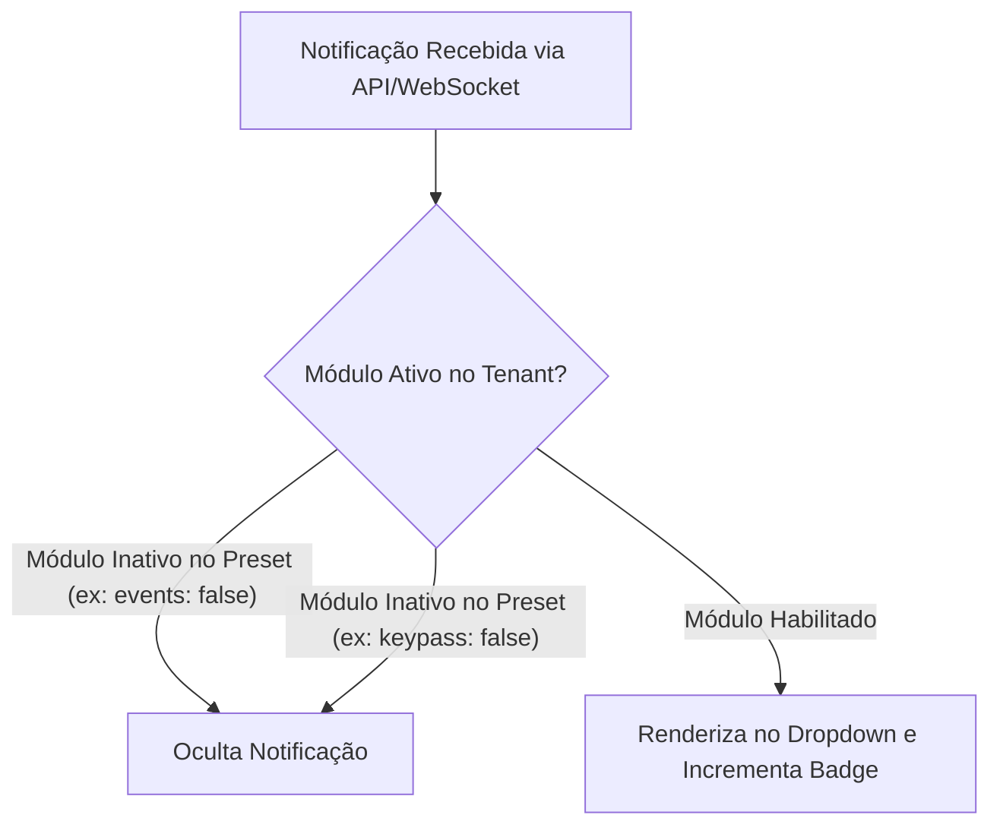
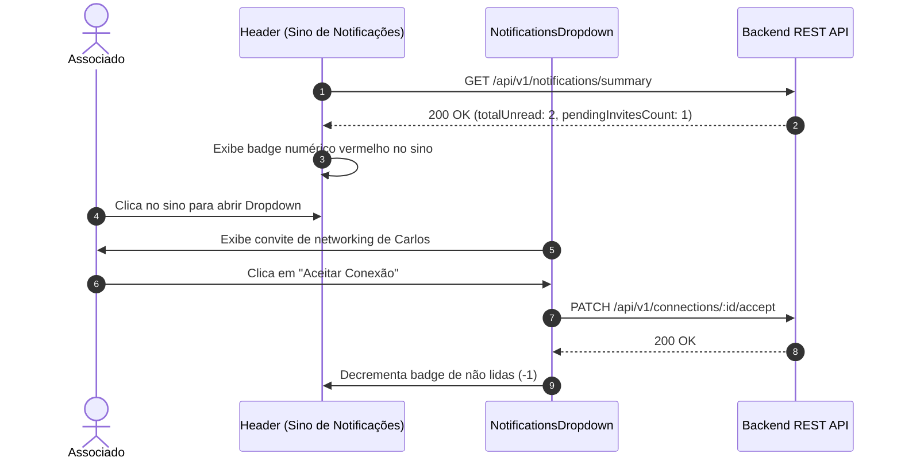

# Especificação de Módulo: Central de Notificações (`NotificationsDropdown`)

A **Central de Notificações** é o componente global presente no cabeçalho (*Header*) de todas as páginas do portal. Ela consolida em tempo real todas as interações sociais, convites de networking pendentes, mensagens não lidas de chat e avisos do ecossistema.

---

## 🛡️ Filtro Dinâmico de Notificações & White-Label

A central de notificações consome `useBrandModules()` para garantir que **somente notificações de módulos ativos no tenant sejam exibidas**:



### Regras de Filtragem por Preset:
- **Quando todos os módulos estão ativos**: Exibe notificações de todos os tipos (convites de networking, chat direto, lembretes de eventos, confirmações de estadias, drops semanais do KeyPass e comunicados institucionais).
- **Quando módulos específicos estão inativos**: O sistema suprime automaticamente notificações de módulos desabilitados no preset (ex: se `events: false`, suprime lembretes de eventos; se `keypass: false`, suprime drops semanais), mantendo o feed de notificações estritamente alinhado com o escopo da marca ativa.

---

## 🗺️ Localização & Escopo

- **Componente**: `src/components/portal/notificationsDropdown.tsx`
- **Exibição**: Barra de navegação superior global (`header.tsx`), ao lado do perfil e do switch de tema.
- **Acesso**: Privado (requer autenticação JWT).

---

## 🔄 Fluxo de Atualização e Ações de Notificação



---

## 🖥️ Arquitetura Visual & Componentes do Dropdown

1. **Gatilho de Sino & Badge de Contagem (`NotificationTrigger`)**:
   - Ícone Phosphor `Bell` com efeito hover.
   - Badge flutuante circular vermelho com o total de pendências (`totalCount`).
   - Se `totalCount === 0`, o sino não exibe o badge vermelho.
2. **Cabeçalho do Dropdown**:
   - Título `"Notificações"` e botão *"Marcar todas como lidas"*.
3. **Seção: Solicitações de Conexão Pendentes (`receivedPendingInvites`)**:
   - Avatar do membro remetente, nome, cargo, empresa e botões *"Aceitar"* (verde) e *"Recusar"* (cinza/vermelho).
4. **Seção: Mensagens de Chat Não Lidas (`unreadMessageThreads`)**:
   - Avatar, nome, trecho da última mensagem, horário relativo e badge numérico.
   - Ao clicar, abre o mensageiro flutuante (`openChat(memberId)`).
5. **Seção: Notificações do Sistema & Atividades**:
   - Alertas sobre confirmação de estadias, lembretes de eventos e drops semanais.

---

## 📊 Interfaces TypeScript Consumidas

```typescript
export interface NotificationItem {
  id: string | number
  type: "connection_request" | "chat_message" | "event_reminder" | "stay_update" | "keypass_drop" | "system"
  title: string
  message: string
  actionUrl?: string
  isRead: boolean
  createdAt: string
  sender?: {
    id: number
    firstName: string
    lastName: string
    avatar: string
    role: string
    company: string
  }
}

export interface NotificationsSummaryResponse {
  totalUnread: number
  pendingInvitesCount: number
  unreadMessagesCount: number
  notifications: NotificationItem[]
}
```

---

## 📡 Especificação dos Endpoints de API

### 1. `GET /api/v1/notifications/summary`
Retorna o resumo para o sino e a listagem inicial.

### 2. `PATCH /api/v1/notifications/:id/read`
Marca notificação individual como lida.

### 3. `POST /api/v1/notifications/read-all`
Marca todas as notificações pendentes como lidas.

---

## 🛡️ Regras de Negócio & Casos de Borda

1. **Sincronização em Tempo Real**: Polling a cada 30 segundos ou SSE/WebSocket.
2. **Contador no Sino**: Soma exata de convites pendentes recebidos + mensagens não lidas + avisos de sistema não lidos.
