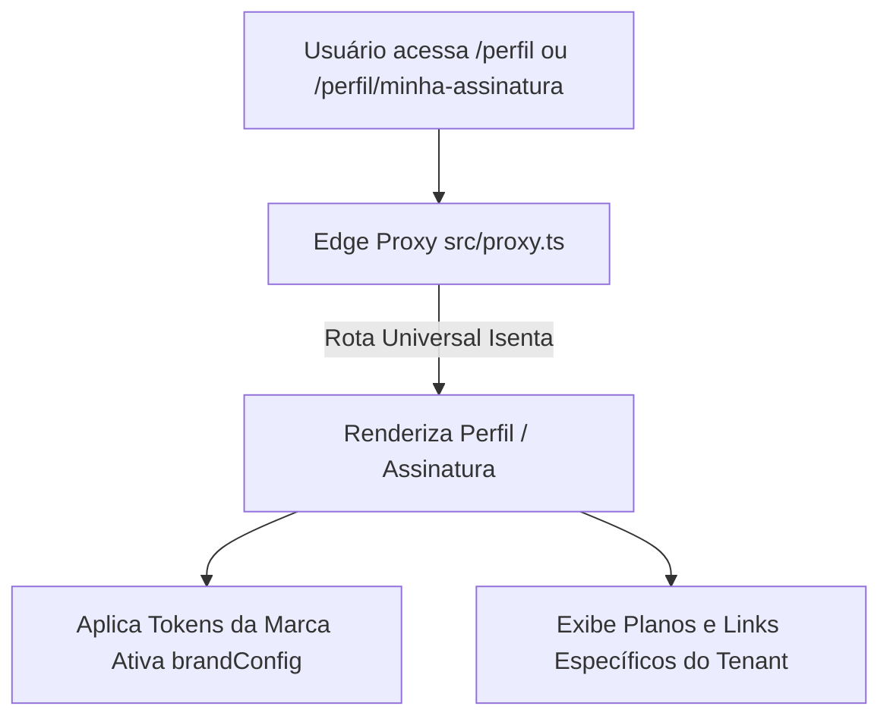
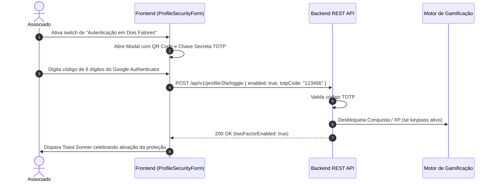

# Especificação de Módulo: Perfil do Membro & Assinatura (`/perfil`)

O módulo de **Perfil & Assinatura** centraliza a identidade profissional do associado, gestão de tags de matchmaking para networking, uploads de fotos e banners, configurações de segurança de acesso (2FA) e gerenciamento financeiro de planos e cartões de crédito.

---

## 🛡️ Controle de Acesso Modular & White-Label

As rotas `/perfil` e `/perfil/minha-assinatura` são classificadas como **Rotas Universais Isentas** (`getModuleByPath(pathname) === null`), permanecendo ativas e acessíveis em qualquer tenant.



### Comportamento White-Label:
- **Cores & Identidade**: Formulários, botões e cartões adotam automaticamente os tokens de cores da marca ativa (injetados dinamicamente via variáveis CSS).
- **Assinatura & Planos**: O painel de faturas e planos consome os dados e links definidos em `brandConfig.links.subscription` e `brandConfig.links.contactEmail`.

---

## 🗺️ Rotas do Módulo & Hierarquia

| Rota | Descrição | Tipo | Acesso |
| :--- | :--- | :--- | :--- |
| `/perfil` | Edição completa de perfil, biografia, tags de negócios e segurança 2FA | Client Component | Autenticado |
| `/perfil/minha-assinatura` | Painel financeiro, detalhes do plano, cartão cadastrado e faturas | Client Component | Autenticado |
| `/minha-assinatura` | Rota alias para `/perfil/minha-assinatura` | Server Component | Autenticado |

---

## 🔄 Fluxo de Ativação do 2FA & Blindagem Digital



---

## 🖥️ Arquitetura Visual & Componentes por Tela

### 1. Meu Perfil Executivo (`/perfil`)
- **Header de Identidade Visual**:
  - Banner de capa (`coverImage`) com upload interativo.
  - Avatar do membro (`avatar`) com botão de câmera.
  - Nome completo, cargo, empresa e badge de Tier do membro.
- **Seção: Dados Pessoais & Profissionais (`ProfilePersonalForm`)**:
  - Inputs para: Nome, Sobrenome, E-mail, Cargo, Empresa, Cidade/UF e Biografia.
- **Seção: Canais de Contato & Redes**:
  - Inputs para: LinkedIn, Instagram e Telefone / WhatsApp com máscara.
- **Seção: Foco de Negócios & Tags de Networking**:
  - **O que Busco (`seeking`)**: Tags dinâmicas com tecla `Enter` ou botão de adicionar.
  - **O que Ofereço (`offering`)**: Competências e ofertas de valor.
- **Seção: Dados Cadastrais & Fiscais**:
  - Nacionalidade, CPF, Data de Nascimento, Razão Social, CNPJ, E-mail Corporativo.
- **Seção: Segurança da Conta**:
  - **Autenticação em Dois Fatores (2FA)**: Switch com modal de QR Code.
  - **Alteração de Senha**: Campos para Senha Atual, Nova Senha e Confirmação.

### 2. Minha Assinatura (`/perfil/minha-assinatura`)
- **Card do Plano**: Nome do plano, badge de status ativo e data da próxima renovação.
- **Card de Pagamento (`PaymentMethodCard`)**: Bandeira do cartão, últimos 4 dígitos mascarados e botão para trocar cartão.
- **Tabela de Histórico de Faturas (`InvoicesTable`)**: Data, descrição, valor e botão de download do PDF.

---

## 📊 Interfaces TypeScript Consumidas

```typescript
export interface ProfileUpdateRequest {
  firstName: string
  lastName: string
  role: string
  company: string
  city: string
  bio: string
  linkedin?: string
  instagram?: string
  phone?: string
  seeking: string[]
  offering: string[]
  nationality?: "brasileiro" | "estrangeiro"
  cpf?: string
  birthDate?: string
  companyName?: string
  cnpj?: string
  corporateEmail?: string
  openingDate?: string
}

export interface SubscriptionDetails {
  planName: string
  tierBadge: string
  status: "active" | "canceled" | "past_due"
  priceFormatted: string
  nextBillingDate: string
  paymentMethod: {
    brand: "mastercard" | "visa" | "amex" | "elo"
    last4: string
    expiry: string
  }
}
```

---

## 📡 Especificação dos Endpoints de API

### 1. `GET /api/v1/profile`
Retorna dados cadastrais, segurança e tags de networking.

### 2. `PUT /api/v1/profile`
Atualiza os dados de perfil do associado logado.

### 3. `POST /api/v1/profile/avatar` & `POST /api/v1/profile/cover`
Upload de imagem via `multipart/form-data`.

### 4. `POST /api/v1/profile/2fa/toggle`
Ativa/desativa autenticação em dois fatores.

### 5. `GET /api/v1/profile/subscription` & `POST /api/v1/profile/subscription/card`
Consulta da assinatura ativa e atualização de cartão de crédito.

### 6. `GET /api/v1/profile/invoices`
Lista faturas e recibos de pagamento em PDF.

---

## 🛡️ Regras de Negócio & Casos de Borda

1. **Sanitização de Tags**: Tags são normalizadas sem caracteres inválidos.
2. **Validação de Documentos**: CPF e CNPJ aplicam validação rigorosa de dígitos verificadores.
3. **Senhas Seguras**: Mínimo de 8 caracteres contendo maiúscula, número e caractere especial.
