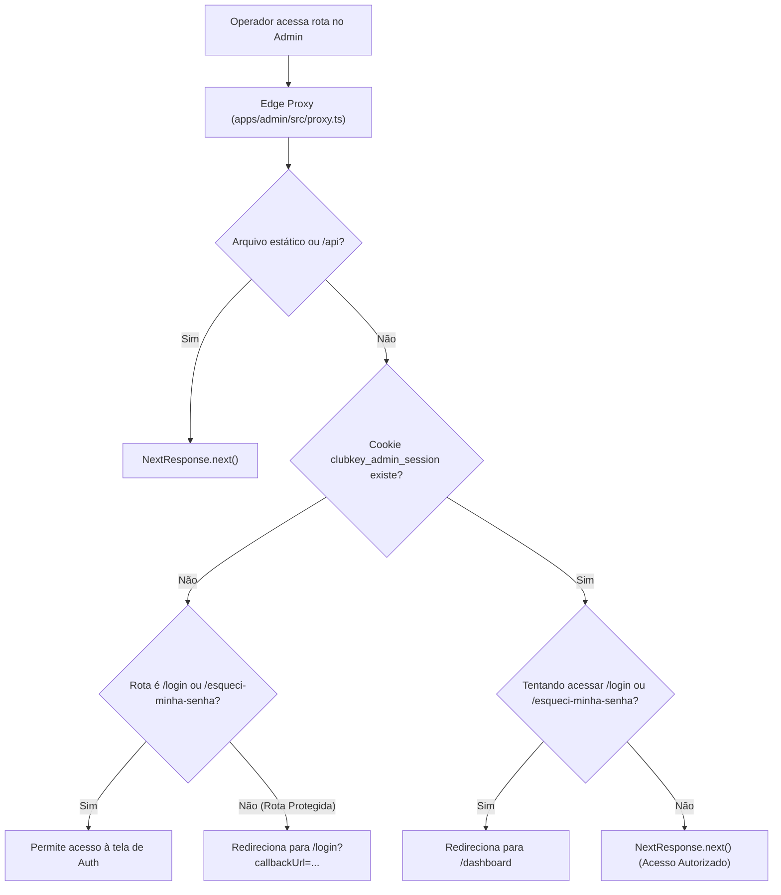

# 🔐 Autenticação & Sessão Administrativa (`apps/admin`)

Este documento especifica o fluxo de autenticação, recuperação de senha, validação de dois fatores (2FA TOTP) e segurança de sessão do **ClubKey Admin (Backoffice)**.

---

## 🗺️ Rotas de Acesso

| Rota | Descrição | Componente Principal | Acesso |
| :--- | :--- | :--- | :--- |
| `/login` | Tela de autenticação com credenciais corporativas e validação de 2FA | `adminLoginForm.tsx` | Público (Redireciona para `/dashboard` se autenticado) |
| `/esqueci-minha-senha` | Solicitação de link seguro para redefinição de credencial administrativa | `adminForgotPasswordForm.tsx` | Público |

---

## 🛡️ Edge Proxy & Proteção de Rotas (`apps/admin/src/proxy.ts`)

O controle de sessão do Painel Administrativo é executado na borda (Edge Runtime do Next.js 16) antes de qualquer renderização de página:

### Regras do Edge Proxy:
1. **Cookie de Sessão**: Valida a presença de `clubkey_admin_session`.
2. **Callback de Retorno**: Ao interceptar acesso não autorizado a rotas como `/perfil` ou `/usuarios`, preserva a URL original no parâmetro `callbackUrl` para redirecionamento pós-login.
3. **Prevenção de Loop**: Usuários com sessão ativa não conseguem acessar as telas de autenticação pública.

---

## 🖥️ Layout & Experiência de Interface

### 1. Split Layout Responsivo
- **Desktop**: Layout dividido em duas metades:
  - **Lado Esquerdo (Branding Hero)**: Fundo institucional escuro, gradientes sutis, logotipo oficial, slogan executivo e selo de segurança com criptografia ponta a ponta.
  - **Lado Direito (Área de Formulário)**: Superfície neutra e minimalista, tipografia nítida, título da ação, descrição de boas-vindas e formulário de entrada.
- **Mobile**: O painel esquerdo é suprimido para economizar espaço e o logotipo oficial é posicionado de forma limpa no topo do formulário.

### 2. Fluxo de Autenticação em 2 Etapas (2FA TOTP)
1. **Etapa 1 (Credenciais)**:
   - Validação com Zod via `adminLoginSchema` (`email` corporativo e `password` com reveal eye).
2. **Etapa 2 (Segundo Fator TOTP)**:
   - Se a conta do operador possuir 2FA habilitado (`is2FAEnabled: true`), a interface transiciona suavemente para o desafio de segurança.
   - O operador insere o código numérico de 6 dígitos gerado pelo seu aplicativo autenticador (Google Authenticator, 1Password, etc.) utilizando o componente **`inputOtp`**.
   - Ao confirmar o código correto, o cookie de sessão é gerado e o redirecionamento é efetuado.

---

## 🔒 Logout & Expiração

- O encerramento de sessão via dropdown do usuário (`adminUserDropdown.tsx`) remove o cookie `clubkey_admin_session` e redireciona imediatamente para `/login`.
