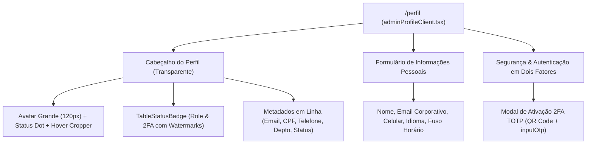

# 👤 Perfil do Administrador (`/perfil`)

A tela de **Perfil do Administrador** (`apps/admin/src/app/(dashboard)/perfil/`) centraliza os dados cadastrais, preferências operacionais e configurações de segurança de acesso do operador logado no painel administrativo.

A interface segue rigorosamente a mesma linguagem visual, hierarquia e minimalismo da tela de detalhes de usuários (`/usuarios/[slug]/detalhes/perfil`).

---

## 🎨 Arquitetura Visual & Componentes

---

## 📋 Seções da Tela

### 1. Cabeçalho de Perfil & Identidade
- **Superfície**: Contêiner sem bordas ou fundos pesados (fundo transparente), mantendo visual executivo e limpo.
- **Avatar em Destaque**:
  - Imagem circular ampliada com indicador verde de status ativo (`bg-emerald-500`).
  - Overlay sutil ao passar o cursor com botão de edição de foto.
  - Integração com o componente **`ImageCropper`** para recorte e proporção quadrada antes do upload.
- **Badges de Governança & Segurança (`TableStatusBadge`)**:
  - **Cargo:** `<TableStatusBadge variant="purple" label="SUPER ADMIN" watermarkIcon={Crown} />`
  - **Segundo Fator:** `<TableStatusBadge variant="emerald" label="2FA Ativo" watermarkIcon={ShieldCheck} />`
- **Linha de Metadados**:
  - Exibe E-mail corporativo, CPF mascarado, Telefone, Departamento e Status da conta de forma horizontalmente alinhada.

### 2. Formulário de Informações Pessoais
Campos editáveis pelo operador:
- **Nome Completo:** Texto aberto.
- **E-mail Corporativo:** Validação de formato de e-mail.
- **Celular Corporativo:** Máscara de telefone internacional / nacional.
- **Idioma de Preferência:** Seleção (`pt-BR`, `en-US`, `es-ES`).
- **Fuso Horário:** Seleção de timezone operacional (`America/Sao_Paulo`).

### 3. Regras Estritas de Governança
Para garantir a integridade da governança corporativa:
- **Sem Auto-Edição de Cargo:** O operador **não pode alterar seu próprio cargo** (`role`) nem seu departamento. Essas definições são reservadas a instâncias superiores de administração.
- **Sem Campo de Nacionalidade:** Campo irrelevante para o escopo administrativo e removido da tela.
- **Sem Seções Redundantes:** Omitidas seções de histórico de sessões conectadas ou governança bloqueada que poluíam a experiência.

### 4. Gestão de Segurança & 2FA (Dois Fatores)
- **Status do 2FA**:
  - Quando ativado: Exibe badge de segurança ativa e botão para desativar mediante confirmação.
  - Quando desativado: Exibe recomendação de ativação e botão "Configurar 2FA".
- **Modal de Configuração TOTP**:
  1. Geração de chave secreta base32 e exibição do QR Code compatível com Google Authenticator, Authy e 1Password.
  2. Opção de cópia da chave manual em texto para contingência.
  3. Desafio de validação com 6 campos numéricos utilizando o componente **`inputOtp`**.
  4. Ativação imediata no store `useAdminStore` após validação do código.
